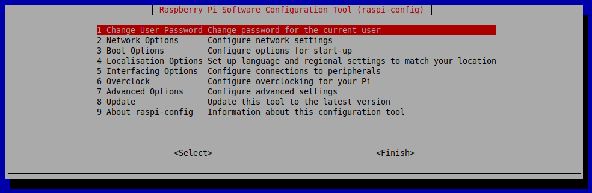

# Audio configuration

The Raspberry Pi has two audio output modes: HDMI and headphone jack. You can switch between these modes at any time.

If your HDMI monitor or TV has in-built speakers, the audio can be played over the HDMI cable, but you can switch it to a set of headphones or other speakers plugged in to the headphone jack. If your display claims to have speakers, sound is output via HDMI by default; and if not it is output via the headphone jack. Sometimes this may not be not what you want, or the auto-detection may be inaccurate, in which case you can manually switch the output.

## Changing the audio output

There are two ways of setting the audio output.

### Command line

The following command, entered in the command line, will switch the audio output to HDMI:

```
amixer cset numid=3 1
```

Here the output is being set to `1`, which is HDMI.

Setting the output to `2` switches to analogue (headphone jack).

The default setting is `0` which is automatic.

### raspi-config

Open up [raspi-config](raspi-config.md) by entering the following in to the command line:

```
sudo raspi-config
```

This will open the configuration screen:



Select Option 8: `Advanced Options` and hit `Enter`, then select Option A6: `Audio` and hit `Enter`.


Now you are presented the two modes explained above, as alternative to the default `Auto` option. Select a mode, hit `Enter` and press the right arrow key to get out of the options list and select `Finish` to exit the configuration tool.

## If you're still not getting sound via HDMI
In some rare cases, it may be necessary to edit config.txt to force HDMI mode (as opposed to DVI mode, which does not send sound). You can do this by editing `/boot/config.txt` and setting `hdmi_drive=2`, then rebooting, for it to take effect.
