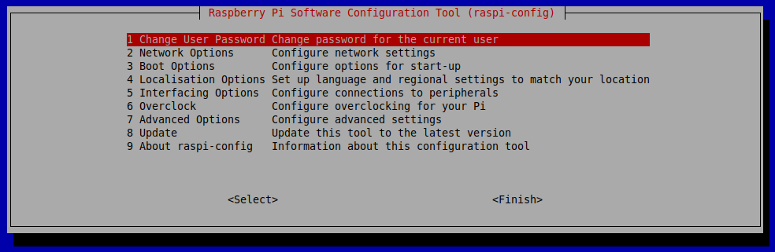

# raspi-config

This page describes the console based raspi-config application. If you are using the Raspberry Pi desktop then you can use the graphical `Raspberry Pi Configuration` application from the `Preferences` menu to configure your Raspberry Pi.

`raspi-config` is the Raspberry Pi configuration tool originally written by [Alex Bradbury](https://github.com/asb). It targets Raspberry Pi OS.

<a name="usage"></a>
## Usage

You will be shown `raspi-config` on first booting into Raspberry Pi OS. To open the configuration tool after this, simply run the following from the command line:

```
sudo raspi-config
```

The `sudo` is required because you will be changing files that you do not own as the `pi` user.

You should see a blue screen with options in a grey box:



Note that the menu shown may differ slightly.

It has the following top level options available:

```
┌───────────────────┤ Raspberry Pi Software Configuration Tool (raspi-config) ├────────────────────┐
│                                                                                                  │
│        1 System Options       Configure system settings                                          │
│        2 Display Options      Configure display settings                                         │
│        3 Interface Options    Configure connections to peripherals                               │
│        4 Performance Options  Configure performance settings                                     │
│        5 Localisation Options Configure language and regional settings                           │
│        6 Advanced Options     Configure advanced settings                                        │                                 │
│        8 Update               Update this tool to the latest version                             │
│        9 About raspi-config   Information about this configuration tool                          │
│                                                                                                  │
│                                                                                                  │
│                           <Select>                           <Finish>                            │
│                                                                                                  │
└──────────────────────────────────────────────────────────────────────────────────────────────────┘
```

<a name="moving-around-the-menu"></a>
### Moving around the menu

Use the `up` and `down` arrow keys to move the highlighted selection between the options available. Pressing the `right` arrow key will jump out of the Options menu and take you to the `<Select>` and `<Finish>` buttons. Pressing `left` will take you back to the options. Alternatively, you can use the `Tab` key to switch between these.

Note that in long lists of option values (like the list of timezone cities), you can also type a letter to skip to that section of the list. For example, entering `L` will skip you to Lisbon, just two options away from London, to save you scrolling all the way through the alphabet.

<a name="what-raspi-config-does"></a>
### What raspi-config does

Generally speaking, `raspi-config` aims to provide the functionality to make the most common configuration changes. This may result in automated edits to `/boot/config.txt` and various standard Linux configuration files. Some options require a reboot to take effect. If you changed any of those, `raspi-config` will ask if you wish to reboot now when you select the `<Finish>` button.

<a name="menu-options"></a>
## Menu options

Note: Due to the continual development of the `raspi-config` tool, the list of options below may not be completely up to date. Also please be aware that different models of Raspberry Pi may have different options available.

### System Options

The system options submenu allows you to make configuration changes to various parts of the boot, login and networking process, along with some other system level changes.

#### Wireless LAN

Allows setting of the wireless LAN SSID and passphrase.

#### Audio

Specifiy the audio output destination.

<a name="change-user-password"></a>
#### Password

The default user on Raspberry Pi OS is `pi` with the password `raspberry`. You can change that here. Read about other [users](../linux/usage/users.md).
 
<a name="hostname"></a>
#### Hostname

Set the visible name for this Pi on a network.

<a name="boot-options"></a>
#### Boot / Auto login

From this submenu you can select whether to boot to console or desktop and whether you need to log in or not. If you select automatic login, you will be logged in as the `pi` user.

#### Network at Boot

Use this option to wait for a network connection before letting boot proceed.

#### Splash Screen

Enable or disable the splash screen displayed at boot time

#### Power LED

If the model of Pi permits it, you can change the behaviour of the power LED using this option.

### Display Options

<a name="resolution"></a>
#### Resolution

Define the default HDMI/DVI video resolution to use when the system boots without a TV or monitor being connected. This can have an effect on RealVNC if the VNC option is enabled.

<a name="underscan"></a>
#### Underscan

Old TV sets had a significant variation in the size of the picture they produced; some had cabinets that overlapped the screen. TV pictures were therefore given a black border so that none of the picture was lost; this is called overscan. Modern TVs and monitors don't need the border, and the signal doesn't allow for it. If the initial text shown on the screen disappears off the edge, you need to enable overscan to bring the border back.

Any changes will take effect after a reboot. You can have greater control over the settings by editing [config.txt](config-txt/README.md).

On some displays, particularly monitors, disabling overscan will make the picture fill the whole screen and correct the resolution. For other displays, it may be necessary to leave overscan enabled and adjust its values.

<a name="pixel-doubling"></a>
#### Pixel Doubling

Enable/disable 2x2 pixel mapping.

#### Composite Video

On the Raspberry Pi4, enable composite video. On models prior to the Raspberry Pi4, composite video is enabled by default so this option is not displayed. 

#### Screen Blanking

Enable or disable screen blanking.

<a name="interfacing-options"></a>
### Interfacing Options

In this submenu there are the following options to enable/disable: Camera, SSH, VNC, SPI, I2C, Serial, 1-wire, and Remote GPIO.

<a name="camera"></a>
#### Camera

Enable/disable the CSI camera interface.

<a name="ssh"></a>
#### SSH

Enable/disable remote command line access to your Pi using SSH.

SSH allows you to remotely access the command line of the Raspberry Pi from another computer. SSH is disabled by default. Read more about using SSH on the [SSH documentation page](../remote-access/ssh/README.md). If connecting your Pi directly to a public network, you should not enable SSH unless you have set up secure passwords for all users.

<a name="VNC"></a>
#### VNC

Enable/disable the RealVNC virtual network computing server.

<a name="spi"></a>
#### SPI

Enable/disable SPI interfaces and automatic loading of the SPI kernel module, needed for products such as PiFace.

<a name="i2c"></a>
#### I2C

Enable/disable I2C interfaces and automatic loading of the I2C kernel module.

<a name="serial"></a>
#### Serial

Enable/disable shell and kernel messages on the serial connection.

<a name="1-wire"></a>
#### 1-wire

Enable/disable the Dallas 1-wire interface. This is usually used for DS18B20 temperature sensors.

#### Remote GPIO

Enable or disable remote access to the GPIO pins.

### Performance Options

<a name="overclock"></a> 
### Overclock

On some models it is possible to overclock your Raspberry Pi's CPU using this tool. The overclocking you can achieve will vary; overclocking too high may result in instability. Selecting this option shows the following warning:

**Be aware that overclocking may reduce the lifetime of your Raspberry Pi.** If overclocking at a certain level causes system instability, try a more modest overclock. Hold down the Shift key during boot to temporarily disable overclocking.

<a name="memory-split"></a>
#### GPU Memory

Change the amount of memory made available to the GPU.

#### Overlay File System

Enable or disable a read-only filesystem

#### Fan

Set the behaviour of a GPIO connected fan

<a name="localisation-options"></a>
### Localisation Options

The localisation submenu gives you these options to choose from: keyboard layout, time zone, locale, and wireless LAN country code.

#### Locale

Select a locale, for example `en_GB.UTF-8 UTF-8`.

#### Time Zone

Select your local time zone, starting with the region, e.g. Europe, then selecting a city, e.g. London. Type a letter to skip down the list to that point in the alphabet.

#### Keyboard

This option opens another menu which allows you to select your keyboard layout. It will take a long time to display while it reads all the keyboard types. Changes usually take effect immediately, but may require a reboot.

#### WLAN Country
This option sets the country code for your wireless network.

<a name="advanced-options"></a>
### Advanced Options

<a name="expand-filesystem"></a>
#### Expand Filesystem

If you have installed Raspberry Pi OS using NOOBS, the filesystem will have been expanded automatically. There may be a rare occasion where this is not the case, e.g. if you have copied a smaller SD card onto a larger one. In this case, you should use this option to expand your installation to fill the whole SD card, giving you more space to use for files. You will need to reboot the Raspberry Pi to make this available. Note that there is no confirmation: selecting the option begins the partition expansion immediately.

<a name="GL-driver"></a>
#### GL Driver

Enable/disable the experimental GL desktop graphics drivers.

<a name="GL-full-KMS"></a>
##### GL (Full KMS) 

Enable/disable the experimental OpenGL Full KMS (kernel mode setting) desktop graphics driver.

<a name="GL-fake-KMS"></a>
##### GL (Fake KMS)

Enable/disable the experimental OpenGL Fake KMS desktop graphics driver.

<a name="legacy"></a>
##### Legacy

Enable/disable the original legacy non-GL VideoCore desktop graphics driver.

#### Compositor

Enable/Display the xcompmgr composition manager

#### Network Interface Names

Enable or disable predictable network interface names. 

#### Network Proxy Settings

Configure the network's proxy settings. 

#### Boot Order

On the Raspberry Pi4, you can specify whether to boot from USB or network if the SD card isn't inserted. See [this page](../hardware/raspberrypi/bcm2711_bootloader_config.md) for more information.

#### Bootloader Version

On the Raspberry Pi4, you can tell the system to use the very latest boot ROM software, or default to the factory default if the latest version causes problems.

<a name="update"></a>
### Update

Update this tool to the latest version.

<a name="about"></a>
### About raspi-config

Selecting this option shows the following text:

```
This tool provides a straightforward way of doing initial configuration of the Raspberry Pi. Although it can be run at any time, some of the options may have difficulties if you have heavily customised your installation.
```

<a name="finish"></a>
### Finish

Use this button when you have completed your changes. You will be asked whether you want to reboot or not. When used for the first time, it's best to reboot. There will be a delay in rebooting if you have chosen to resize your SD card.

<a name="development-of-this-tool"></a>
## Development of this tool

See this tool's source at [github.com/RPi-Distro/raspi-config](https://github.com/RPi-Distro/raspi-config), where you can open issues and create pull requests.

---

*This article uses content from the eLinux wiki page [RPi raspi-config](http://elinux.org/RPi_raspi-config), which is shared under the [Creative Commons Attribution-ShareAlike 3.0 Unported license](http://creativecommons.org/licenses/by-sa/3.0/)*
