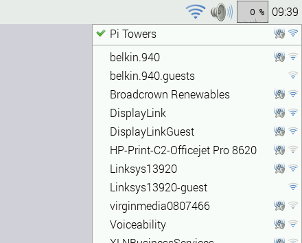

# WiFi

A GUI is provided for setting up WiFi connections in the current Raspbian release.

WiFi connections can be made via the network icon at the right-hand end of the menu bar. If a WiFi dongle is plugged in, left-clicking this icon will bring up a list of available WiFi networks, as shown below. If no networks are found, it will show the message "No APs found - scanning..." - just wait a few seconds without closing the menu, and it should find your network.

The icons on the right show whether a network is secured or not, and its signal strength. Click the network that you want to connect to; if it is secured, a dialogue box is shown prompting you to enter the network key:

Enter the key and press OK, then wait a couple of seconds. The network icon will flash briefly to show that a connection is being made; once it is ready, the icon stops flashing and shows the signal strength.

In older versions of Raspbian, there are alternative ways of setting up WiFi. Here are 3 different ways to configure it:
  
- [Using GUI application](http://learn.adafruit.com/adafruits-raspberry-pi-lesson-3-network-setup/setting-up-wifi-with-raspbian)
- [Using the command line](wireless-cli.md)
- [Using wicd-curses](http://www.raspyfi.com/wi-fi-on-raspberry-pi-a-simple-guide/)
