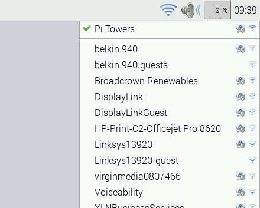
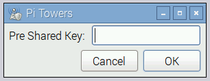

# Wireless connectivity in the Raspberry Pi Desktop

A GUI is provided for setting up wireless connections in Raspberry Pi OS with the Raspberry Pi Desktop. If you are not using the Raspberry Pi Desktop, you can set up wireless networking from the [command line](wireless-cli.md).

Wireless connections can be made via the network icon at the right-hand end of the menu bar. If you are using a Pi with built-in wireless connectivity, or if a wireless dongle is plugged in, left-clicking this icon will bring up a list of available wireless networks, as shown below. If no networks are found, it will show the message 'No APs found - scanning...'. Wait a few seconds without closing the menu, and it should find your network.

Note that on Raspberry Pi devices that support the 5GHz band (Pi3B+, Pi4, CM4, Pi400), wireless networking is disabled for regulatory reasons, until the country code has been set. To set the country code, open the `Raspberry Pi Configuration` application from the Preferences Menu, select **Localisation** and set the appropriate code.

The icons on the right show whether a network is secured or not, and give an indication of its signal strength. Click the network that you want to connect to. If it is secured, a dialogue box will prompt you to enter the network key:

Enter the key and click **OK**, then wait a couple of seconds. The network icon will flash briefly to show that a connection is being made. When it is ready, the icon will stop flashing and show the signal strength.
