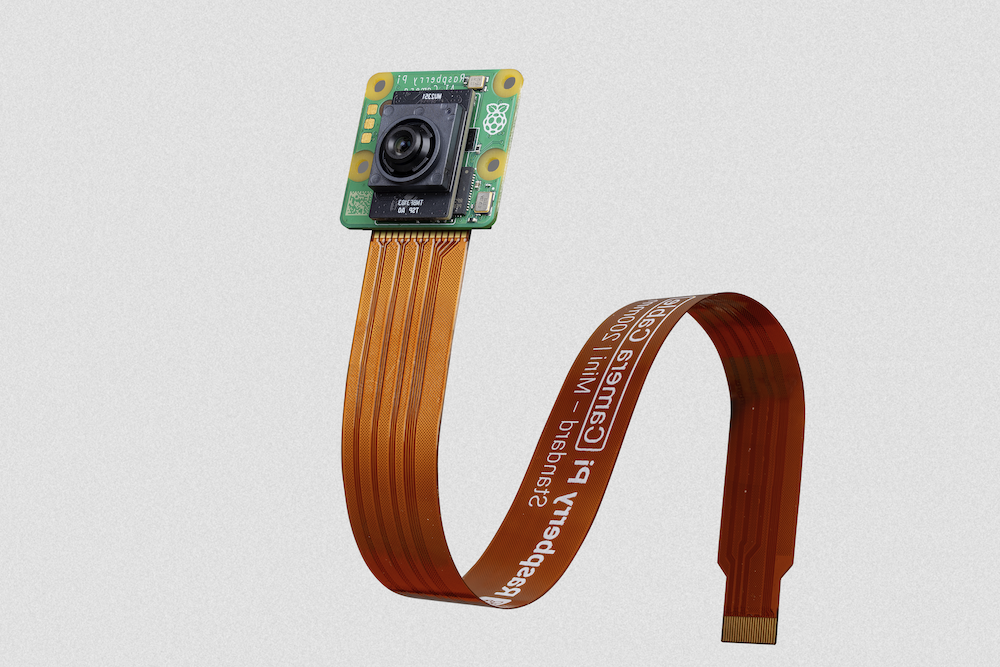

[[ai-camera]]
== About

The Raspberry Pi AI Camera uses the Sony IMX500 imaging sensor to provide low-latency and high-performance AI capabilities to any camera application. The tight integration with https://www.raspberrypi.com/documentation/computers/camera_software.adoc[Raspberry Pi's camera software stack] allows users to deploy their own neural network models with minimal effort.

This section demonstrates how to run either a pre-packaged or custom neural network model on the camera. Additionally, this section includes the steps required to interpret inference data generated by neural networks running on the IMX500 in https://github.com/raspberrypi/rpicam-apps[`rpicam-apps`] and https://github.com/raspberrypi/picamera2[Picamera2].

