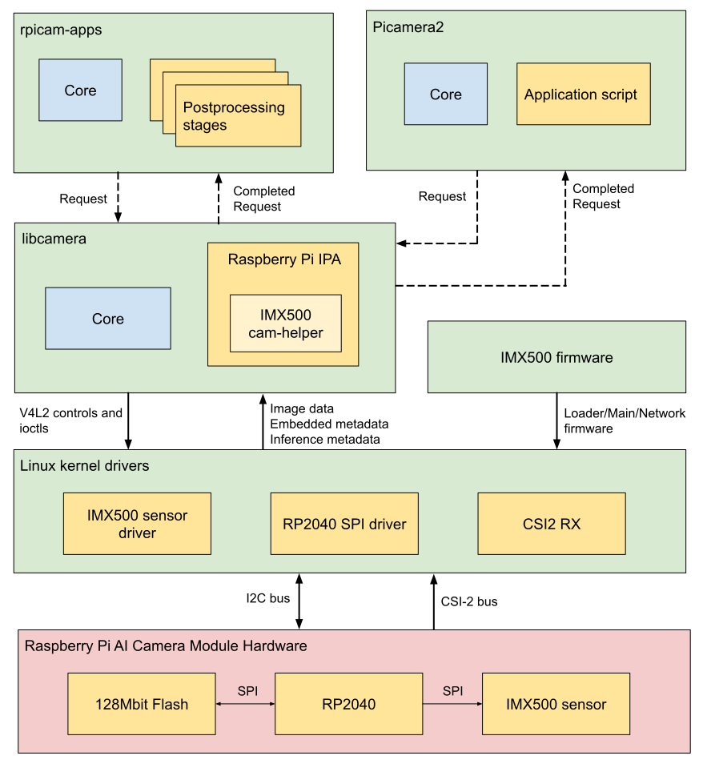

== Under the Hood

The diagram below shows the various camera software components (in green) used during our imaging/inference use case with the Raspberry Pi AI Camera module hardware (in red).

On startup, the IMX500 sensor modules gets loaded with firmware to run a particular neural network model. On streaming, the IMX500 generates an image stream together with an inference stream. This inference stream holds the inputs and outputs of the neural network model, also known as input/output tensors.

=== Device drivers

At the lowest level, the camera module is configured over the I2C bus from the IMX500 sensor kernel driver. The CSI2 driver (`CFE` on Pi 5, `Unicam` on all other Pi platforms) sets up the receiver to write the image data stream into a frame buffer, together with the embedded data and inference data streams into another buffer in memory.

The firmware files are also transferred over the I2C bus wires with either the standard I2C protocol, or a custom high speed protocol in the case of Pi 5. This is handled through the RP2040 SPI driver in the kernel. The RP2040 microcontroller is responsible for management of the firmware transfer operation on the camera module. It bridges the I2C transfers from the kernel to the IMX500 via a SPI bus. The RP2040 also caches firmware files on the on-board flash chip for fast upload to the IMX500, avoiding the need to transfer the entire firmware blob over the I2C bus.

=== libcamera

Once `libcamera` dequeues the image and inference data buffers from the kernel, the IMX500 specific `cam-helper` library (part of the Raspberry Pi IPA within libcamera), parses the inference buffer to get the input/output tensors. These tensors as packaged as Raspberry Pi vendor specific https://libcamera.org/api-html/namespacelibcamera_1_1controls.html[`libcamera Controls`] to be returned out to the application for consumption. The following controls are returned:

[%header,cols="a,a"]
|===
| Control
| Description

| `CnnOutputTensor`
| Floating point array storing the output tensor.

| `CnnInputTensor`
| Floating point array storing the input tensor.

| `CnnOutputTensorInfo`
| Network specific parameters describing the output tensors structure:

[source,c]
----
struct OutputTensorInfo {
	uint32_t tensorDataNum;
	uint32_t numDimensions;
	uint16_t size[MaxNumDimensions];
};

struct CnnOutputTensorInfo {
	char networkName[NetworkNameLen];
	uint32_t numTensors;
	OutputTensorInfo info[MaxNumTensors];
};
----

| `CnnInputTensorInfo`
| Network specific parameters describing the input tensors structure:

[source,c]
----
struct CnnInputTensorInfo {
	char networkName[NetworkNameLen];
	uint32_t width;
	uint32_t height;
	uint32_t numChannels;
};
----

|===

=== rpicam-apps

`rpicam-apps` provides an IMX500 postprocessing stage base class that implements helpers for IMX500 postprocessing stages - https://github.com/raspberrypi/rpicam-apps/blob/post_processing_stages/imx500_post_processing_stage.hpp[`IMX500PostProcessingStage`]. This base class can be used to derive a new postprocessing stage for any neural network model running on the IMX500. For example, in https://github.com/raspberrypi/rpicam-apps/blob/post_processing_stages/imx500_mobilenet_ssd.cpp[`imx500_mobilenet_ssd.cpp`], the following derived class is instanciated (not complete implementation):

[source,cpp]
----
class ObjectInference : public IMX500PostProcessingStage
{
public:
	ObjectInference(RPiCamApp *app) : IMX500PostProcessingStage(app) {}

	char const *Name() const override;

	void Read(boost::property_tree::ptree const &params) override;

	void Configure() override;

	bool Process(CompletedRequestPtr &completed_request) override;
};
----

On every frame received by the application, the `Process()` function is called (`ObjectInference::Process()` in the above case). In this function, you can extract the output tensor for futher processing and/or analysis by the stage:

[source,cpp]
----
auto output = completed_request->metadata.get(controls::rpi::CnnOutputTensor);
if (!output)
{
  LOG_ERROR("No output tensor found in metadata!");
  return false;
}

std::vector<float> output_tensor(output->data(), output->data() + output->size());
----

Once this is completed, the final results can either be visualised or saved in metadata and consumed by either another downstream stage, or the top level application itself. In the object inference case:

[source,cpp]
----
if (objects.size())
  completed_request->post_process_metadata.Set("object_detect.results", objects);
----

The `object_detect_draw_cv` postprocessing stage running downstream fetches these results from the metadata and draws the bounding boxes onto the image in the `ObjectDetectDrawCvStage::Process()` function:

[source,cpp]
----
std::vector<Detection> detections;
completed_request->post_process_metadata.Get("object_detect.results", detections);
----

A full list of helper functions provided by `IMX500PostProcessingStage` is listed below:

[%header,cols="a,a"]
|===
| Function
| Description

| `Read()`
| Typically called from `<Derived Class>::Read()`, this function reads the config parameters for input tensor parsing and saving.

This function also reads the neural network model file string (`"network_file"`) and sets up the firmware to be loaded on camera open.

| `Process()`
| Typically called from `<Derived Class>::Process()` this function processes and saves the input tensor to a file if required by the JSON config file.

| `SetInferenceRoiAbs()`
| Sets an absolute region of interest (ROI) crop rectangle on the sensor image to use for inferencing on the IMX500.

| `SetInferenceRoiAuto()`
| Automatically calculates region of interest (ROI) crop rectangle on the sensor image to preserve the input tensor aspect ratio for a given neural network.

| `ShowFwProgressBar()`
| Displays a progress bar on the console showing the progress of the neural network firmware upload to the IMX500.

| `ConvertInferenceCoordinates()`
| Converts from the input tensor coordinate space to the final ISP output image space.

There are a number of scaling/cropping/translation operations occurring from the original sensor image to the fully processed ISP output image. This function converts coordinates provided by the output tensor to the equivalent coordinates after performing these operations.

|===

=== Picamera2

IMX500 integration in `Picamera2` is very similar to what is available in `rpicam-apps`. `Picamera2` has an IMX500 helper class that provides the same functionality as the `rpicam-apps` `IMX500PostProcessingStage` base class. This can be imported to any python script with:

[source,python]
----
from picamera2.devices.imx500 import IMX500

# This must be called before instantiation of Picamera2
imx500 = IMX500(model_file)
----

To retrieve the output tensors, you fetch them from the controls and use it for for futher processing and/or analysis by the python script.

For example, in an object inference use case such as https://github.com/raspberrypi/picamera2/tree/main/examples/imx500/imx500_object_detection_demo.py[imx500_object_detection_demo.py], the object bounding boxes and confidence values are extracted in `parse_detections()` and draw the boxes on the image in `draw_detections()`:

[source,python]
----
class Detection:
    def __init__(self, coords, category, conf, metadata):
        """Create a Detection object, recording the bounding box, category and confidence."""
        self.category = category
        self.conf = conf
        obj_scaled = imx500.convert_inference_coords(coords, metadata, picam2)
        self.box = (obj_scaled.x, obj_scaled.y, obj_scaled.width, obj_scaled.height)

def draw_detections(request, detections, stream="main"):
    """Draw the detections for this request onto the ISP output."""
    labels = get_labels()
    with MappedArray(request, stream) as m:
        for detection in detections:
            x, y, w, h = detection.box
            label = f"{labels[int(detection.category)]} ({detection.conf:.2f})"
            cv2.putText(m.array, label, (x + 5, y + 15), cv2.FONT_HERSHEY_SIMPLEX, 0.5, (0, 0, 255), 1)
            cv2.rectangle(m.array, (x, y), (x + w, y + h), (0, 0, 255, 0))
        if args.preserve_aspect_ratio:
            b = imx500.get_roi_scaled(request)
            cv2.putText(m.array, "ROI", (b.x + 5, b.y + 15), cv2.FONT_HERSHEY_SIMPLEX, 0.5, (255, 0, 0), 1)
            cv2.rectangle(m.array, (b.x, b.y), (b.x + b.width, b.y + b.height), (255, 0, 0, 0))

def parse_detections(request, stream='main'):
    """Parse the output tensor into a number of detected objects, scaled to the ISP out."""
    outputs = imx500.get_outputs(request.get_metadata())
    boxes, scores, classes = outputs[0][0], outputs[1][0], outputs[2][0]
    detections = [ Detection(box, category, score, metadata)
                   for box, score, category in zip(boxes, scores, classes) if score > threshold]
    draw_detections(request, detections, stream)
----

Note that there is no additional hysteresis or temporal filtering applied to the output like in the `rpicam-apps` example. However this should be easy enough to add to this example if needed.

The IMX500 class in `Picamera2` provides the following helper functions:

[%header,cols="a,a"]
|===
| Function
| Description

| `IMX500.get_full_sensor_resolution()`
| Return the full sensor resolution of the IMX500.

| `IMX500.config()`
| Returns a dictionary of the neural network configuration.

| `IMX500.convert_inference_coords()`
| Converts from the input tensor coordinate space to the final ISP output image space.

There are a number of scaling/cropping/translation operations occurring from the original sensor image to the fully processed ISP output image. This function converts coordinates provided by the output tensor to the equivalent coordinates after performing these operations.

| `IMX500.show_network_fw_progress_bar()`
| Displays a progress bar on the console showing the progress of the neural network firmware upload to the IMX500.

| `IMX500.get_roi_scaled()`
| Returns the region of interest (ROI) in the ISP output coordinate space.

| `IMX500.get_isp_output_size()`
| Returns the ISP output image size.

| `IMX5000.get_input_w_h()`
| Returns the input tensor size based on the neural network model used.

| `IMX500.get_outputs()`
| Returns the output tensors for a given frame request.

| `IMX500.get_output_shapes()`
| Returns the shape of the output tensors for the neural network model used.

| `IMX500.set_inference_roi_abs()`
| Sets an absolute region of interest (ROI) crop rectangle on the sensor image to use for inferencing on the IMX500.

| `IMX500.set_inference_aspect_ratio()`
| Automatically calculates region of interest (ROI) crop rectangle on the sensor image to preserve the input tensor aspect ratio for a given neural network.

| `IMX500.get_kpi_info()`
| Returns the frame level performance indicators logged by the IMX500.

|===
