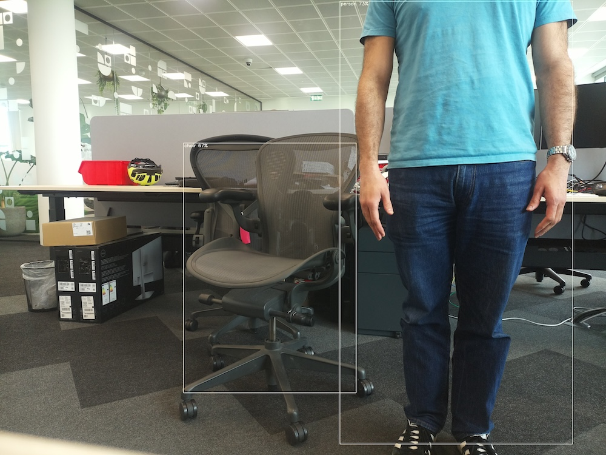

== Getting Started

The instructions below describe how to get started and run the pre-packaged MobileNet SSD and PoseNet neural network models on the Raspberry Pi AI Camera.

All the following commands must be run in a terminal window.

=== Prerequisites

This tutorial assumes you are using the AI Camera attached to either a Raspberry Pi 4 Model B or Raspberry Pi 5 board. However, other Raspberry Pi models with a camera connector (e.g. the Raspberry Pi Zero 2 W or Raspberry Pi 3 Model B+) are also applicable to this tutorial.

You must also have the latest Raspberry Pi OS image (Bookworm at the time of writing this) flashed onto an SD card and be fully up-to-date with:

[source,console]
----
sudo apt update
sudo apt full-upgrade -y
----

=== Install the IMX500 firmware
The AI camera requires run-time firmware to be downloaded onto the IMX500 sensor on startup. This firmware files must be install installed on the system with:

[source,console]
----
sudo apt install imx500-firmware imx500-models rpicam-apps-imx500-postprocess python3-opencv
----

This will install `/lib/firmware/imx500_loader.fpk` and `/lib/firmware/imx500_main.fpk` firmware files required for operating the IMX500 sensor. It will also place a number of neural network model firmware files in `/usr/share/imx500-models/`.

[NOTE]
The IMX500 kernel device driver loads all the firmware files (loader, main, network) when the camera is started. This may take several minutes if the neural network model firmware has not been previously cached. For our demos below, a progress bar will be displayed on the console indicating the loading progress.

=== Reboot
Finally reboot the Raspberry Pi:

[source,console]
----
sudo reboot
----

== Example Applications

Once all the system packages are updated and firmware files installed, we can start running some example applications. As mentioned earlier, the Raspberry Pi AI Camera comes fully integrated with our camera software (`libcamera`, `rpicam-apps` and `Picamera2` applications).

=== rpicam-apps

The https://www.raspberrypi.com/documentation/computers/camera_software.html#libcamera-and-rpicam-apps[rpicam-apps camera applications] now include IMX500 object inference and pose estimation stages that can be run in the postprocessing pipeline. Further details on the postprocessing pipeline can be found https://www.raspberrypi.com/documentation/computers/camera_software.html#post-processing[here].

The postprocessing JSON files used by `rpicam-apps` in the below demos can be found in `/usr/share/rpicam-assets/`

==== Object Inference

The MobileNet SSD neural network performs basic object detection and provides bounding boxes and confidence values for each object found. The `imx500_mobilenet_ssd.json` JSON file contains the configuration parameters for the IMX500 object inferencing postprocessing stage using the MobileNet SSD neural network. On a default installation, there should be no reason to change this. Leave all other parameters unchanged for now.

Next, run one of the camera application, for example `rpicam-hello` with this postprocessing file:

[source,console]
----
rpicam-hello -t 0s --post-process-file /usr/share/rpicam-assets/imx500_mobilenet_ssd.json --viewfinder-width 1920 --viewfinder-height 1080 --framerate 30
----

This will pop-up a viewfinder with bounding boxes overlaid on objects the neural network has recognised.

If you want to record this as a video, you can use `rpicam-vid` instead, for example:

[source,console]
----
rpicam-vid -t 10s -o output.264 --post-process-file /usr/share/rpicam-assets/imx500_mobilenet_ssd.json --width 1920 --height 1080 --framerate 30
----

`imx500_mobilenet_ssd.json` lists two stages to run in the postprocessing pipeline - the `imx500_mobilenet_ssd` stage and the `object_detect_draw_cv` stage. The former picks out bounding boxes and confidence values generated by the neural network in the output tensor, while the latter actually draws the boxes and labels on the image.

A number of configuration parameters can be tweaked to alter the behaviour of the `imx500_object_inference` stage. For example, `max_detections` gives the maximum number of objects to be detected and `threshold` gives a minimum confidence value to return for an object. The raw inference output data of this network can be quite noisy, so this stage also preforms some temporal filtering and applies hysteresis, which can be disabled by removing the `temporal_filter` config block.

==== Pose Estimation

The PoseNet neural network performs pose estimation and provides key points on the body associated with joints and limbs. To run the PoseNet example, we use the same comand line as used for the MobileNet SSD example, but replacing `imx500_mobilenet_ssd.json` with `imx500_posenet.json`:

[source,console]
----
rpicam-hello -t 0s --post-process-file /usr/share/rpicam-assets/imx500_posenet.json --viewfinder-width 1920 --viewfinder-height 1080 --framerate 30
----

`imx500_posenet.json` lists two stages to run in the postprocessing pipeline - the `imx500_posenet` stage and the `plot_pose_cv` stage. The `imx500_posenet` stage fetches the raw output tensor form the PoseNet neural network, while the `plot_pose_cv` stage draws the actual line overlays on the image. However unlike the MobileNet SSD case, the PoseNet output tensor must be futher postprocessed in software to generate the final output of body key points.

image::images/imx500-posenet.jpg[IMX500 PoseNet]

Again,`imx500_posenet.json` has a number of configuration parameters that can be tweaked to alter the behaviour of the stages's output, e.g. confidence threshold, number of detections, etc.

=== Picamera2

https://datasheets.raspberrypi.com/camera/picamera2-manual.pdf[`Picamera2`] does not have a specific postprocessing framework like `rpicam-apps` does. However, this is because implementing such postprocessing is far simpler in Python compared to C++.

Example scripts to perform image classification, object inference/segmentation, and pose estimation using `Picamera2` can be found in https://github.com/raspberrypi/picamera2-imx500/blob/main/examples/imx500/. The https://github.com/raspberrypi/picamera2-imx500/blob/main/examples/imx500/README.md[`README.md`] file lists all the neural networks that can be used and the available parameters for the example scripts.

For example, to run the YOLOv8 object inference demo use the following command:

[source,console]
----
python imx500_object_detection_demo.py --model /usr/share/imx500-models/imx500_network_yolov8n_pp.rpk --ignore-dash-labels -r
----

and for pose estimation:

[source,console]
----
python imx500_pose_estimation_yolov8n_demo.py --model /usr/share/imx500-models/imx500_network_yolov8n_pose.rpk
----
