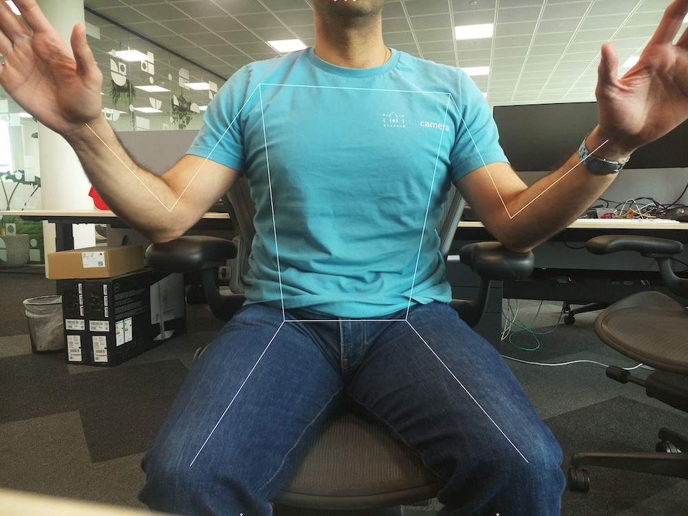

== Getting started

The instructions below describe how to run the pre-packaged MobileNet SSD and PoseNet neural network models on the Raspberry Pi AI Camera.

=== Prerequisites

These instructions assumes you are using the AI Camera attached to either a Raspberry Pi 4 Model B or Raspberry Pi 5 board. With minor changes, you can follow these instructions on other Raspberry Pi models with a camera connector, including the Raspberry Pi Zero 2 W and Raspberry Pi 3 Model B+.

First, ensure that your Raspberry Pi runs the latest software. Run the following command to update:

[source,console]
----
$ sudo apt update && sudo apt full-upgrade
----

=== Install the IMX500 firmware

The AI camera must download runtime firmware onto the IMX500 sensor during startup. To install these firmware files onto your Raspberry Pi, run the following command:

[source,console]
----
$ sudo apt install imx500-firmware imx500-models rpicam-apps-imx500-postprocess python3-opencv
----

This command:

* installs the `/lib/firmware/imx500_loader.fpk` and `/lib/firmware/imx500_main.fpk` firmware files required to operate the IMX500 sensor
* places a number of neural network model firmware files in `/usr/share/imx500-models/`

NOTE: The IMX500 kernel device driver loads all the firmware files (loader, main, and network) when the camera starts. This may take several minutes if the neural network model firmware has not been previously cached. The demos below display a progress bar on the console to indicate firmware loading progress.

=== Reboot

Now that you've installed the prerequisites, restart your Raspberry Pi:

[source,console]
----
$ sudo reboot
----

== Run example applications

Once all the system packages are updated and firmware files installed, we can start running some example applications. As mentioned earlier, the Raspberry Pi AI Camera integrates fully with `libcamera`, `rpicam-apps`, and `Picamera2`.

=== `rpicam-apps`

The xref:../computers/camera_software.adoc#rpicam-apps[`rpicam-apps` camera applications] include IMX500 object inference and pose estimation stages that can be run in the post-processing pipeline. For more information about the post-processing pipeline, see xref:../computers/camera_software.adoc#post-process-file[the post-processing documentation].

The examples on this page use post-processing JSON files located in `/usr/share/rpicam-assets/`.

==== Object inference

The MobileNet SSD neural network performs basic object detection, providing bounding boxes and confidence values for each object found. `imx500_mobilenet_ssd.json` contains the configuration parameters for the IMX500 object inferencing post-processing stage using the MobileNet SSD neural network.

`imx500_mobilenet_ssd.json` declares a post-processing pipeline that contains two stages:

. `imx500_mobilenet_ssd`, which picks out bounding boxes and confidence values generated by the neural network in the output tensor
. `object_detect_draw_cv`, which draws bounding boxes and labels on the image

The MobileNet SSD tensor requires no significant post-processing on your Raspberry Pi to generate the final output of bounding boxes. All object detection runs directly on the AI Camera.

The following command runs `rpicam-hello` with object detection post-processing:

[source,console]
----
$ rpicam-hello -t 0s --post-process-file /usr/share/rpicam-assets/imx500_mobilenet_ssd.json --viewfinder-width 1920 --viewfinder-height 1080 --framerate 30
----

After running the command, you should see a viewfinder that overlays bounding boxes on objects recognised by the neural network:

image::images/imx500-mobilenet.jpg[IMX500 MobileNet]

To record video with object detection overlays, use `rpicam-vid` instead. The following command runs `rpicam-hello` with object detection post-processing:

[source,console]
----
$ rpicam-vid -t 10s -o output.264 --post-process-file /usr/share/rpicam-assets/imx500_mobilenet_ssd.json --width 1920 --height 1080 --framerate 30
----

You can configure the `imx500_object_inference` stage in many ways.

For example, `max_detections` defines the maximum number of objects that the pipeline will detect at any given time. `threshold` defines the minimum confidence value required for the pipeline to consider any input as an object.

The raw inference output data of this network can be quite noisy, so this stage also preforms some temporal filtering and applies hysteresis. To disable this filtering, remove the `temporal_filter` config block.

==== Pose estimation

The PoseNet neural network performs pose estimation, labelling key points on the body associated with joints and limbs. `imx500_posenet.json` contains the configuration parameters for the IMX500 pose estimation post-processing stage using the PoseNet neural network.

`imx500_posenet.json` declares a post-processing pipeline that contains two stages:

* `imx500_posenet`, which fetches the raw output tensor from the PoseNet neural network
* `plot_pose_cv`, which draws line overlays on the image

The AI Camera performs basic detection, but the output tensor requires additional post-processing on your host Raspberry Pi to produce final output.

The following command runs `rpicam-hello` with pose estimation post-processing:

[source,console]
----
$ rpicam-hello -t 0s --post-process-file /usr/share/rpicam-assets/imx500_posenet.json --viewfinder-width 1920 --viewfinder-height 1080 --framerate 30
----

You can configure the `imx500_posenet` stage in many ways.

For example, `max_detections` defines the maximum number of body points that the pipeline will detect at any given time. `threshold` defines the minimum confidence value required for the pipeline to consider input as a body point.

=== Picamera2

For examples of image classification, object inference, object segmentation, and pose estimation using Picamera2, see https://github.com/raspberrypi/picamera2-imx500/blob/main/examples/imx500/[the `picamera2-imx500` GitHub repository].

Download the repository to your Raspberry Pi to run the examples. You'll find example files in the root directory, with additional information in the `README.md` file.

Run the following script from the repository to run YOLOv8 object inference:

[source,console]
----
$ python imx500_object_detection_demo.py --model /usr/share/imx500-models/imx500_network_yolov8n_pp.rpk --ignore-dash-labels -r
----

To try pose estimation in Picamera2, run the following script from the repository:

[source,console]
----
$ python imx500_pose_estimation_yolov8n_demo.py --model /usr/share/imx500-models/imx500_network_yolov8n_pose.rpk
----
