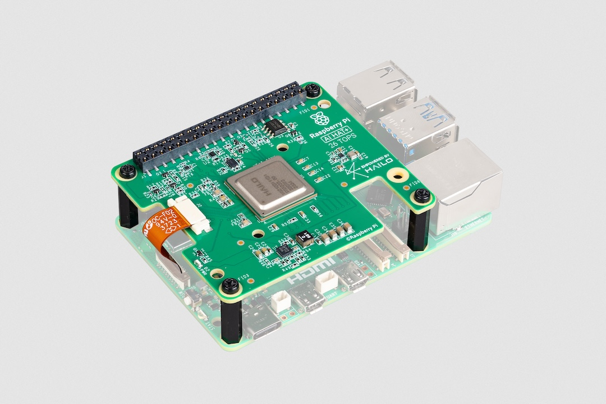
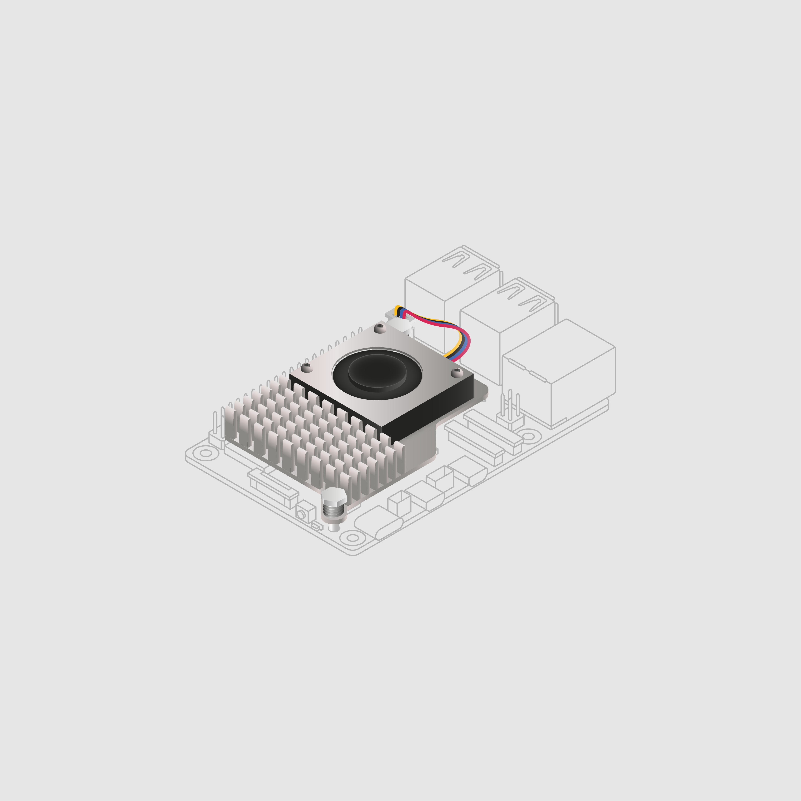

[[ai-hat-plus]]
== About

.The 26 tera-operations per second (TOPS) Raspberry Pi AI HAT+

The Raspberry Pi AI HAT+ add-on board has a built-in Hailo AI accelerator compatible with
Raspberry Pi 5. The NPU in the AI HAT+ can be used for applications including process control, security, home automation, and robotics.

The AI HAT+ is available in 13 and 26 tera-operations per second (TOPS) variants, built around the Hailo-8L and Hailo-8 neural network inference accelerators. The 13 TOPS variant works best with moderate workloads, with performance similar to the xref:ai-kit.adoc[AI Kit]. The 26 TOPS variant can run larger networks, can run networks faster, and can more effectively run multiple networks simultaneously.

The AI HAT+ communicates using Raspberry Pi 5's PCIe interface. The host Raspberry Pi 5 automatically detects the on-board Hailo accelerator and uses the NPU for supported AI computing tasks. Raspberry Pi OS's built-in `rpicam-apps` camera applications automatically use the NPU to run compatible post-processing tasks.

[[ai-hat-plus-installation]]
== Install

To use the AI HAT+, you will need:

* a Raspberry Pi 5

Each AI HAT+ comes with a ribbon cable, GPIO stacking header, and mounting hardware. Complete the following instructions to install your AI HAT+:

. First, ensure that your Raspberry Pi runs the latest software. Run the following command to update:
+
[source,console]
----
$ sudo apt update && sudo apt full-upgrade
----

. Next, xref:../computers/raspberry-pi.adoc#update-the-bootloader-configuration[ensure that your Raspberry Pi firmware is up-to-date]. Run the following command to see what firmware you're running:
+
[source,console]
----
$ sudo rpi-eeprom-update
----
+
If you see 6 December 2023 or a later date, proceed to the next step. If you see a date earlier than 6 December 2023, run the following command to open the Raspberry Pi Configuration CLI:
+
[source,console]
----
$ sudo raspi-config
----
+
Under `Advanced Options` > `Bootloader Version`, choose `Latest`. Then, exit `raspi-config` with `Finish` or the *Escape* key.
+
Run the following command to update your firmware to the latest version:
+
[source,console]
----
$ sudo rpi-eeprom-update -a
----
+
Then, reboot with `sudo reboot`.

. Disconnect the Raspberry Pi from power before beginning installation.

. For the best performance, we recommend using the AI HAT+ with the Raspberry Pi Active Cooler. If you have an Active Cooler, install it before installing the AI HAT+.
+
--

--
. Install the spacers using four of the provided screws. Firmly press the GPIO stacking header on top of the Raspberry Pi GPIO pins; orientation does not matter as long as all pins fit into place. Disconnect the ribbon cable from the AI HAT+, and insert the other end into the PCIe port of your Raspberry Pi. Lift the ribbon cable holder from both sides, then insert the cable with the copper contact points facing inward, towards the USB ports. With the ribbon cable fully and evenly inserted into the PCIe port, push the cable holder down from both sides to secure the ribbon cable firmly in place.
+
--
image::images/ai-hat-plus-installation-02.png[width="60%"]
--
. Set the AI HAT+ on top of the spacers, and use the four remaining screws to secure it in place.

. Insert the ribbon cable into the slot on the AI HAT+. Lift the ribbon cable holder from both sides, then insert the cable with the copper contact points facing up. With the ribbon cable fully and evenly inserted into the port, push the cable holder down from both sides to secure the ribbon cable firmly in place.

. Congratulations, you have successfully installed the AI HAT+. Connect your Raspberry Pi to power; Raspberry Pi OS will automatically detect the AI HAT+.

== Get started with AI on your Raspberry Pi

To start running AI accelerated applications on your Raspberry Pi, check out our xref:../computers/ai.adoc[Getting Started with the AI Kit and AI HAT+] guide.
