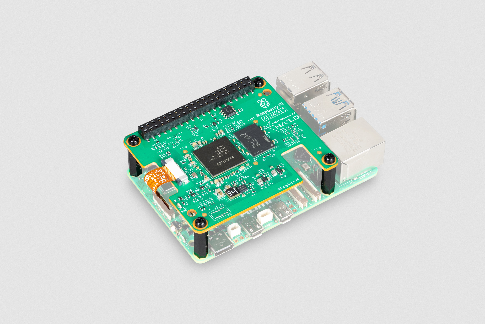
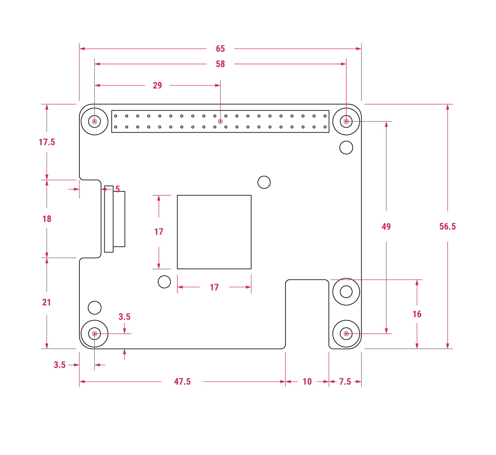
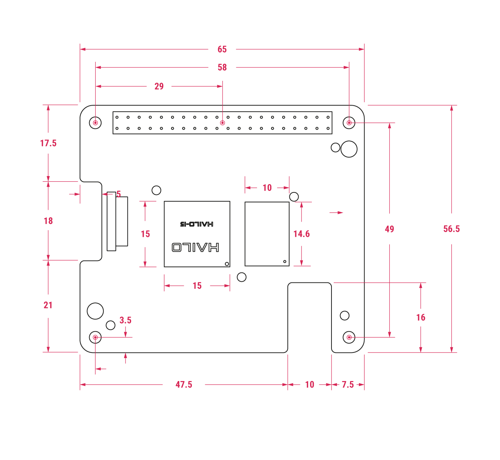
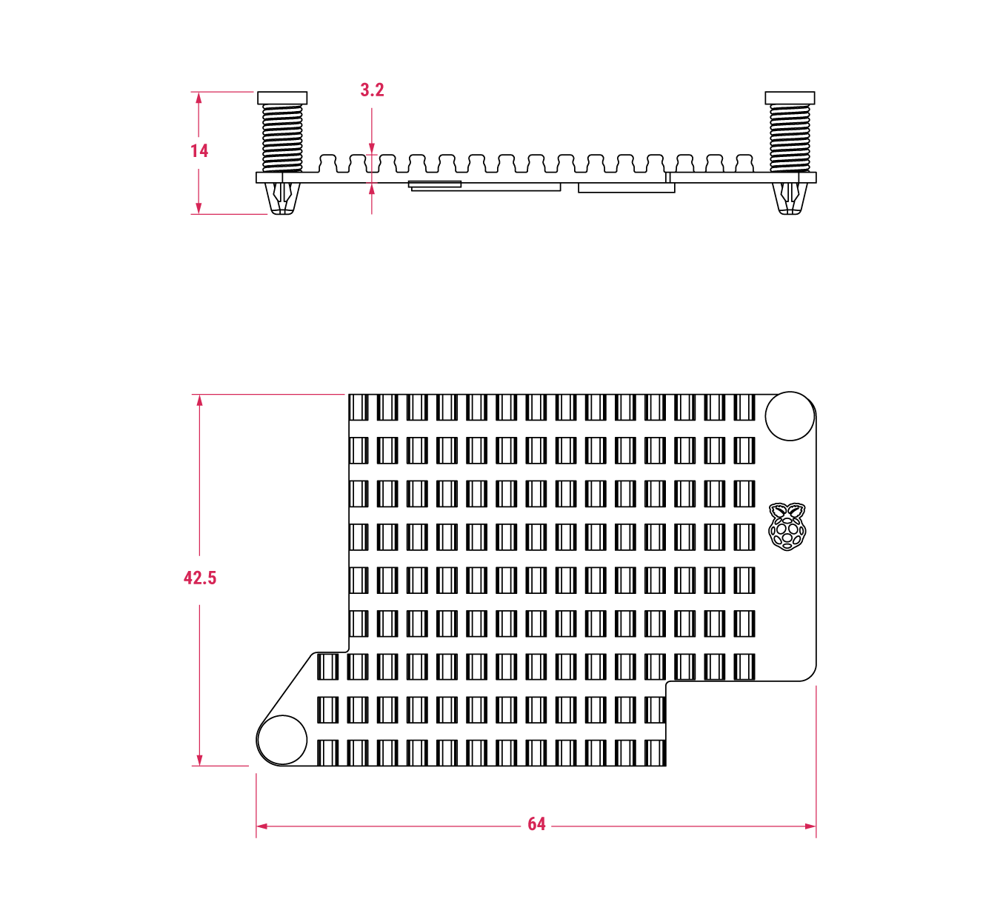

[[ai-hat-plus]]

AI HATs are add-on boards for Raspberry Pi 5 that come with a built-in AI accelerator chip: the Hailo neural processing unit (NPU). The Hailo NPU allows Raspberry Pi 5 to run hardware-accelerated AI models locally, removing the need to send data to a remote cloud server for processing. This edge AI approach improves performance, reduces latency, and helps to keep data private. For information about how AI HATs integrate with Raspberry Pi 5 to provide hardware-accelerated AI inference, see <<explanation>>.

AI HATs use the newer Raspberry Pi HAT specification, indicated with a plus sign (*\+*). There are two AI HAT models: *AI HAT+* and *AI HAT+ 2*. For more information, see <<AIHAT-models>>.
These AI HATs are available in different performance variants, measured in tera-operations per second (TOPS) of inference performance. AI HAT+ is available in a *13 TOPS* or a *26 TOPS* variant; AI HAT+ 2 is available in a single *40 TOPS* variant. For more information, see <<AIHAT-TOPS>>.

.The 26 tera-operations per second (TOPS) Raspberry Pi AI HAT+
image::images/ai-hat-plus-hero.jpg[width="50%"]

.The 40 tera-operations per second (TOPS) Raspberry Pi AI HAT+ 2

[[explanation]]
== How it works

An AI HAT integrates with Raspberry Pi 5 to provide hardware-accelerated AI inference using the on-board Hailo NPU (accelerator chip).

When an AI HAT+ or AI HAT+ 2 is connected to a Raspberry Pi 5, Raspberry Pi OS automatically detects the on-board accelerator and offloads supported AI workloads to it. This includes using our existing camera and vision frameworks to run vision-based neural network models on the NPU. For instructions on connecting an AI HAT+ or AI HAT+ 2 to a Raspberry Pi 5, see <<ai-hat-plus-installation>>.

The camera application frameworks, `rpicam-apps` and `Picamera2`, which come with Raspberry Pi OS, can automatically use the Hailo NPU for supported AI computing tasks, such as image recognition and object detection. For more information, see xref:../computers/ai.adoc[AI software].

While detection and basic integration are automatic, you must also install other software components and supported AI models to use hardware-accelerated inference. For more information, see xref:../computers/ai.adoc[AI software].

[[AIHAT-models]]
== Models

The following table lists the main capability differences between AI HAT+ and AI HAT+ 2. For information about the specific performance variants of the accelerator chips available for each model, see <<AIHAT-TOPS>>.

NOTE: The *AI Kit* has the same specifications as the Hailo-8L variant of AI HAT+ and is functionally equivalent. However, the AI Kit is no longer in production and we recommend using one of the AI HATs described in this page.

[cols="1,2,2", options="header"]
|===
| Feature | AI HAT+ | AI HAT+ 2

| *Accelerator chip (Hailo NPU)*
| Hailo-8L (13 TOPS, INT8) or Hailo-8 (26 TOPS, INT8)
| Hailo-10H (40 TOPS, INT4)

| *Memory (RAM)*
| Uses the memory on a Raspberry Pi 5
| Has its own 8 GB onboard memory, allowing it to run LLMs and VLMs up to ~6 billion parameters

| *Large Language Model (LLM) support*
| Not supported
| Supported

| *Vision-Language Model (VLM) support*
| Not supported
| Supported

| *Use cases*
| Object detection, camera post-processing, robotics, moderate neural workloads
| Everything available on AI HAT+ plus generative AI workloads, including local LLMs and VLMs
|===

[[AIHAT-TOPS]]
== Performance (TOPS) variants

*AI HAT+* is available in the following tera-operations per second (TOPS) inference performance variants:

- *13 TOPS*, built around the *Hailo-8L* neural network accelerator. This suits moderate workloads, with performance similar to the xref:ai-kit.adoc[AI Kit].
- *26 TOPS*, built around the *Hailo-8* neural network accelerator. This supports larger networks, higher throughput, and parallel AI models.

*AI HAT+ 2* delivers *40 TOPS* inference performance, built around the *Hailo-10H* neural network inference accelerator. This supports all AI HAT+ workloads and adds local LLM and VLM capabilities, enabling applications such as local chat over documents.

== Physical specifications

The following images depict the physical dimensions of AI HAT+, AI HAT+ 2, and the heatsink that comes with AI HAT+ 2. The size is the same for both AI HAT+ and AI HAT+ 2; the main visual difference is the inclusion of the SDRAM on AI HAT+ 2. For more information about this difference, see <<AIHAT-models>>.

=== AI HAT+ specifications

The following image depicts the approximate physical dimensions of an AI HAT+ in millimetres (mm). AI HAT+ is approximately 66 mm × 56.5 mm. The Hailo NPU has a metal casing around it, making it approximately 17 mm × 17 mm.

.Mechanical diagram of AI HAT+; all measurements are approximate and in millimetres

=== AI HAT+ 2 and heatsink specifications

The following image depicts the approximate physical dimensions of an AI HAT+ 2 in millimetres (mm). AI HAT+ is approximately 66 mm × 56.5 mm. The Hailo NPU is approximately 15 mm × 15 mm and the SDRAM is approximately 14.5 mm × 10 mm.

.Mechanical diagram of AI HAT+ 2; all measurements are approximate and in millimetres

The following image depicts the approximate physical dimensions of the heatsink for an AI HAT+ 2 in millimetres (mm). Taking into account both corners with the push-pin holes for attaching the heatsink to an AI HAT+ 2, the heatsink is approximately 42.5 mm × 64 mm. With the push pins, an AI HAT+ 2 is approximately 14 mm high; without the push pins, an AI HAT+ 2 is approximately 3.2 mm high.

.Mechanical diagram of the heatsink for an AI HAT+ 2; all measurements are approximate and in millimetres

[[ai-hat-plus-installation]]
== Hardware assembly

Check that you have the required hardware and then follow the steps to install an AI HAT+ or AI HAT+ 2 on a Raspberry Pi 5, ensuring that your Raspberry Pi 5 is disconnected from power before you begin.

[[hardware]]
=== Prerequisites

Both AI HAT+ and AI HAT+ 2 come with the following mounting hardware:

- Four threaded spacers.
- Four long screws for attaching the spacers to your Raspberry Pi 5.
- Four short screws for mounting an AI HAT+ or AI HAT+ 2 to the spacers on your Raspberry Pi 5.
- A GPIO stacking header.
- A ribbon cable.

.Mounting hardware for an AI HAT
image::images/ai-hat-plus-installation-02.png[width="60%"]

Additionally, you need:

- A Raspberry Pi 5.
- A Phillips crosshead screwdriver.
- Optionally, a Raspberry Pi Active Cooler (recommended). This is an aluminium heatsink with a fan that helps to dissipate heat from your Raspberry Pi 5, keeping it at a safe operating temperature.

AI HAT+ 2 comes with an additional heatsink that you install on top of the HAT. We recommend installing both the Active Cooler (on your Raspberry Pi 5) and the heatsink (on your AI HAT+ 2).

When you have all of the required hardware, complete the following steps.

=== Step 1. Prepare your Raspberry Pi 5

Before mounting an AI HAT+ or AI HAT+ 2, ensure that the Raspberry Pi 5 you're mounting it to is running Raspberry Pi OS Trixie with the latest software installed, and that it has the latest Raspberry Pi firmware:

[source, console]
----
$ sudo apt update
$ sudo apt full-upgrade -y
$ sudo rpi-eeprom-update -a
$ sudo reboot
----

For more information, see xref:../computers/raspberry-pi.adoc#update-the-bootloader-configuration[Update the bootloader configuration].

[[step2]]
=== Step 2. Mount an Active Cooler (recommended)

We recommend that you mount an Active Cooler to your Raspberry Pi 5. If you want to skip this step, or if your Raspberry Pi 5 already has an Active Cooler mounted to it, move on to the next step.

--
image::images/ai-hat-plus-installation-01.png[width="60%"]
--

First, ensure that your Raspberry Pi 5 is disconnected from power. Then:

. *Prepare the cooler.* Remove the protective paper from the thermal pads at the bottom of the cooler. This exposes a sticky surface on each of the thermal pads.
. *Position the cooler.* Align the two white push pins with the two dedicated heatsink holes on your Raspberry Pi 5. In this position, the thermal pads align with the wireless radio, the system-on-chip (SoC), and the power management integrated circuit (PMIC).
. *Secure the cooler.* Press the cooler gently onto your Raspberry Pi 5. Then, evenly press the two white push pins down into the two dedicated heatsink holes on your Raspberry Pi 5 until they click.
. *Connect the fan.* Plug the fan's JST connector into the fan socket on your Raspberry Pi 5.

NOTE: Ensure that the push pins are undamaged and securely clipped to the Raspberry Pi 5 before use.

We recommend that you don't remove the cooler after it's fitted to the Raspberry Pi 5. This is because removing the cooler can cause the push pins and thermal pads to degrade, which can lead to product damage.

[[step3]]
=== Step 3. Mount the AI HAT+ 2 heatsink (recommended)

The AI HAT+ 2 comes with an additional heatsink. If you're mounting an AI HAT+ and not an AI HAT+ 2, you can skip this step.

While the heatsink supplied with the AI HAT+ 2 is optional, we recommend mounting it to your AI HAT+ 2, especially if you're running benchmarks or intensive AI workloads. This prevents your AI HAT+ 2 from slowing down due to overheating.

To attach the AI HAT+ 2 heatsink to your AI HAT+ 2 (before mounting it to your Raspberry Pi 5):

. *Prepare the heatsink.* Remove the protective paper from the thermal pads on the underside of the heatsink. This exposes a sticky surface on each of the thermal pads.
. *Position the heatsink.* Align the two black push pins on the heatsink to the two dedicated heatsink holes in diagonally opposite corners on your AI HAT+ 2. In this position, the thermal pads align with the power regulator, the Hailo NPU, and the SDRAM chip.
. *Secure the heatsink.* Evenly press the two black push pins down into the heatsink holes on the AI HAT+ 2 until they click.

NOTE: Ensure that the push pins are undamaged and securely clipped to the AI HAT+ 2 before use.

We recommend that you don't remove the heatsink after it's fitted to the Raspberry Pi AI HAT+ 2. This is because removing the heatsink can cause the push pins and thermal pads to degrade, which can lead to product damage.

[[step4]]
=== Step 4. Mount the AI HAT

The AI HAT+ and AI HAT+ 2 both connect to a Raspberry Pi 5 using its PCIe port, which is a high-speed interface for connecting hardware components.

First, ensure that your Raspberry Pi 5 is disconnected from power, and then:

. *Fit the spacers.* Using a Phillips crosshead screwdriver, attach the four spacers to the yellow holes on your Raspberry Pi 5 using the four longer screws.
. *Connect the GPIO stacking header.* Align the GPIO stacking header with the GPIO pins on your Raspberry Pi 5. Press down firmly until the header is fully seated. The orientation of the header doesn't matter so long as all the GPIO pins are correctly aligned and inserted.
. *Disconnect the PCIe ribbon cable from your AI HAT.* Slide the retaining clips outwards from both sides of the PCIe connector on the AI HAT and then gently pull out the cable.
. *Insert the PCIe ribbon cable into your Raspberry Pi.* Insert the other end of the ribbon cable into the PCIe connector on your Raspberry Pi 5. To do this, first slide the retaining clip of the PCIe connector on your Raspberry Pi 5 upwards from both sides. Then, insert the ribbon cable into the PCIe connector. Ensure that the metallic contact points are facing inwards (towards the USB ports).
. *Secure the PCIe ribbon cable to your Raspberry Pi.* While holding the ribbon cable in place, push the retaining clip back into the connector from both sides, ensuring that the cable is evenly inserted.
. *Mount the AI HAT.* With the main components of your AI HAT facing upwards, align the mounting holes on the AI HAT with the spacers on your Raspberry Pi 5. Use the four remaining (shorter) screws to secure the AI HAT in place.
. *Insert the PCIe ribbon cable into your AI HAT.* Insert the unconnected end of the ribbon cable into the PCIe connector on your AI HAT. To do this, first slide the retaining clip of the PCIe connector on your AI HAT outwards from both sides. Then, insert the ribbon cable into the PCIe connector.
. *Secure the PCIe ribbon cable to your AI HAT.* While holding the ribbon cable in place, push the retaining clip back into the connector from both sides, ensuring that the cable is evenly inserted.

== Next steps: Run AI models

AI HATs support both example models provided by Hailo and custom models trained for your specific applications, such as speech-to-text, translation, or visual scene analysis. For a list of available example models, see Hailo's https://hailo.ai/products/hailo-software/model-explorer/generative-ai/[Model Explorer].

To start running AI models on your Raspberry Pi 5, see xref:../computers/ai.adoc[AI software], which provides information and guidance on:

- Running AI-accelerated visual models on your Raspberry Pi 5.
- Generative AI models relevant to AI HAT+ 2.