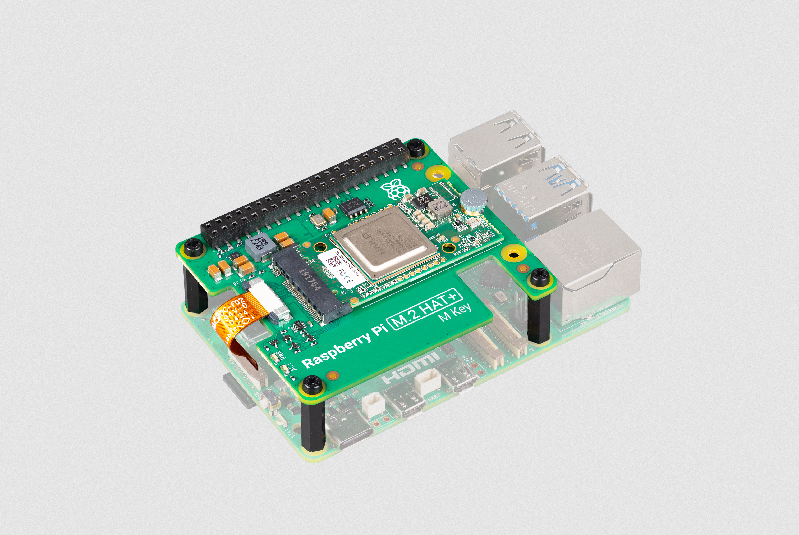
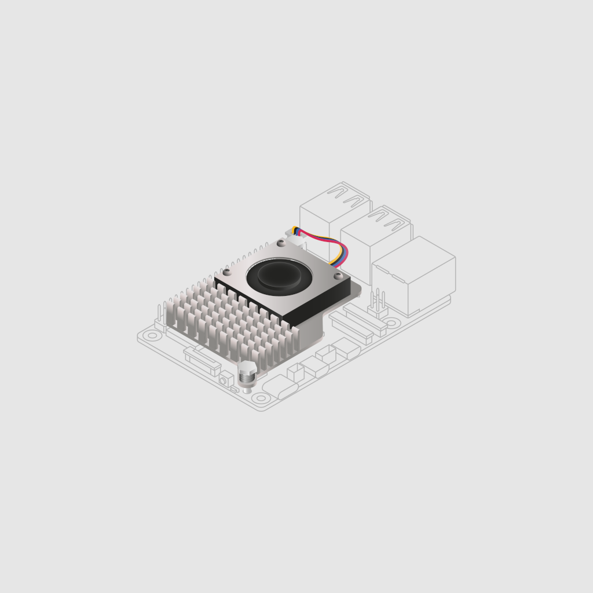
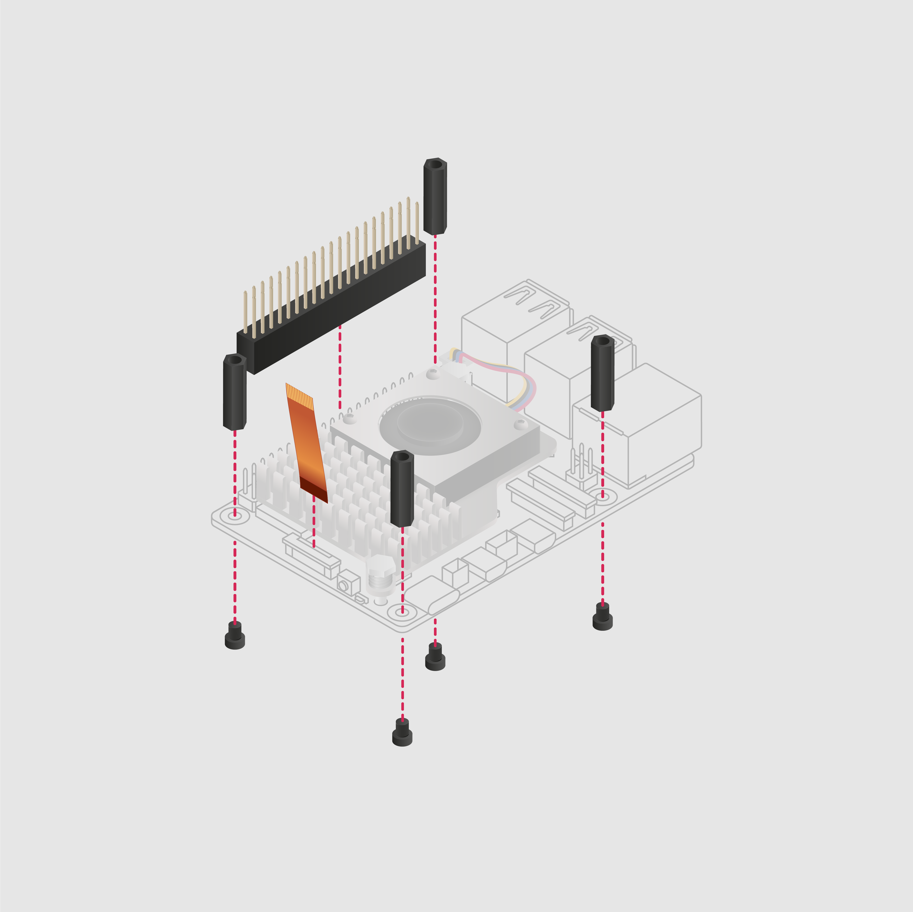
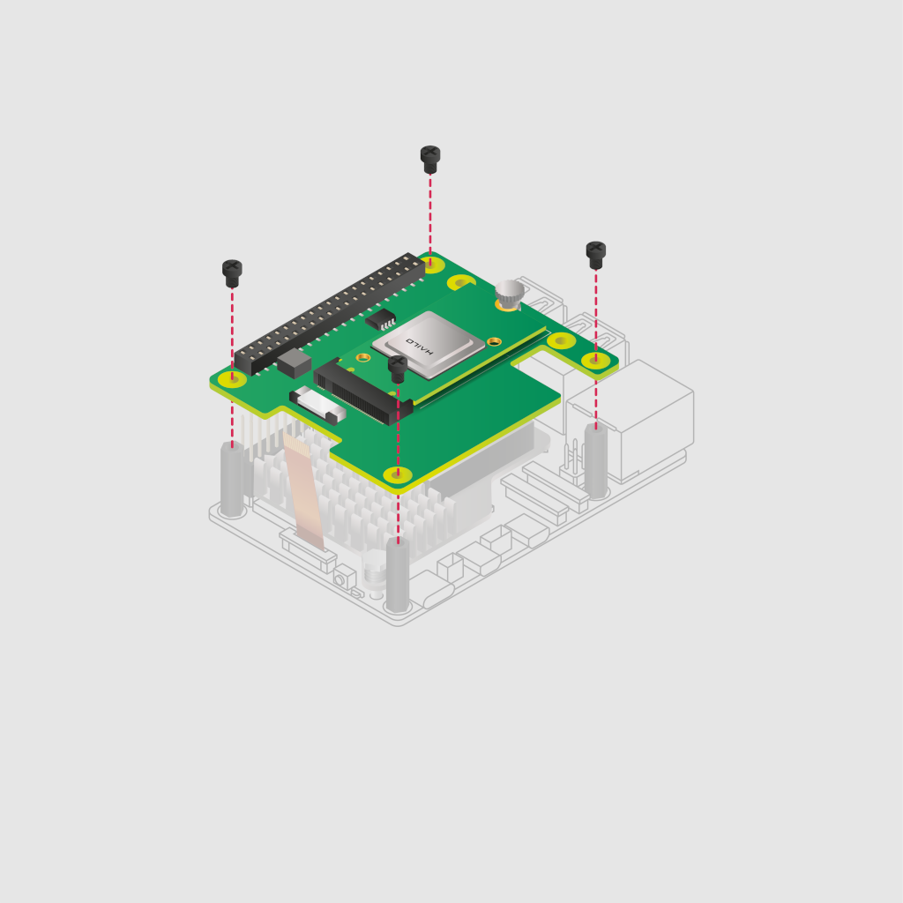
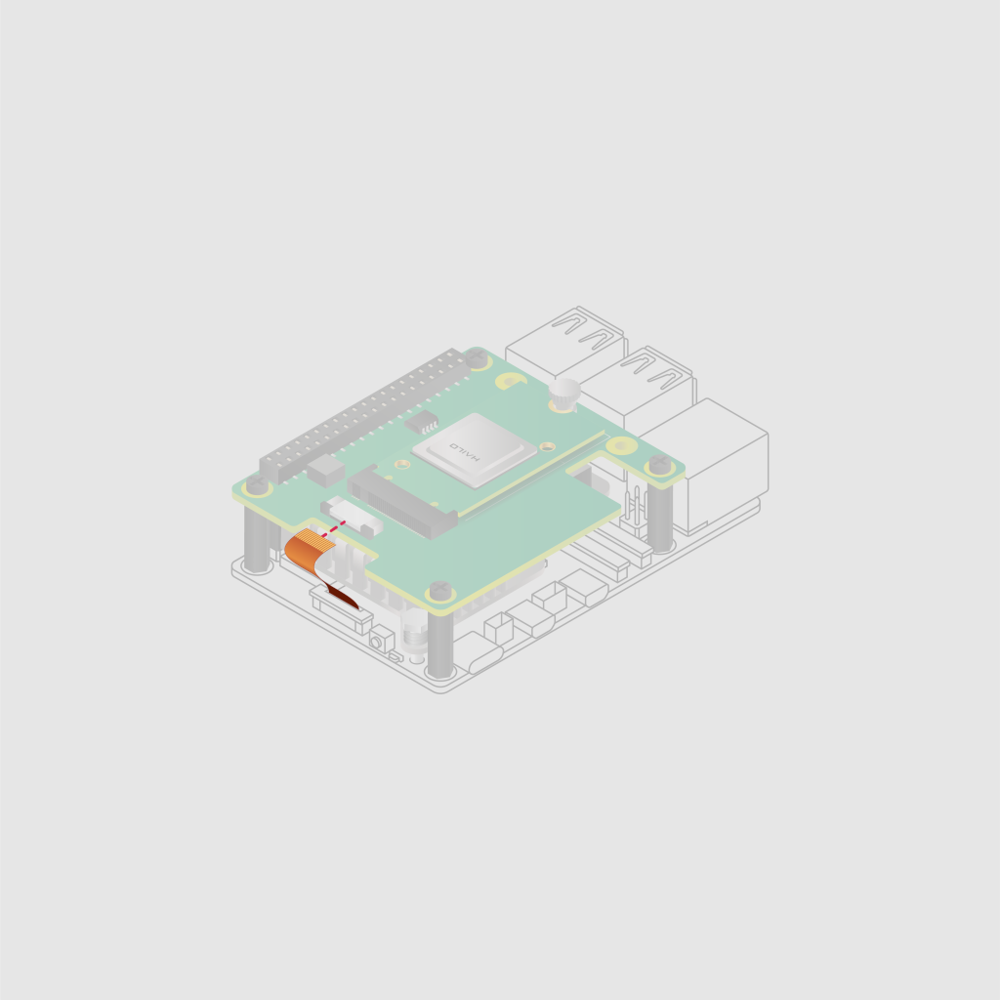
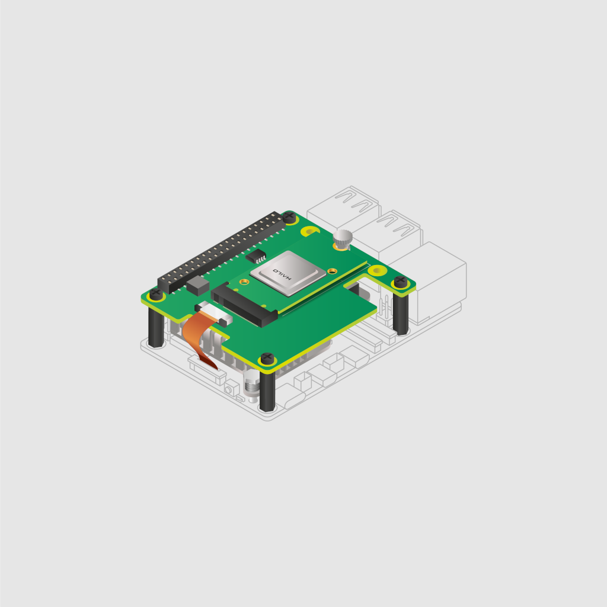

[[ai-kit]]
== About

.The Raspberry Pi AI Kit

The Raspberry Pi AI Kit bundles the xref:m2-hat-plus.adoc#m2-hat-plus[Raspberry Pi M.2 HAT+] with a Hailo AI acceleration module for use with Raspberry Pi 5. The kit contains the following:

* Hailo AI module containing a Neural Processing Unit (NPU)
* Raspberry Pi M.2 HAT+, to connect the AI module to your Raspberry Pi 5
* thermal pad pre-fitted between the module and the M.2 HAT+
* mounting hardware kit
* 16 mm stacking GPIO header

== AI module features

* 13 tera-operations per second (TOPS) neural network inference accelerator built around the Hailo-8L chip.
* M.2 2242 form factor

[[ai-kit-installation]]
== Install

To use the AI Kit, you will need:

* a Raspberry Pi 5

Each AI Kit comes with a pre-installed AI module, ribbon cable, GPIO stacking header, and mounting hardware. Complete the following instructions to install your AI Kit:

. First, ensure that your Raspberry Pi runs the latest software. Run the following command to update:
+
[source,console]
----
$ sudo apt update && sudo apt full-upgrade
----

. Next, xref:../computers/raspberry-pi.adoc#update-the-bootloader-configuration[ensure that your Raspberry Pi firmware is up-to-date]. Run the following command to see what firmware you're running:
+
[source,console]
----
$ sudo rpi-eeprom-update
----
+
If you see 6 December 2023 or a later date, proceed to the next step. If you see a date earlier than 6 December 2023, run the following command to open the Raspberry Pi Configuration CLI:
+
[source,console]
----
$ sudo raspi-config
----
+
Under `Advanced Options` > `Bootloader Version`, choose `Latest`. Then, exit `raspi-config` with `Finish` or the *Escape* key.
+
Run the following command to update your firmware to the latest version:
+
[source,console]
----
$ sudo rpi-eeprom-update -a
----
+
Then, reboot with `sudo reboot`.

. Disconnect the Raspberry Pi from power before beginning installation.

. For the best performance, we recommend using the AI Kit with the Raspberry Pi Active Cooler. If you have an Active Cooler, install it before installing the AI Kit.
+
--

--
. Install the spacers using four of the provided screws. Firmly press the GPIO stacking header on top of the Raspberry Pi GPIO pins; orientation does not matter as long as all pins fit into place. Disconnect the ribbon cable from the AI Kit, and insert the other end into the PCIe port of your Raspberry Pi. Lift the ribbon cable holder from both sides, then insert the cable with the copper contact points facing inward, towards the USB ports. With the ribbon cable fully and evenly inserted into the PCIe port, push the cable holder down from both sides to secure the ribbon cable firmly in place.
+
--

--
. Set the AI Kit on top of the spacers, and use the four remaining screws to secure it in place.
+
--

--
. Insert the ribbon cable into the slot on the AI Kit. Lift the ribbon cable holder from both sides, then insert the cable with the copper contact points facing up. With the ribbon cable fully and evenly inserted into the port, push the cable holder down from both sides to secure the ribbon cable firmly in place.
+
--

--
. Congratulations, you have successfully installed the AI Kit. Connect your Raspberry Pi to power; Raspberry Pi OS will automatically detect the AI Kit.
+
--

--

WARNING: Always disconnect your Raspberry Pi from power before connecting or disconnecting a device from the M.2 slot.

== Get started with AI on your Raspberry Pi

To start running AI accelerated applications on your Raspberry Pi, check out our xref:../computers/ai.adoc[Getting Started with the AI Kit and AI HAT+] guide.
