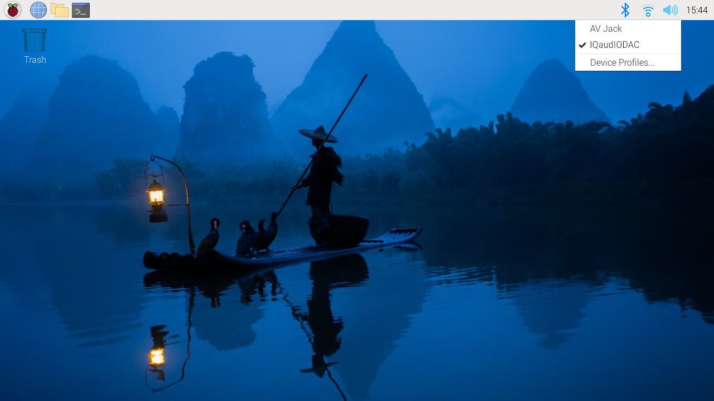

== Configuration

A pre-programmed EEPROM is included on all Raspberry Pi audio boards. Raspberry Pi audio boards are designed to be plug-and-play; Raspberry Pi OS is able to automatically detect and configure itself. In Raspberry Pi OS, right-clicking on the audio settings in the top right-hand corner of your screen will allow you to switch between the on-board audio settings and the HAT audio settings:

There are a number of third-party audio software applications available for Raspberry Pi that will support the plug-and-play feature of our audio boards. Often these are used headless. They can be controlled via a PC or Mac application, or by a web server installed on Raspberry Pi, with interaction through a webpage.

If you need to configure Raspberry Pi OS yourself, perhaps if you're running a headless system of your own and don't have the option of control via the GUI, you will need to make your Raspberry Pi audio board the primary audio device in Raspberry Pi OS, disabling the Raspberry Pi's on-board audio device. This is done by editing the xref:../computers/config_txt.adoc#what-is-config-txt[`/boot/firmware/config.txt`] file. Using a Terminal session connected to your Raspberry Pi via SSH, run the following command to edit the file:

[source,console]
----
$ sudo nano /boot/firmware/config.txt
----

Find the `dtparam=audio=on` line in the file and comment it out by placing a # symbol at the start of the line. Anything written after the # symbol in any given line will be disregarded by the program. Your `/boot/firmware/config.txt` file should now contain the following entry:

[source,ini]
----
#dtparam=audio=on
----

Press `Ctrl+X`, then the `Y` key, then *Enter* to save. Finally, reboot your Raspberry Pi in order for the settings to take effect.

[source,console]
----
$ sudo reboot
----

Alternatively, the `/boot/firmware/config.txt` file can be edited directly onto the Raspberry Pi's microSD card, inserted into your usual computer. Using the default file manager, open the `/boot/firmware/` volume on the card and edit the `config.txt` file using an appropriate text editor, then save the file, eject the microSD card and reinsert it back into your Raspberry Pi.

=== Attach the HAT

The Raspberry Pi audio boards attach to the Raspberry Pi's 40-pin header. They are designed to be supported on the Raspberry Pi using the supplied circuit board standoffs and screws. No soldering is required on the Raspberry Pi audio boards for normal operation unless you are using hardwired connections for specific connectors such as XLR (External Line Return) connections on the DAC Pro.

All the necessary mounting hardware including spacers, screws and connectors is provided. The PCB spacers should be screwed, finger-tight only, to the Raspberry Pi before adding the audio board. The remaining screws should then be screwed into the spacers from above.

=== Hardware versions

There are multiple versions of the audio cards. Your specific version determines the actions required for configuration. Older, IQaudIO-branded boards have a black PCB. Newer Raspberry Pi-branded boards have a green PCB. These boards are electrically equivalent, but have different EEPROM contents.

After attaching the HAT and applying power, check that the power LED on your audio card is illuminated, if it has one. For example, the Codec Zero has an LED marked `PWR`.

After establishing the card has power, use the following command to check the version of your board:

[source,console]
----
$ grep -a . /proc/device-tree/hat/*
----

If the vendor string says "Raspberry Pi Ltd." then no further action is needed (but see below for the extra Codec Zero configuration). If it says "IQaudIO Limited www.iqaudio.com" then you will need the additional config.txt settings outlined below. If it says "No such file or directory" then the HAT is not being detected, but these config.txt settings may still make it work.

[source,ini]
----
# Some magic to prevent the normal HAT overlay from being loaded
dtoverlay=
# And then choose one of the following, according to the model:
dtoverlay=rpi-codeczero
dtoverlay=rpi-dacplus
dtoverlay=rpi-dacpro
dtoverlay=rpi-digiampplus
----

=== Extra Codec Zero configuration

The Raspberry Pi Codec Zero board uses the Dialog Semiconductor DA7212 codec. This allows
the recording of audio from the built-in MEMS microphone, from stereo phono sockets (AUX
IN) or two mono external electret microphones. Playback is through stereo phono sockets (AUX OUT)
or a mono speaker connector.

Each input and output device has its own mixer, allowing the audio levels and volume to be adjusted
independently. Within the codec itself, other mixers and switches exist to allow the output to be mixed to a single mono channel for single-speaker output. Signals may also be inverted; there is a five-band equaliser to adjust certain frequency bands. These settings can be controlled interactively, using AlsaMixer, or programmatically.

Both the AUX IN and AUX OUT are 1V RMS. It may be necessary to adjust
the AUX IN's mixer to ensure that the input signal doesn't saturate the ADC. Similarly, the output mixers can be to be adjusted to get the best possible output.

Preconfigured scripts (loadable ALSA settings) https://github.com/raspberrypi/Pi-Codec[are available on GitHub], offering:
 
* Mono MEMS mic recording, mono speaker playback
* Mono MEMS mic recording, mono AUX OUT playback
* Stereo AUX IN recording, stereo AUX OUT playback
* Stereo MIC1/MIC2 recording, stereo AUX OUT playback

The Codec Zero needs to know which of these input and output settings are being used each time the Raspberry Pi powers on. Using a Terminal session on your Raspberry Pi, run the following command to download the scripts:

[source,console]
----
$ git clone https://github.com/raspberrypi/Pi-Codec.git
----

If git is not installed, run the following command to install it:

[source,console]
----
$ sudo apt install git
----

The following command will set your device to use the on-board MEMS microphone and output for speaker playback:

[source,console]
----
$ sudo alsactl restore -f /home/<username>/Pi-Codec/Codec_Zero_OnboardMIC_record_and_SPK_playback.state
----

This command may result in erroneous messages, including the following:

* "failed to import hw"
* "No state is present for card"

In most cases, these warnings are harmless; you can safely ignore them.

However, the following warnings may indicate a hardware failure:

* "Remote I/O error"

In Linux, the following warnings indicate that the kernel can't communicate with an I2C device:

* "Remote I/O error" (`REMOTEIO`)

In order for your project to operate with your required settings when it is powered on, edit the `/etc/rc.local` file. The contents of this file are run at the end of every boot process, so it is ideal for this purpose. Edit the file:

[source,console]
----
$ sudo nano /etc/rc.local
----

Add the chosen script command above the exit 0 line and then *Ctrl X*, *Y* and *Enter* to save. The file should now look similar to this depending on your chosen setting:

[source,bash]
----
#!/bin/sh
#
# rc.local
#
# This script is executed at the end of each multiuser runlevel.
# Make sure that the script will "exit 0" on success or any other
# value on error.
#
# In order to enable or disable this script just change the execution
# bits.
#
# By default this script does nothing.

sudo alsactl restore -f /home/<username>/Pi-Codec/Codec_Zero_OnboardMIC_record_and_SPK_playback.state

exit 0
----

Press `Ctrl+X`, then the `Y` key, then *Enter* to save. Reboot for the settings to take effect:

[source,console]
----
$ sudo reboot
----

If you are using your Raspberry Pi and Codec Zero in a headless environment, there is one final step required to make the Codec Zero the default audio device without access to the GUI audio settings on the desktop. We need to create a small file in your home folder:

[source,console]
----
$ sudo nano .asoundrc
----

Add the following to the file:

----
pcm.!default {
        type hw
        card Zero
}
----

Press `Ctrl+X`, then the `Y` key, then *Enter* to save. Reboot once more to complete the configuration:

Modern Linux distributions such as Raspberry Pi OS typically use PulseAudio or PipeWire for audio control. These frameworks are capable of mixing and switching audio from multiple sources. They provide a high-level API for audio applications to use. Many audio apps use these frameworks by default.

Only create `~/.asoundrc` if an audio application needs to:

* communicate directly with ALSA
* run in an environment where PulseAudio or PipeWire are not present

This file can interfere with the UI's view of underlying audio resources. As a result, we do not recommend creating `~/.asoundrc` when running the Raspberry Pi OS desktop.
The UI may automatically clean up and remove this file if it exists.

[source,console]
----
$ sudo reboot
----

=== Mute and unmute the DigiAMP{plus}

The DigiAMP{plus} mute state is toggled by GPIO22 on Raspberry Pi. The latest audio device tree
supports the unmute of the DigiAMP{plus} through additional parameters.

Firstly a "one-shot" unmute when kernel module loads.

For Raspberry Pi boards:

[source,ini]
----
dtoverlay=rpi-digiampplus,unmute_amp
----

For IQaudIO boards:

[source,ini]
----
dtoverlay=iqaudio-digiampplus,unmute_amp
----

Unmute the amp when an ALSA device is opened by a client. Mute, with a five-second delay
when the ALSA device is closed. (Reopening the device within the five-second close
window will cancel mute.)

For Raspberry Pi boards:

[source,ini]
----
dtoverlay=rpi-digiampplus,auto_mute_amp
----

For IQaudIO boards:

[source,ini]
----
dtoverlay=iqaudio-digiampplus,auto_mute_amp
----

If you do not want to control the mute state through the device tree, you can also script your own
solution. 

The amp will start up muted. To unmute the amp:

[source,console]
----
$ sudo sh -c "echo 22 > /sys/class/gpio/export"
$ sudo sh -c "echo out >/sys/class/gpio/gpio22/direction"
$ sudo sh -c "echo 1 >/sys/class/gpio/gpio22/value"
----

To mute the amp once more:

[source,console]
----
$ sudo sh -c "echo 0 >/sys/class/gpio/gpio22/value"
----
