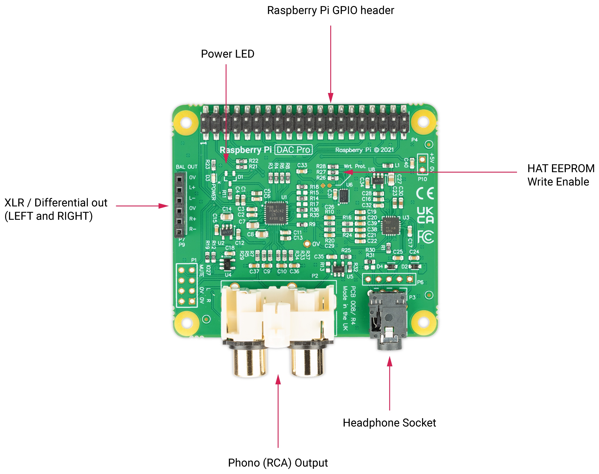
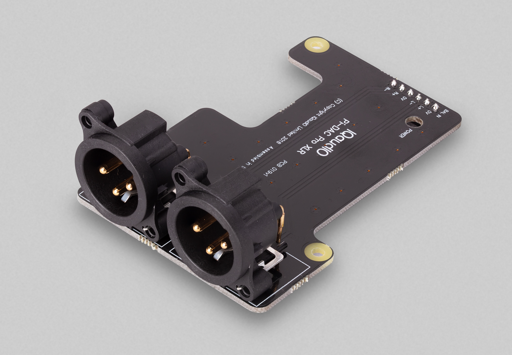

=== Raspberry Pi DAC Pro

The Raspberry Pi DAC Pro HAT is our highest-fidelity digital to analogue converter (DAC).

With the Texas Instruments PCM5242, the DAC Pro provides outstanding signal-to-noise ratio (SNR)
and supports balanced/differential output in parallel to phono/RCA line-level output. It also includes a
dedicated headphone amplifier. The DAC Pro is powered by a Raspberry Pi through the GPIO header.

As part of the DAC Pro, two three-pin headers (P7/P9) are exposed above the Raspberry Pi's USB and Ethernet ports for use by the optional XLR board, allowing differential/balanced output.

==== Pinouts
[cols="1,12"]
|===
| *P1* | Analogue out (0-2V RMS), carries GPIO27, MUTE signal (headphone detect), left and right
audio and left and right ground.
| *P6* | Headphone socket signals (1: LEFT, 2: GROUND, 3: RIGHT, 4: GROUND, 5: DETECT).
| *P7/9* | Differential (0-4V RMS) output (P7: LEFT, P9: RIGHT).
| *P10* | Alternative 5V input, powering Raspberry Pi in parallel.
|===

==== Optional XLR Board

The Pi-DAC PRO exposes a 6 pin header used by the optional XLR board to provide Differential / Balanced output exposed by XLR sockets above the Pi’s USB/Ethernet ports. 

An XLR connector is used in Studio and some hi-end hifi systems. It can also be used to drive ACTIVE “monitor” speakers as used at discos or on stage.
