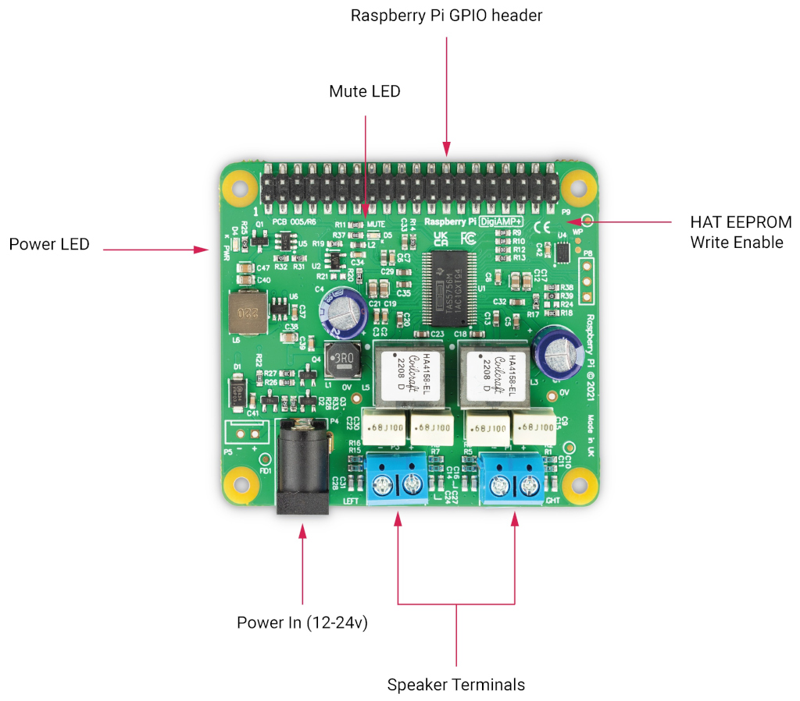

=== Raspberry Pi DigiAMP{plus}

With Raspberry Pi DigiAMP{plus}, you can connect 2 passive stereo speakers up to 35W with variable output, making it ideal for use in Raspberry Pi-based hi-fi systems.

DigiAMP{plus} uses the Texas Instruments TAS5756M PowerDAC and must be powered from an external supply. It requires a 12-24V DC power source (the XP Power VEC65US19 power supply is recommended).

DigiAMP{plus}’s power in barrel connector is 5.5mm x 2.5mm. 

At power-on, the amplifier is muted by default (the mute LED is illuminated). Software is responsible for the mute state and LED control (Raspberry Pi GPIO22).

DigiAMP{plus} is designed to provide power to the Raspberry Pi and DigiAMP{plus} together in parallel, delivering 5.1V at 2.5amp to the Raspberry Pi through the GPIO header.

WARNING: Do not apply power to the Raspberry Pi's own power input when using DigiAMP{plus}.

==== Pinouts 
[cols="1,12"]
|===
| *P5* | Alternative power input for hard wired installations (polarity must be observed).
| *P8* | TAS5756m Internal GPIO1/2/3
|===
