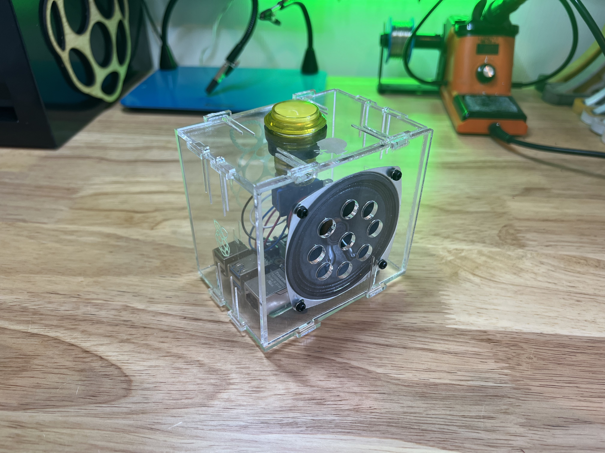
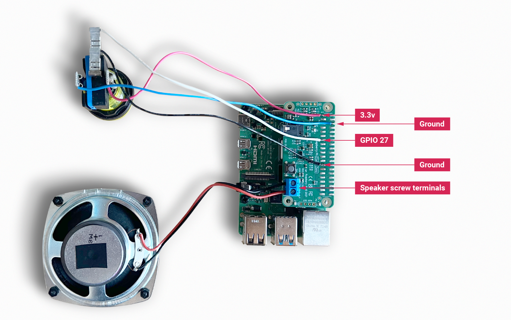

== Getting started

=== Creating a toy chatter box

As an example of what Raspberry Pi Audio Boards can do, let's walk through the creation of a toy chatter box. Its on-board microphone, programmable button and speaker driver make the Codec Zero an ideal choice for this application. 

A random pre-recorded five-second audio clip will be played when the button is pressed. After holding for ten seconds, a notifying burp sound will be emitted, after which a new five-second clip will be recorded. Holding the button down for more than 20 seconds will play a second burp sound, and then erase all previous recordings.

=== Hardware and wiring

For this project, any small passive speaker should be sufficient. We're using one available https://shop.pimoroni.com/products/3-speaker-4-3w?variant=380549926[here], which handles 5W of power at 4Ω. We have also used an illuminated momentary push button, and a laser-cut box to house all the components; but both are entirely optional. This example will work just using the Codec Zero's on-board button, which is pre-wired to GPIO 27. (Alternatively, you can use any momentary push button, such as those available https://shop.pimoroni.com/products/mini-arcade-buttons?variant=40377171274[here].)

Use a small flat-head screwdriver to attach your speaker to the screw terminals. For the additional push button, solder the button wires directly to the Codec Zero pads as indicated, using GPIO pin 27 and Ground for the switch, and +3.3V and Ground for the LED, if necessary. 

=== Setting up your Raspberry Pi

In this example, we are using Raspberry Pi OS Lite. Our guides on https://www.raspberrypi.com/documentation/computers/getting-started.html#installing-the-operating-system[Getting started] cover this topic in great detail. Make sure that you update your operating system before proceeding and follow the instructions provided for Codec Zero configuration, including the commands to enable the on-board microphone and speaker output.

=== Programming your Raspberry Pi

Open a shell — for instance by connecting via SSH — on your Raspberry Pi and run the following to create our Python script:

----
$ sudo nano chatter_box.py
----

Adding the following to the file:

----
#!/usr/bin/env python3
from gpiozero import Button
from signal import pause
import time
import random
import os
from datetime import datetime

# Print current date

date = datetime.now().strftime("%d_%m_%Y-%H:%M:%S")
print(f"{date}")

# Make sure that the 'sounds' folder exists, and if it does not, create it 

path = '/home/pi/sounds'

isExist = os.path.exists(path)

if not isExist: 
  os.makedirs(path)
  print("The new directory is created!")
  os.system('chmod 777 -R /home/pi/sounds')

# Download a 'burp' sound if it does not already exist 

burp = '/home/pi/burp.wav'

isExist = os.path.exists(burp)
if not isExist:
  os.system('wget http://rpf.io/burp -O burp.wav')
  print("Burp sound downloaded!")

# Setup button functions - Pin 27 = Button hold time 10 seconds.

button = Button(27, hold_time=10)

def pressed():
    global press_time
    press_time = time.time()
    print("Pressed at %s" % (press_time));

def released():
    release_time = time.time()
    pressed_for = release_time - press_time
    print("Released at %s after %.2f seconds" % (release_time, pressed_for))
    if pressed_for < button.hold_time:
        print("This is a short press")
        randomfile = random.choice(os.listdir("/home/pi/sounds/"))
        file = '/home/pi/sounds/' + randomfile
        os.system('aplay ' + file)
    elif pressed_for > 20:
        os.system('aplay ' + burp)
        print("Erasing all recorded sounds")
        os.system('rm /home/pi/sounds/*');
		
def held():
    print("This is a long press")
    os.system('aplay ' + burp)
    os.system('arecord --format S16_LE --duration=5 --rate 48000 -c2 /home/pi/sounds/$(date +"%d_%m_%Y-%H_%M_%S")_voice.m4a');

button.when_pressed = pressed
button.when_released = released
button.when_held = held

pause()

----

Ctrl X, Y and Enter to save. To make the script executable, type the following:

----
$ sudo chmod +x chatter_box.py
----

Enter the following to create a crontab daemon that will automatically start the script each time the device is powered on:

----
$ crontab -e
----

You will be asked to select an editor; we recommend you use `nano`. Select it by entering the corresponding number, and press Enter to continue. The following line should be added to the bottom of the file:

----
@reboot python /home/pi/chatter_box.py
----

Ctrl X, Y and Enter to save, then reboot your device. 

=== Operating your device

The final step is to ensure that everything is operating as expected. Press the button and release it when you hear the burp. The recording will now begin for a period of five seconds. Once you have released the button, press it briefly again to hear the recording. Repeat this process as many times as you wish, and your sounds will be played at random. You can delete all recordings by pressing and holding the button, keeping the button pressed during the first burp and recording process, and releasing it after at least 20 seconds, at which point you will hear another burp sound confirming that the recordings have been deleted.

video::BjXERzu8nS0[youtube]

=== Next steps

Upgrades! It is always fun to upgrade a project, so why not add some additional features, such as an LED that will illuminate when recording? This project has all the parts required to make your own version of a https://aiyprojects.withgoogle.com/[Google intelligent speaker system], or you may want to consider building a second device that can be used to create a pair of walkie-talkies that are capable of transferring audio files over a network via SSH. 

