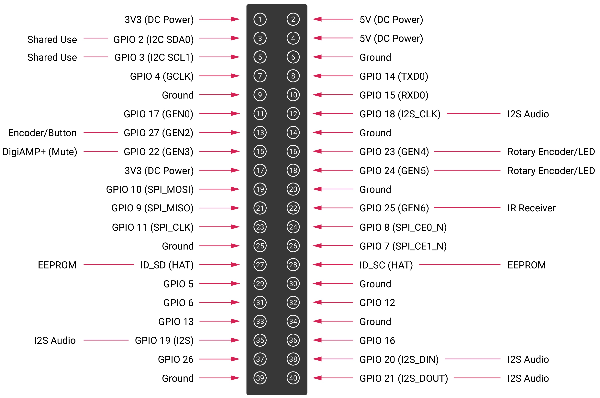
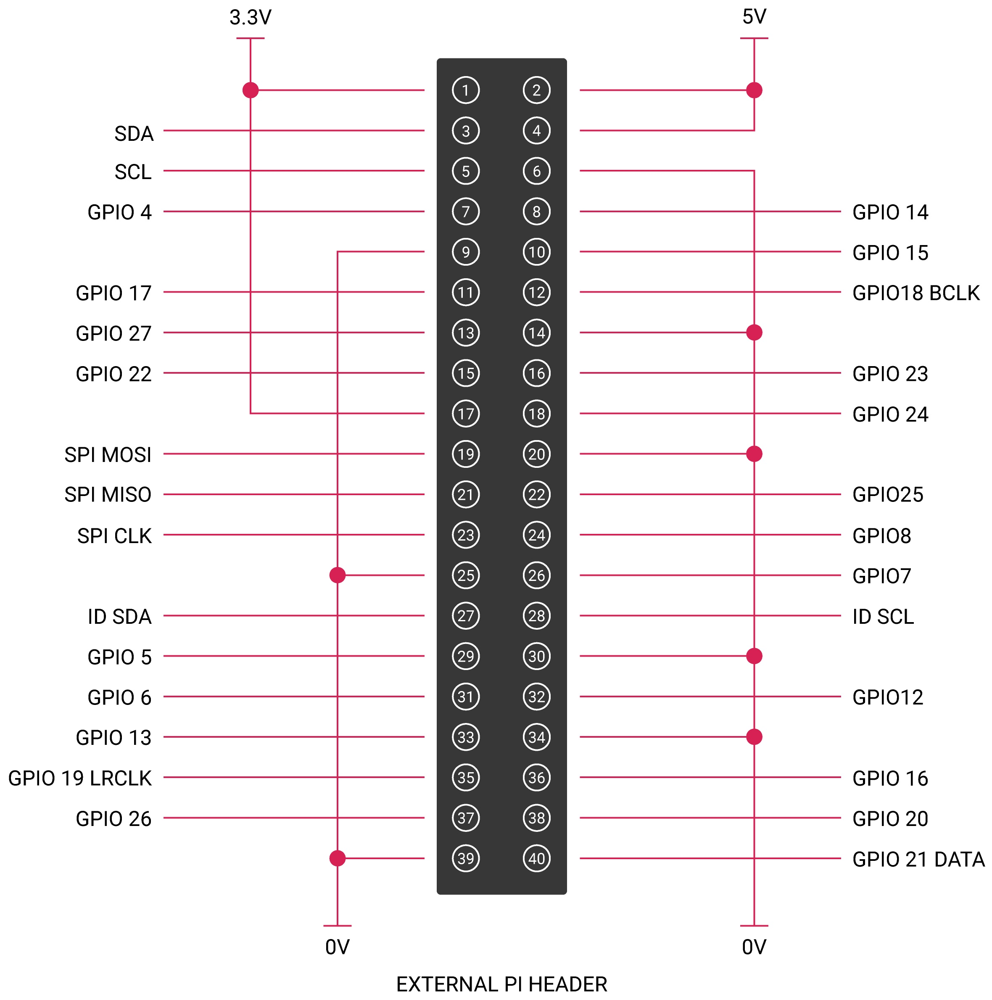

== Hardware information

Hardware information: 

* PCB screws are all M2.5.
* PCB standoffs (for case) are 5mm male/female.
* PCB standoffs (for Raspberry Pi to audio boards) are 9mm female/female.
* PCB standoffs (for XLR to DAC PRO) are 8mm female/male.
* PCB standoffs (for the official Raspberry Pi 7-inch display) are 5mm male/female.
* The rotary encoders we have used and tested are the Alpha three-pin rotary encoder
RE160F-40E3-20A-24P, the ALPS EC12E2430804 (RS: 729-5848), and the Bourns ECW0JB24-AC0006L (RS: 263-2839).
* The barrel connector used for powering the DigiAMP{plus} is 2.5mmID, 5.5mmOD, 11mm.
* The DigiAMP{plus} is designed to operate with a 12V to 24V, 3A supply such as the XPPower
VEC65US19 or similar.
* The DigiAMP{plus} uses CamdenBoss two-part connectors. Those fitted to the PCB are 
CTBP9350/2AO.
* The speaker terminal used on the Codec Zero will accept wires of between 14~26 AWG
(wire of max 1.6mm in diameter).

=== GPIO usage 

Raspberry Pi audio boards take advantage of a number of pins on the GPIO header in
order to operate successfully. Some of these pins are solely for the use of the board, and
some can be shared with other peripherals, sensors, etc.

The following Raspberry Pi GPIO pins will be used by the audio boards:

* All power pins
* All ground pins
* GPIO 2/3 (I2C)
* GPIO 18/19/20/21 (I2S)

If appropriate then the following are also used:

* GPIO 22 (DigiAMP+ mute/unmute support)
* GPIO 23/24 for rotary encoder (physical volume control) or status LED (Codec Zero)
* GPIO 25 for the IR Sensor
* GPIO 27 for the rotary encoder push switch/Codec Zero switch

=== DAC PRO, DAC{plus}, DigiAMP{plus}, Codec Zero

The DAC PRO, DAC{plus} and DigiAMP{plus} re-expose the Raspberry Pi signals, allowing additional sensors and peripherals
to be added easily. Please note that some signals are for exclusive use (I2S and EEPROM) by some
of our boards; others such as I2C can be shared across multiple boards.

=== Saving AlsaMixer settings

To store the AlsaMixer settings, add the following at the command line:

----
$ sudo alsactl store
----

You can save the current state to a file, then reload that state at startup.

To save:

----
$ sudo alsactl store -f /home/pi/usecase.state
----

To restore a saved file:

----
$ sudo alsactl restore -f /home/pi/usecase.state
----

=== Using external USB devices

If you want to enable 1.2 amp USB support (to allow USB hard disks to power up when
accessory boards are in use), you may also want to add the following line to your `/boot/config.txt`
file:

----
max_usb_current=1
----

=== MPD-based audio with volume control

To allow Music Player Daemon (MPD)-based audio software to control the audio board’s built in volume, the file
`/etc/mpd.conf` may need to be changed to support the correct AlsaMixer name.

This can be achieved by ensuring the 'Audio output' section of `/etc/mpd.conf` has the 'mixer_control'
line. Below is an example for the Texas Instruments-based boards (DAC
PRO/DAC{plus}/DigiAMP{plus}):

----
audio_output {
    type "alsa"
    name "ALSA Device"
    mixer_control "Digital"
}
----

