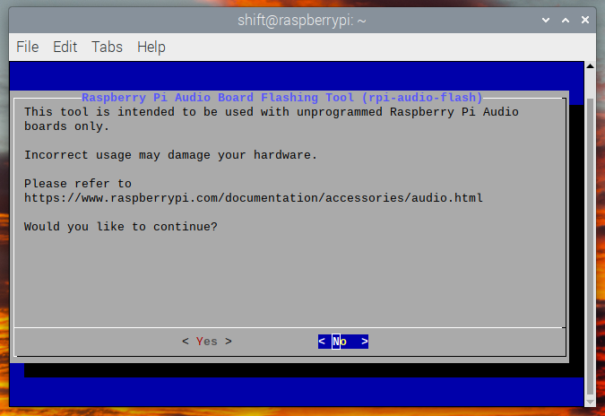
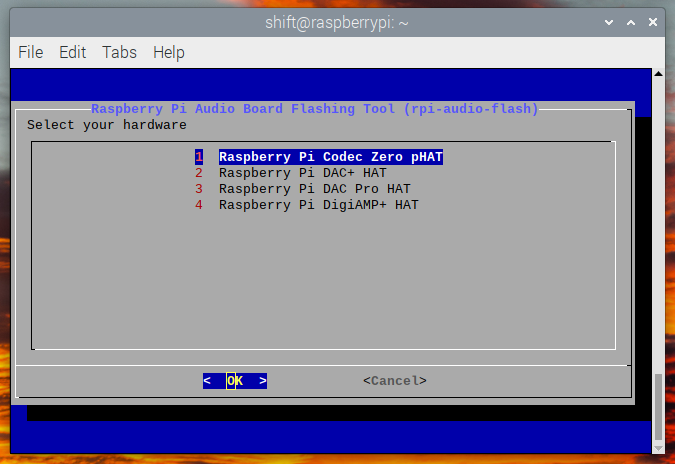
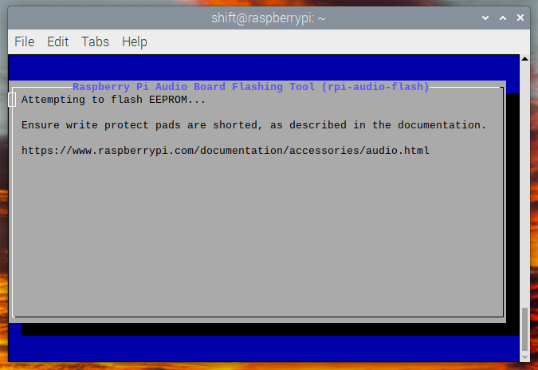
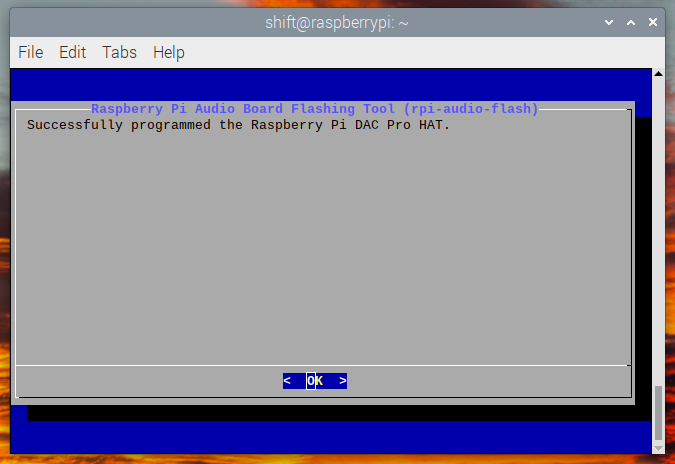

== Updating your firmware

Raspberry Pi Audio Boards use an EEPROM that contains information that is used by the host Raspberry Pi device to select the appropriate driver at boot time. This information is programmed into the EEPROM during manufacture. There are some circumstances where the end user may wish to update the EEPROM contents: this can be done from the command line.

IMPORTANT: Before proceeding, you should update the Raspberry Pi OS running on your Raspberry Pi to the latest version.

=== The EEPROM write-protect link

During the programming process you will need to connect the two pads shown in the red box with a wire to pull down the EEPROM write-protect link.

image::images/write_protect_tabs.jpg[width="80%"]

NOTE: In some cases the two pads may already have a 0Ω resistor fitted to bridge the write-protect link, as illustrated in the picture of the Codec Zero board above.

=== EEPROM Programming

Once the write-protect line has been pulled down, the EEPROM can be programmed. 

You should first install the utilities and then run the programmer. Open up a terminal window and type the following:

----
$ sudo apt update
$ sudo apt install rpi-audio-utils
$ sudo rpi-audio-flash
----

After starting you will be presented with a warning screen.

Selecting "Yes" to proceed will present you with a menu allowing you to select your hardware.

NOTE: If no HAT is present, or if the connected HAT is not a Raspberry Pi Audio board, you will be presented with an error screen. If the firmware has already been updated on the board, a message will be displayed informing you that you do not have to continue.

After selecting the correct hardware a screen will display while the new firmware is flashed to the HAT.

Afterwards a screen will display telling you that the new firmware has installed.

NOTE: If the firmware fails to install correctly, an error screen will be displayed. In the first instance you should remove and reseat the HAT board and try flashing the firmware again.

