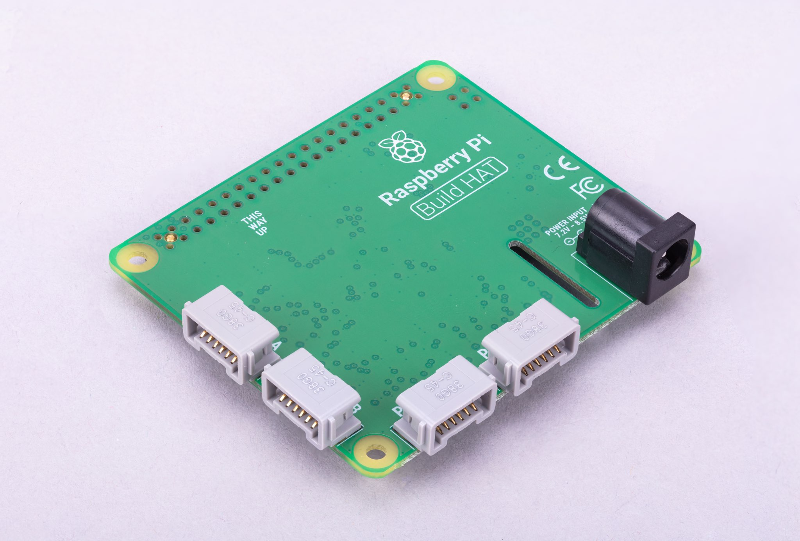
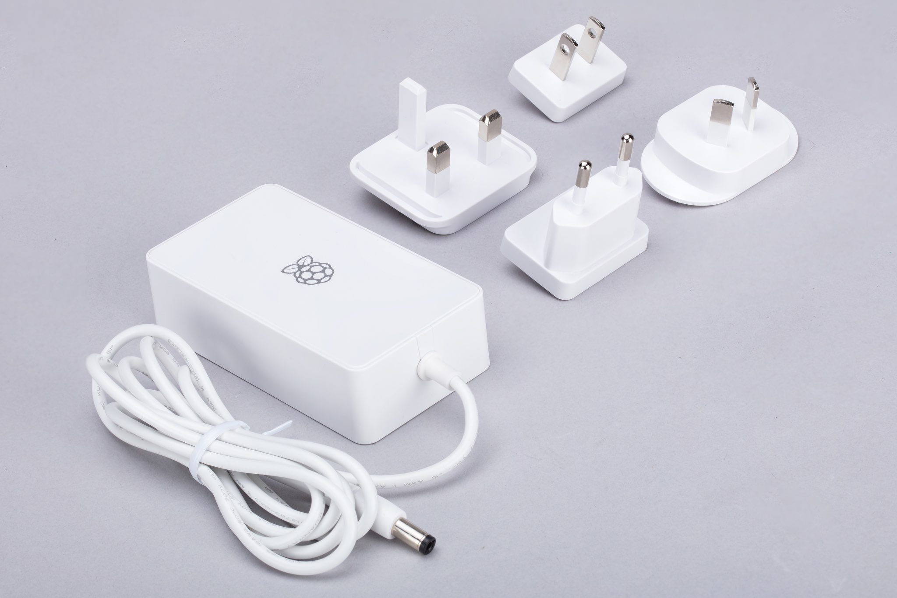

[[about-build-hat]]
== About

The https://raspberrypi.com/products/build-hat[Raspberry Pi Build HAT] is an add-on board that connects to the 40-pin GPIO header of your Raspberry Pi, which was designed in collaboration with LEGO® Education to make it easy to control LEGO® Technic™ motors and sensors with Raspberry Pi computers.

WARNING: The Raspberry Pi Build HAT is not yet supported by Raspberry Pi OS _Trixie_. To use the Build HAT, install or stay on Raspberry Pi OS _Bookworm_ for now.

NOTE: A full list of supported devices can be found in the xref:build-hat.adoc#device-compatibility[Device Compatibility] section.

It provides four connectors for LEGO® Technic™ motors and sensors from the SPIKE™ Portfolio. The available sensors include a distance sensor, a colour sensor, and a versatile force sensor. The angular motors come in a range of sizes and include integrated encoders that can be queried to find their position.

The Build HAT fits all Raspberry Pi computers with a 40-pin GPIO header, including, with the addition of a ribbon cable or other extension device, Keyboard-series devices. Connected LEGO® Technic™ devices can easily be controlled in Python, alongside standard Raspberry Pi accessories such as a camera module.

The Raspberry Pi Build HAT power supply (PSU), which is https://raspberrypi.com/products/build-hat-power-supply[available separately], is designed to power both the Build HAT and Raspberry Pi computer along with all connected LEGO® Technic™ devices.

The LEGO® Education SPIKE™ Prime Set 45678 and SPIKE™ Prime Expansion Set 45681, available separately from LEGO® Education resellers, include a collection of useful elements supported by the Build HAT.

NOTE: The HAT works with all 40-pin GPIO Raspberry Pi boards, including Zero-series devices. With the addition of a ribbon cable or other extension device, it can also be used with Keyboard-series devices.

* Controls up to 4 LEGO® Technic™ motors and sensors included in the SPIKE™ Portfolio
* Easy-to-use https://buildhat.readthedocs.io/[Python library] to control your LEGO® Technic™ devices
* Fits onto any Raspberry Pi computer with a 40-pin GPIO header
* Onboard xref:../microcontrollers/silicon.adoc[RP2040] microcontroller manages low-level control of LEGO® Technic™ devices
* External 8V PSU https://raspberrypi.com/products/build-hat-power-supply[available separately] to power both Build HAT and Raspberry Pi

[NOTE]
====
The Build HAT cannot power Keyboard-series devices, since they do not support power supply over the GPIO headers.
====
