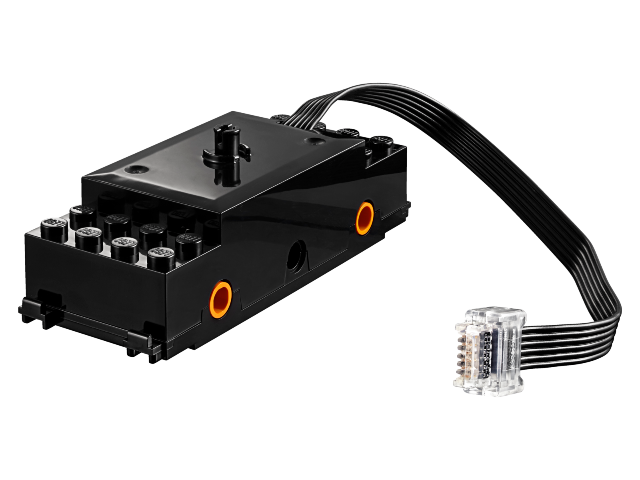
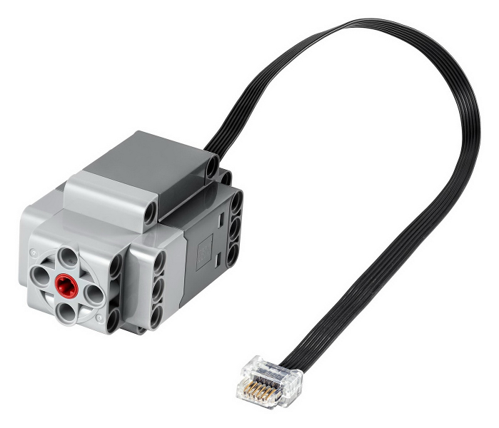

=== Using Motors from .NET

There are two types of motors, the *passive* ones and the *active* ones. Active motors will provide detailed position, absolute position and speed while passive motors can only be controlled with speed.

A common set of functions to control the speed of the motors are available. There are 2 important ones: `SetPowerLimit` and `SetBias`:

[csharp]
----
train.SetPowerLimit(1.0);
train.SetBias(0.2);
----

The accepted values are only from 0.0 to 1.0. The power limit is a convenient ay to reduce in proportion the maximum power.

The bias value sets for the current port which is added to positive motor drive values and subtracted from negative motor drive values. This can be used to compensate for the fact that most DC motors require a certain amount of drive before they will turn at all.

The default values when a motor is created is 0.7 for the power limit and 0.3 for the bias.

==== Passive Motors

.Train motor, https://www.bricklink.com/v2/catalog/catalogitem.page?S=88011-1&name=Train%20Motor&category=%5BPower%20Functions%5D%5BPowered%20Up%5D#T=S&O={%22iconly%22:0}[Image from Bricklink]

The typical passive motor is a train and older Powered Up motors. The `Speed` property can be set and read. It is the target and the measured speed at the same time as those sensors do not have a way to measure them. The value is from -100 to +100.

Functions to control `Start`, `Stop` and `SetSpeed` are also available. Here is an example of how to use it:

[csharp]
----
Console.WriteLine("This will run the motor for 20 secondes incrementing the PWM");
train.SetPowerLimit(1.0);
train.Start();
for (int i = 0; i < 100; i++)
{
    train.SetSpeed(i);
    Thread.Sleep(250);
}

Console.WriteLine("Stop the train for 2 seconds");
train.Stop();
Thread.Sleep(2000);
Console.WriteLine("Full speed backward for 2 seconds");
train.Start(-100);
Thread.Sleep(2000);
Console.WriteLine("Full speed forward for 2 seconds");
train.Start(100);
Thread.Sleep(2000);
Console.WriteLine("Stop the train");
train.Stop();
----

NOTE: Once the train is started, you can adjust the speed and the motor will adjust accordingly.

==== Active Motors

.Active motor, https://www.bricklink.com/v2/catalog/catalogitem.page?S=88014-1&name=Technic%20XL%20Motor&category=%5BPower%20Functions%5D%5BPowered%20Up%5D#T=S&O={%22iconly%22:0}[Image from Bricklink]

Active motors have `Speed`, `AbsolutePosition`, `Position` and `TargetSpeed` as special properties. They are read continuously even when the motor is stopped.

The code snippet shows how to get the motors, start them and read the properties:

[csharp]
----
brick.WaitForSensorToConnect(SensorPort.PortA);
brick.WaitForSensorToConnect(SensorPort.PortD);
var active = (ActiveMotor)brick.GetMotor(SensorPort.PortA);
var active2 = (ActiveMotor)brick.GetMotor(SensorPort.PortD);
active.Start(50);
active2.Start(50);
// Make sure you have an active motor plug in the port A and D
while (!Console.KeyAvailable)
{
    Console.CursorTop = 1;
    Console.CursorLeft = 0;
    Console.WriteLine($"Absolute: {active.AbsolutePosition}     ");
    Console.WriteLine($"Position: {active.Position}     ");
    Console.WriteLine($"Speed: {active.Speed}     ");
    Console.WriteLine();
    Console.WriteLine($"Absolute: {active2.AbsolutePosition}     ");
    Console.WriteLine($"Position: {active2.Position}     ");
    Console.WriteLine($"Speed: {active2.Speed}     ");
}

active.Stop();
active2.Stop();
----

NOTE: You should not forget to start and stop your motors when needed.

Advance features are available for active motors. You can request to move for seconds, to a specific position, a specific absolute position. Here are couple of examples:

[csharp]
----
// From the previous example, this will turn the motors back to their initial position:
active.TargetSpeed = 100;
active2.TargetSpeed = 100;
// First this motor and will block the thread
active.MoveToPosition(0, true);
// Then this one and will also block the thread
active2.MoveToPosition(0, true);
----

Each function allow you to block or not the thread for the time the operation will be performed. Note that for absolute and relative position moves, there is a tolerance of few degrees.

[csharp]
----
brick.WaitForSensorToConnect(SensorPort.PortA);
var active = (ActiveMotor)brick.GetMotor(SensorPort.PortA);
active.TargetSpeed = 70;
Console.WriteLine("Moving motor to position 0");
active.MoveToPosition(0, true);
Console.WriteLine("Moving motor to position 3600 (10 turns)");
active.MoveToPosition(3600, true);
Console.WriteLine("Moving motor to position -3600 (so 20 turns the other way");
active.MoveToPosition(-3600, true);
Console.WriteLine("Moving motor to absolute position 0, should rotate by 90°");
active.MoveToAbsolutePosition(0, PositionWay.Shortest, true);
Console.WriteLine("Moving motor to position 90");
active.MoveToAbsolutePosition(90, PositionWay.Shortest, true);
Console.WriteLine("Moving motor to position 179");
active.MoveToAbsolutePosition(179, PositionWay.Shortest, true);
Console.WriteLine("Moving motor to position -180");
active.MoveToAbsolutePosition(-180, PositionWay.Shortest, true);
active.Float();
----

You can place the motor in a float position, meaning, there are no more constrains on it. This is a mode that you can use when using the motor as a tachometer, moving it and reading the position. If you still have constrains on the motors, you may not be able to move it.
