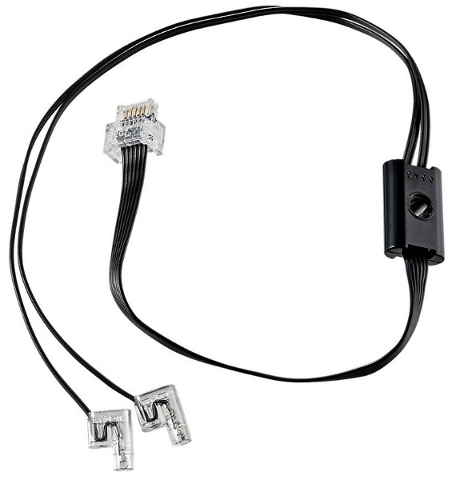
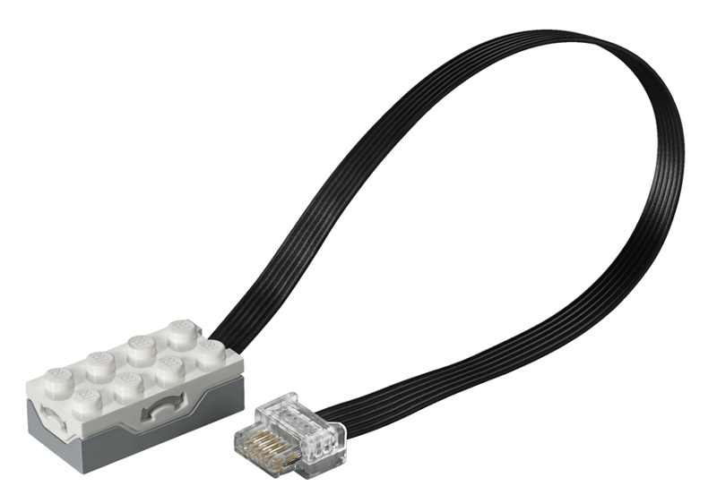
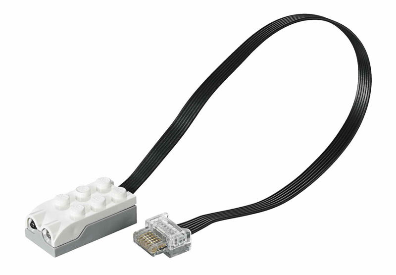
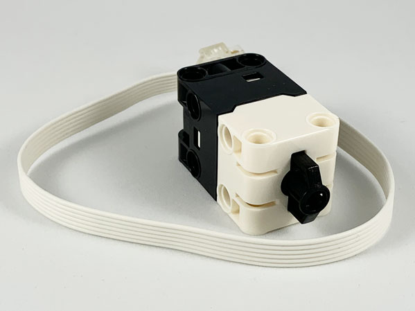
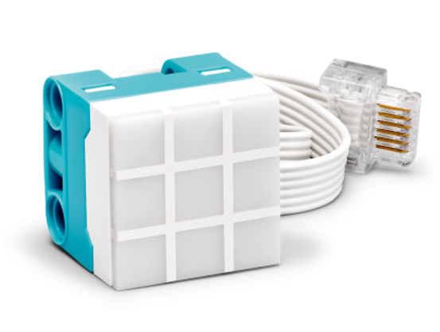
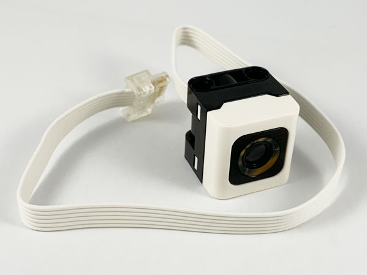
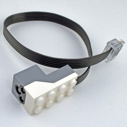
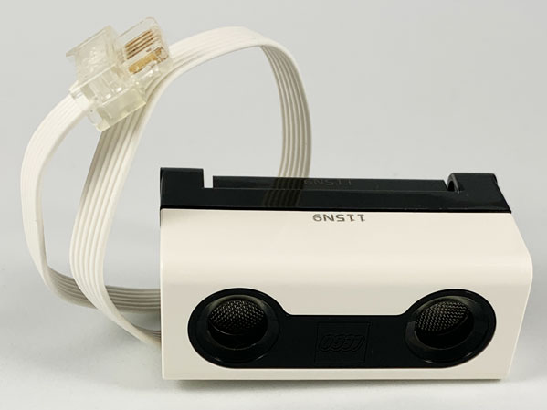

=== Using Sensors from .NET

Like for motors, you have active and passive sensors. Most recent sensors are active. The passive one are lights and simple buttons. Active ones are distance or color sensors, as well as small 3x3 pixel displays.

==== Button/Touch Passive Sensor

The button/touch passive sensor have one specific property `IsPressed`. The property is set to true when the button is pressed. Here is a complete example with events:

[csharp]
----
brick.WaitForSensorToConnect(SensorPort.PortA);
var button = (ButtonSensor)brick.GetSensor(SensorPort.PortA);
bool continueToRun = true;
button.PropertyChanged += ButtonPropertyEvent;
while (continueToRun)
{
    // You can do many other things here
    Thread.Sleep(50);
}

button.PropertyChanged -= ButtonPropertyEvent;
Console.WriteLine($"Button has been pressed, we're stopping the program.");
brick.Dispose();

void ButtonPropertyEvent(object? sender, PropertyChangedEventArgs e)
{
    Console.WriteLine($"Property changed: {e.PropertyName}");
    if (e.PropertyName == nameof(ButtonSensor.IsPressed))
    {
        continueToRun = false;
    }
}
----

==== Passive Light

.Passive light, https://www.bricklink.com/v2/catalog/catalogitem.page?P=22168c01&name=Electric,%20Light%20Unit%20Powered%20Up%20Attachment&category=%5BElectric,%20Light%20&%20Sound%5D#T=C&C=11[Image from Bricklink]

The passive light are the train lights. They can be switched on and you can controlled their brightness.

[csharp]
----
brick.WaitForSensorToConnect(SensorPort.PortA);
var light = (PassiveLight)brick.GetSensor(SensorPort.PortA);
// Brightness 50%
light.On(50);
Thread.Sleep(2000);
// 70% Brightness
light.Brightness = 70;
Thread.Sleep(2000);
// Switch light off
light.Off()
----

==== Active Sensor

The active sensor class is a generic one that all the active sensor heritate including active motors. They contains a set of properties regarding how they are connected to the Build HAT, the modes, the detailed combi modes, the hardware, software versions and a specific property called `ValueAsString`. The value as string contains the last measurement as a collection of strings. A measurement arrives like `P0C0: +23 -42 0`, the enumeration will contains `P0C0:`, `+23`, `-42` and `0`. This is made so if you are using advance modes and managing yourself the combi modes and commands, you'll be able to get the measurements.

All active sensor can run a specific measurement mode or a combi mode. You can setup one through the advance mode using the `SelectModeAndRead` and `SelectCombiModesAndRead` functions with the specific mode(s) you'd like to continuously have. It is important to understand that changing the mode or setting up a new mode will stop the previous mode.

The modes that can be combined in the Combi mode are listed in the `CombiModes` property. Al the properties of the sensors will be updated automatically when you'll setup one of those modes.

==== WeDo Tilt Sensor

.WeDo Tilt sensor, https://www.bricklink.com/v2/catalog/catalogitem.page?S=45305-1&name=WeDo%202.0%20Tilt%20Sensor&category=%5BEducational%20&%20Dacta%5D%5BWeDo%5D#T=S&O={%22iconly%22:0}[Image from Bricklink]

WeDo Tilt Sensor has a special `Tilt` property. The type is a point with X is the X tilt and Y is the Y tilt. The values goes from -45 to + 45, they are caped to those values and represent degrees.

You can set a continuous measurement for this sensor using the `ContinuousMeasurement` property.

[csharp]
----
brick.WaitForSensorToConnect(SensorPort.PortA);
var tilt = (WeDoTiltSensor)brick.GetSensor(SensorPort.PortA);
tilt.ContinuousMeasurement = true;
Point tiltValue;
while(!console.KeyAvailable)
{
    tiltValue = tilt.Tilt;
    console.WriteLine($"Tilt X: {tiltValue.X}, Tilt Y: {tiltValue.Y}");
    Thread.Sleep(200);
}
----

==== WeDoDistance Sensor

.WeDo Distance sensor, https://www.bricklink.com/v2/catalog/catalogitem.page?S=45304-1&name=WeDo%202.0%20Motion%20Sensor&category=%5BEducational%20&%20Dacta%5D%5BWeDo%5D#T=S&O={%22iconly%22:0}[Image from Bricklink]

WeDo Distance Sensor gives you a distance in millimeters with the Distance property.

[csharp]
----
brick.WaitForSensorToConnect(SensorPort.PortA);
var distance = (WeDoDistanceSensor)brick.GetSensor(SensorPort.PortA);
distance.ContinuousMeasurement = true;
while(!console.KeyAvailable)
{    
    console.WriteLine($"Distance: {distance.Distance} mm");
    Thread.Sleep(200);
}
----

==== SPIKE Prime Force Sensor

.Spike Force Sensor, https://www.bricklink.com/v2/catalog/catalogitem.page?P=37312c01&name=Electric%20Sensor,%20Force%20-%20Spike%20Prime&category=%5BElectric%5D#T=C&C=11[Image from Bricklink]

This force sensor measure the pressure applies on it and if it is pressed. The two properties can be access through `Force` and `IsPressed` properties.

[csharp]
----
brick.WaitForSensorToConnect(SensorPort.PortA);
var force = (ForceSensor)brick.GetSensor(SensorPort.PortA);
force.ContinuousMeasurement = true;
while(!force.IsPressed)
{    
    console.WriteLine($"Force: {force.Force} N");
    Thread.Sleep(200);
}
----

==== SPIKE Essential 3x3 Color Light Matrix

.spike 3x3 matrix, https://www.bricklink.com/v2/catalog/catalogitem.page?P=45608c01&name=Electric,%203%20x%203%20Color%20Light%20Matrix%20-%20SPIKE%20Prime&category=%5BElectric%5D#T=C[Image from Bricklink]

This is a small 3x3 display with 9 different leds that can be controlled individually. The class exposes functions to be able to control the screen. Here is an example using them:

[csharp]
----
brick.WaitForSensorToConnect(SensorPort.PortA);
var matrix = (ColorLightMatrix)brick.GetSensor(SensorPort.PortA);
for(byte i = 0; i < 10; i++)
{
    // Will light every led one after the other like a progress bar
    matrix.DisplayProgressBar(i);
    Thread.Sleep(1000);
}

for(byte i = 0; i < 11; i++)
{
    // Will display the matrix with the same color and go through all of them
    matrix.DisplayColor((LedColor)i);
    Thread.Sleep(1000);
}

Span<byte> brg = stackalloc byte[9] { 1, 2, 3, 4, 5, 6, 7, 8, 9 };
Span<LedColor> col = stackalloc LedColor[9] { LedColor.White, LedColor.White, LedColor.White,
  LedColor.White, LedColor.White, LedColor.White, LedColor.White, LedColor.White, LedColor.White };
// Shades of grey
matrix.DisplayColorPerPixel(brg, col);
----

==== SPIKE Prime Color Sensor and Color and Distance Sensor

SPIKE color sensor:

.spike color sensor, https://www.bricklink.com/v2/catalog/catalogitem.page?P=37308c01&name=Electric%20Sensor,%20Color%20-%20Spike%20Prime&category=%5BElectric%5D#T=C&C=11[Image from Bricklink]

Color and distance sensor:

.Color distance sensor, https://www.bricklink.com/v2/catalog/catalogitem.page?P=bb0891c01&name=Electric%20Sensor,%20Color%20and%20Distance%20-%20Boost&category=%5BElectric%5D#T=C&C=1[Image from Bricklink]

Those color sensor has multiple properties and functions. You can get the `Color`, the `ReflectedLight` and the `AmbiantLight`.

On top of this, the Color and Distance sensor can measure the `Distance` and has an object `Counter`. It will count automatically the number of objects which will go in and out of the range. This does allow to count objects passing in front of the sensor. The distance is limited from 0 to 10 centimeters.

[csharp]
----
brick.WaitForSensorToConnect(SensorPort.PortC);

var colorSensor = (ColorAndDistanceSensor)brick.GetActiveSensor(SensorPort.PortC);
while (!Console.KeyAvailable)
{
    var colorRead = colorSensor.GetColor();
    Console.WriteLine($"Color:     {colorRead}");
    var reflected = colorSensor.GetReflectedLight();
    Console.WriteLine($"Reflected: {reflected}");
    var ambiant = colorSensor.GetAmbiantLight();
    Console.WriteLine($"Ambiant:   {ambiant}");
    var distance = colorSensor.GetDistance();
    Console.WriteLine($"Distance: {distance}");
    var counter = colorSensor.GetCounter();
    Console.WriteLine($"Counter:  {counter}");
    Thread.Sleep(200);
}
----

NOTE: For better measurement, it is not recommended to change the measurement mode in a very fast way, the color integration may not be done in a proper way. This example gives you the full spectrum of what you can do with the sensor. Also, this class do not implement a continuous measurement mode. You can setup one through the advance mode using the `SelectModeAndRead` function with the specific mode you'd like to continuously have. It is important to understand that changing the mode or setting up a new mode will stop the previous mode.

==== SPIKE Prime Ultrasonic Distance Sensor

.spike distance sensor, https://www.bricklink.com/v2/catalog/catalogitem.page?P=37316c01&name=Electric%20Sensor,%20Distance%20-%20Spike%20Prime&category=%5BElectric%5D#T=C&C=11[Image from Bricklink]

This is a distance sensor and it does implement a `Distance` property that will give the distance in millimeter. A `ContinuousMeasurement` mode is also available on this one.

[csharp]
----
brick.WaitForSensorToConnect(SensorPort.PortA);
var distance = (UltrasonicDistanceSensor)brick.GetSensor(SensorPort.PortA);
distance.ContinuousMeasurement = true;
while(!console.KeyAvailable)
{    
    console.WriteLine($"Distance: {distance.Distance} mm");
    Thread.Sleep(200);
}
----
