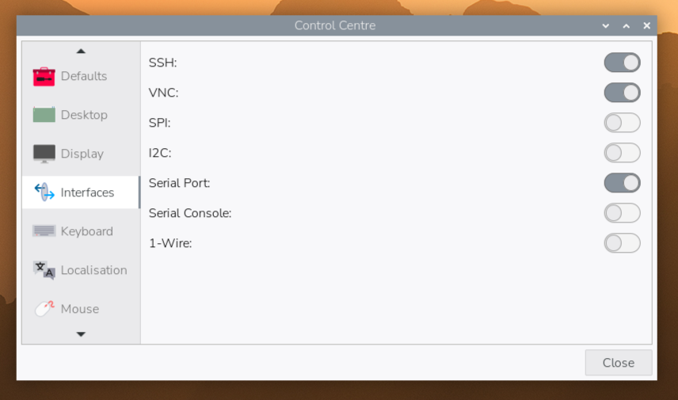
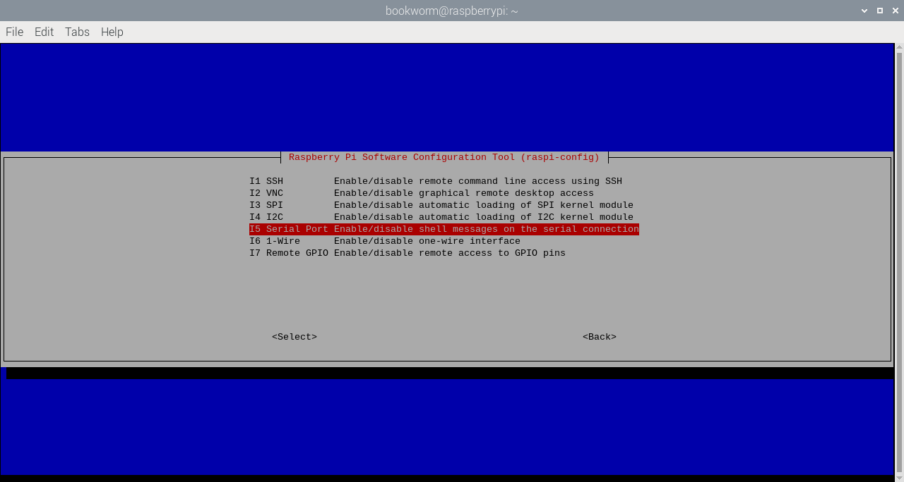

== Preparing your Build HAT

NOTE: Before starting to work with your Raspberry Pi Build HAT you should xref:../computers/getting-started.adoc#setting-up-your-raspberry-pi[set up] your Raspberry Pi, xref:../computers/getting-started.html#installing-the-operating-system[install] the latest version of the operating system using https://www.raspberrypi.org/downloads/[Raspberry Pi Imager].

Attach 9mm spacers to the bottom of the board. Seat the Raspberry Pi Build HAT onto your Raspberry Pi. Make sure you put it on the right way up. Unlike other HATs, all the components are on the bottom, leaving room for a breadboard or LEGO® elements on top.  

image::images/fitting-build-hat.gif[width="80%"]

=== Access the GPIO Pins

If you want to access the GPIO pins of the Raspberry Pi, you can add an optional tall header and use 15 mm spacers.

image::images/tall-headers.png[width="80%"]

The following pins are used by the Build HAT itself and you should not connect anything to them.

[[table_passive_ids]]
[cols="^1,^1,^1", width="75%", options="header"]
|===
| GPIO| Use | Status
| GPIO0/1 | ID prom | 
| GPIO4| Reset | 
| GPIO14| Tx | 
| GPIO15| Rx | 
| GPIO16 | RTS | unused
| GPIO17 | CTS | unused
|===

=== Setting up your Raspberry Pi

Once the Raspberry Pi has booted, open the Raspberry Pi Configuration tool by clicking on the Raspberry Menu button and then selecting “Preferences” and then “Raspberry Pi Configuration”.

Click on the “interfaces” tab and adjust the Serial settings as shown below:

==== Using your Raspberry Pi Headless

If you are running your Raspberry Pi xref:../computers/configuration.html#setting-up-a-headless-raspberry-pi[headless] and using `raspi-config`, select “interface options from the first menu”.

image::images/raspi-config-1.png[width="70%"]

Then “P6 Serial Port”.

Disable the serial console:

image::images/raspi-config-3.png[width="70%"]

And enable the serial port hardware.

image::images/raspi-config-4.png[width="70%"]

The final settings should look like this.

image::images/raspi-config-5.png[width="70%"]

You will need to reboot at this point if you have made any changes.

=== Powering the Build HAT

Connect an external power supply - the https://raspberrypi.com/products/build-hat-power-supply[official Raspberry Pi Build HAT power supply] is recommended. You don’t need to connect a USB power supply to the Raspberry Pi as well.

image::images/powering-build-hat.gif[width="80%"]

[NOTE]
======
The LEGO® Technic™ motors are very powerful; to drive them you’ll need an external 7.5V power supply. If you just want to read from sensors or motor encoders, you can power your Raspberry Pi and Build HAT the usual way, via Raspberry Pi's USB power socket.
======
