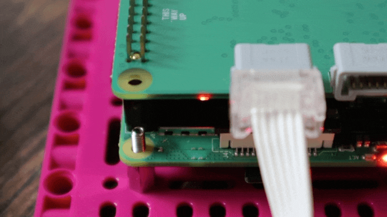
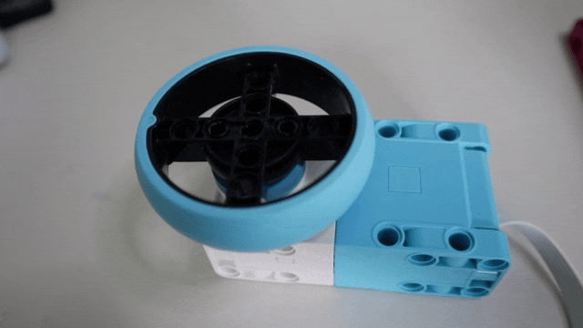

=== Using Motors from Python

There are xref:build-hat.adoc#device-compatibility[a number of motors] that work with the Build HAT.

==== Connecting a Motor

Connect a motor to port A on the Build HAT. The LPF2 connectors need to be inserted the correct way up. If the connector doesn’t slide in easily, rotate by 180 degrees and try again. 

image::images/connect-motor.gif[width="80%"]

==== Working with Motors

Start the https://thonny.org/[Thonny IDE]. Add the program code below:

[source,python,linenums]
----
from buildhat import Motor

motor_a = Motor('A')

motor_a.run_for_seconds(5)
----

Run the program by clicking the play/run button. If this is the first time you’re running a Build HAT program since the Raspberry Pi has booted, there will be a few seconds pause while the firmware is copied across to the board. You should see the red LED extinguish and the green LED illuminate. Subsequent executions of a Python program will not require this pause.

Your motor should turn clockwise for 5 seconds.

Change the final line of your program and re-run. 

[source,python,linenums, start=5]
----
motor_a.run_for_seconds(5, speed=50)
----

The motor should now turn faster. Make another change:

[source,python,linenums, start=5]
----
motor_a.run_for_seconds(5, speed=-50)
----

The motor should turn in the opposite (anti-clockwise) direction

Create a new program by clicking on the plus button in Thonny. Add the code below:

[source,python]
----
from buildhat import Motor

motor_a = Motor('A')

while True:
    print("Position: ", motor_a.get_aposition())
----

Run the program. Grab the motor and turn the shaft. You should see the numbers printed in the Thonny REPL changing. 
