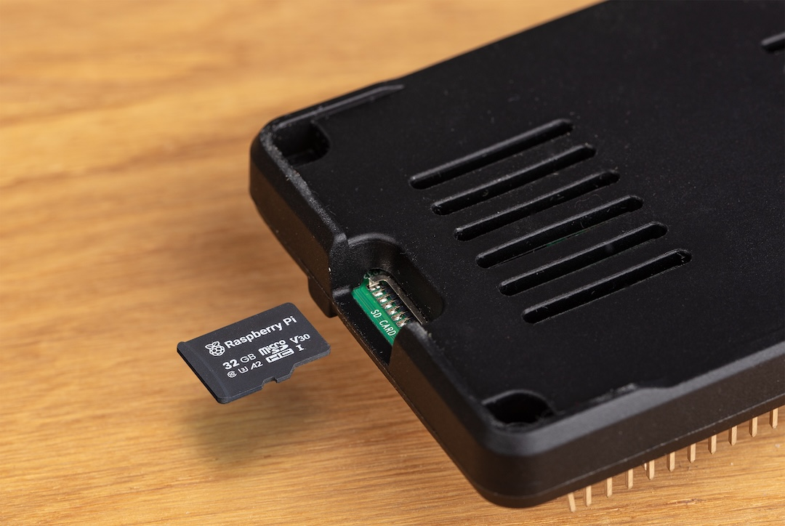
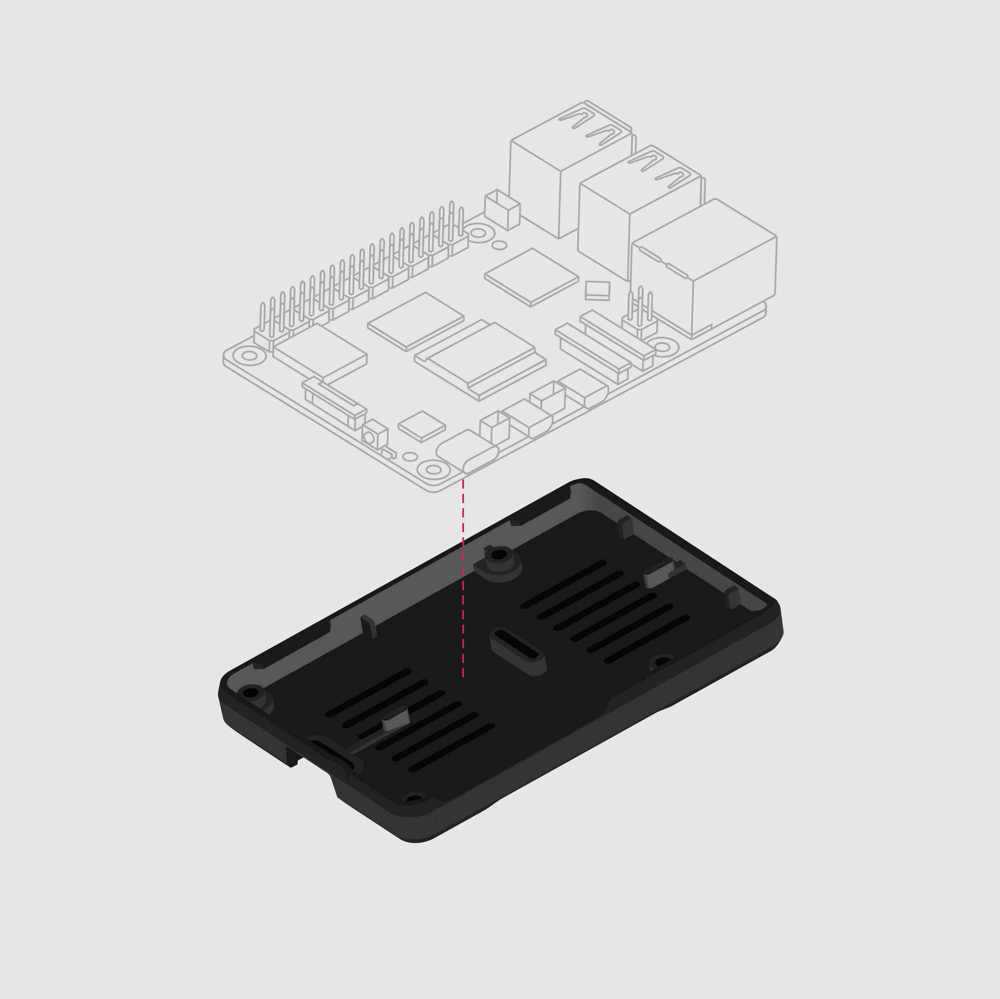

== About

.The Raspberry Pi Bumper for Raspberry Pi 5

The Raspberry Pi Bumper for Raspberry Pi 5 is a snap-on silicone cover that protects
the bottom and edges of the board. When attached, the mounting holes of the Raspberry Pi remain accessible through the bumper.

The Bumper is only compatible with Raspberry Pi 5.

== Assembly instructions

.Assembling the bumper

To attach the Raspberry Pi Bumper to your Raspberry Pi:

. Turn off your Raspberry Pi and disconnect the power cable.
. Remove the SD card from the SD card slot of your Raspberry Pi.
. Align the bumper with the board.
. Press the board gently but firmly into the bumper, taking care to avoid contact between the bumper and any of the board’s components.
. Insert your SD card back into the SD card slot of your Raspberry Pi.
. Reconnect your Raspberry Pi to power.

To remove the Raspberry Pi Bumper from your Raspberry Pi:

. Turn off your Raspberry Pi and disconnect the power cable.
. Remove the SD card from the SD card slot of your Raspberry Pi.
. Gently but firmly peel the bumper away from the board, taking care to avoid contact between the bumper and any of the board’s components.
. Insert your SD card back into the SD card slot of your Raspberry Pi.
. Reconnect your Raspberry Pi to power.
