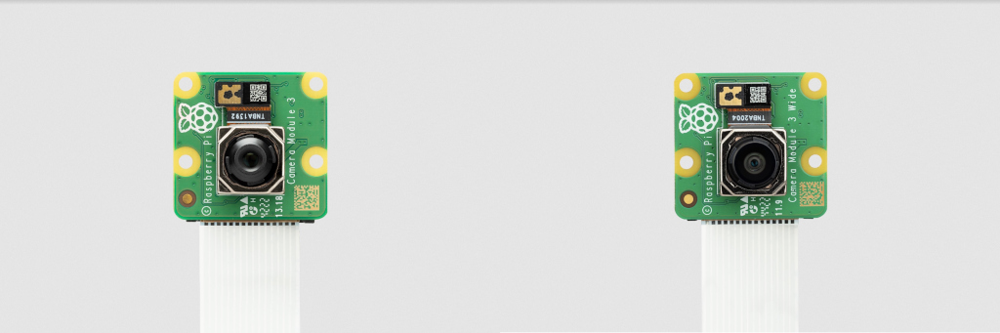
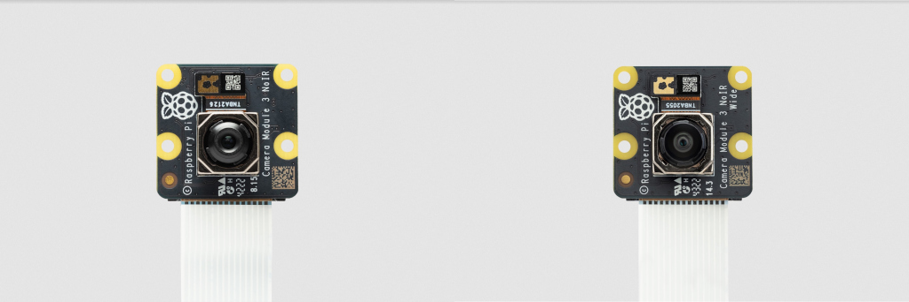
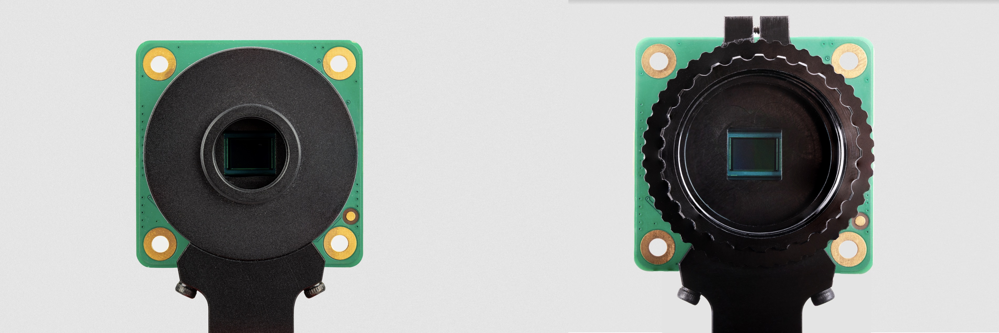

:figure-caption!:
== Camera Modules

There are now several official Raspberry Pi camera modules. The original 5-megapixel model was https://www.raspberrypi.com/news/camera-board-available-for-sale/[released] in 2013, it was followed by an 8-megapixel https://www.raspberrypi.com/products/camera-module-v2/[Camera Module 2] which was https://www.raspberrypi.com/news/new-8-megapixel-camera-board-sale-25/[released] in 2016. The latest camera model is the 12-megapixel https://raspberrypi.com/products/camera-module-3/[Camera Module 3] which was https://www.raspberrypi.com/news/new-autofocus-camera-modules/[released] in 2023. The original 5MP device is no longer available from Raspberry Pi. 

All of these cameras come in visible light and infrared versions, while the Camera Module 3 also comes as a standard or wide FoV model for a total of four different variants.

.Camera Module 3 (left) and Camera Module 3 Wide (right)

.Camera Module 3 NoIR (left) and Camera Module 3 NoIR Wide (right)

Aditionally a 12-megapixel https://www.raspberrypi.com/products/raspberry-pi-high-quality-camera/[High Quality Camera] with CS- or M12-mount variants for use with external lenses was https://www.raspberrypi.com/news/new-product-raspberry-pi-high-quality-camera-on-sale-now-at-50/[released in 2020] and https://www.raspberrypi.com/news/new-autofocus-camera-modules/[2023] respectively. There is no infrared version of the HQ Camera, however the xref:camera.adoc#hq-camera-filter-removal[IR Filter can be removed] if required.

.HQ Camera, M12-mount (left) and C/CS-mount (right)

NOTE: Raspberry Pi Camera Modules are compatible with all Raspberry Pi computers with CSI connectors - that is, all models except Raspberry Pi 400 and the 2016 launch version of Zero.

=== Installing a Raspberry Pi camera

WARNING: Cameras are sensitive to static. Earth yourself prior to handling the PCB. A sink tap or similar should suffice if you don't have an earthing strap.

==== Connecting the Camera

The flex cable inserts into the connector labelled CAMERA on the Raspberry Pi, which is located between the Ethernet and HDMI ports. The cable must be inserted with the silver contacts facing the HDMI port. To open the connector, pull the tabs on the top of the connector upwards, then towards the Ethernet port. The flex cable should be inserted firmly into the connector, with care taken not to bend the flex at too acute an angle. To close the connector, push the top part of the connector towards the HDMI port and down, while holding the flex cable in place.

We have created a video to illustrate the process of connecting the camera. Although the video shows the original camera on the original Raspberry Pi 1, the principle is the same for all camera boards:

video::GImeVqHQzsE[youtube]

Depending on the model, the camera may come with a small piece of translucent blue plastic film covering the lens. This is only present to protect the lens while it is being mailed to you, and needs to be removed by gently peeling it off.

NOTE: There is additional documentation available around fitting the recommended https://datasheets.raspberrypi.com/hq-camera/cs-mount-lens-guide.pdf[6mm] and https://datasheets.raspberrypi.com/hq-camera/c-mount-lens-guide.pdf[16mm] lens to the HQ Camera.

=== Preparing the Software

Before proceeding, we recommend ensuring that your kernel, GPU firmware and applications are all up to date. Please follow the instructions on xref:../computers/os.adoc#using-apt[keeping your operating system up to date].

Then, please follow the relevant setup instructions for the xref:../computers/camera_software.adoc#getting-started[libcamera] software stack, and the https://datasheets.raspberrypi.com/camera/picamera2-manual.pdf[Picamera2 Python library].

=== Hardware Specification

|===
|  | Camera Module v1 | Camera Module v2 | Camera Module 3 | Camera Module 3 Wide | HQ Camera

| Net price
| $25
| $25
| $25 
| $35
| $50

| Size
| Around 25 × 24 × 9 mm
| Around 25 × 24 × 9 mm
| Around 25 × 24 × 11.5 mm
| Around 25 × 24 × 12.4 mm
| 38 x 38 x 18.4mm (excluding lens)

| Weight
| 3g
| 3g
| 4g
| 4g
|

| Still resolution
| 5 Megapixels
| 8 Megapixels
| 11.9 Megapixels
| 11.9 Megapixels
| 12.3 Megapixels

| Video modes
| 1080p30, 720p60 and 640 × 480p60/90
| 1080p47, 1640 × 1232p41 and 640 × 480p206
| 2304 × 1296p56, 2304 × 1296p30 HDR, 1536 × 864p120
| 2304 × 1296p56, 2304 × 1296p30 HDR, 1536 × 864p120
| 2028 × 1080p50, 2028 × 1520p40 and 1332 × 990p120

| Sensor
| OmniVision OV5647
| Sony IMX219
| Sony IMX708
| Sony IMX708
| Sony IMX477

| Sensor resolution
| 2592 × 1944 pixels
| 3280 × 2464 pixels
| 4608 x 2592 pixels
| 4608 x 2592 pixels
| 4056 x 3040 pixels

| Sensor image area
| 3.76 × 2.74 mm
| 3.68 x 2.76 mm (4.6 mm diagonal)
| 6.45 x 3.63mm (7.4mm diagonal)
| 6.45 x 3.63mm (7.4mm diagonal)
| 6.287mm x 4.712 mm (7.9mm diagonal)

| Pixel size
| 1.4 µm × 1.4 µm
| 1.12 µm x 1.12 µm
| 1.4 µm x 1.4 µm
| 1.4 µm x 1.4 µm
| 1.55 µm x 1.55 µm

| Optical size
| 1/4"
| 1/4"
| 1/2.43"
| 1/2.43"
| 1/2.3"

| Focus
| Fixed
| Adjustable
| Motorized
| Motorized
| Adjustable

| Depth of field
| Approx 1 m to ∞ 
| Approx 10 cm to ∞ 
| Approx 10 cm to ∞ 
| Approx 5 cm to ∞ 
| N/A

| Focal length
| 3.60 mm +/- 0.01
| 3.04 mm
| 4.74 mm
| 2.75 mmm
| Depends on lens

| Horizontal Field of View (FoV)
| 53.50  +/- 0.13 degrees
| 62.2 degrees
| 66 degrees
| 102 degrees
| Depends on lens

| Vertical Field of View (FoV)
| 41.41 +/- 0.11 degrees
| 48.8 degrees
| 41 degrees
| 67 degrees
| Depends on lens

| Focal ratio (F-Stop)
| F2.9
| F2.0
| F1.8
| F2.2
| Depends on lens

| Maximum exposure times (seconds)
| 6
| 11.76
| 112
| 112
| 670.74

| Lens Mount
| N/A
| N/A
| N/A 
| N/A
| CS- or M12-mount
|===

=== Mechanical Drawings

Available mechanical drawings;

* Camera Module 2 https://datasheets.raspberrypi.com/camera/camera-module-2-mechanical-drawing.pdf[PDF]
* Camera Module 3 https://datasheets.raspberrypi.com/camera/camera-module-3-standard-mechanical-drawing.pdf[PDF]
* Camera Module 3 Wide https://datasheets.raspberrypi.com/camera/camera-module-3-wide-mechanical-drawing.pdf[PDF]
* HQ Camera Module (CS-mount version) https://datasheets.raspberrypi.com/hq-camera/hq-camera-cs-mechanical-drawing.pdf[PDF]
** The CS-mount https://datasheets.raspberrypi.com/hq-camera/hq-camera-cs-lensmount-drawing.pdf[PDF]
* HQ Camera Module (M12-mount version) https://datasheets.raspberrypi.com/hq-camera/hq-camera-m12-mechanical-drawing.pdf[PDF]

NOTE: Board dimensions and mounting-hole positions for Camera Module 3 are identical to Camera Module 2. However, due to changes in the size and position of the sensor module, it is not mechanically compatible with the camera lid for the Raspberry Pi Zero Case.

=== Schematics

.Schematic of the Raspberry Pi CSI camera connector.
image:images/RPi-S5-conn.png[camera connector]

Other available schematics;

* Camera Module v2 https://datasheets.raspberrypi.com/camera/camera-module-2-schematics.pdf[PDF]
* HQ Camera Module https://datasheets.raspberrypi.com/hq-camera/hq-camera-schematics.pdf[PDF]
