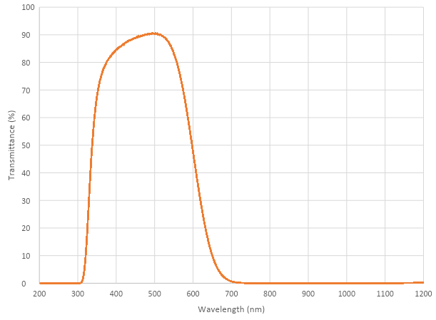
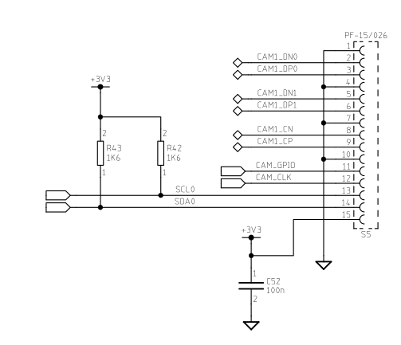
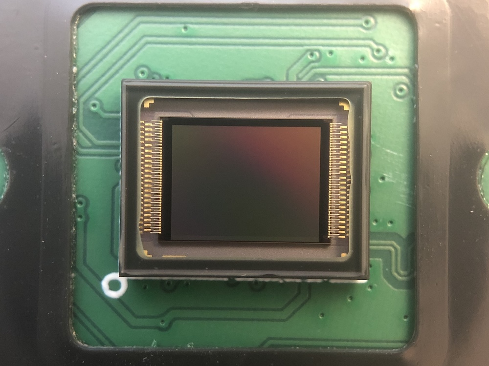
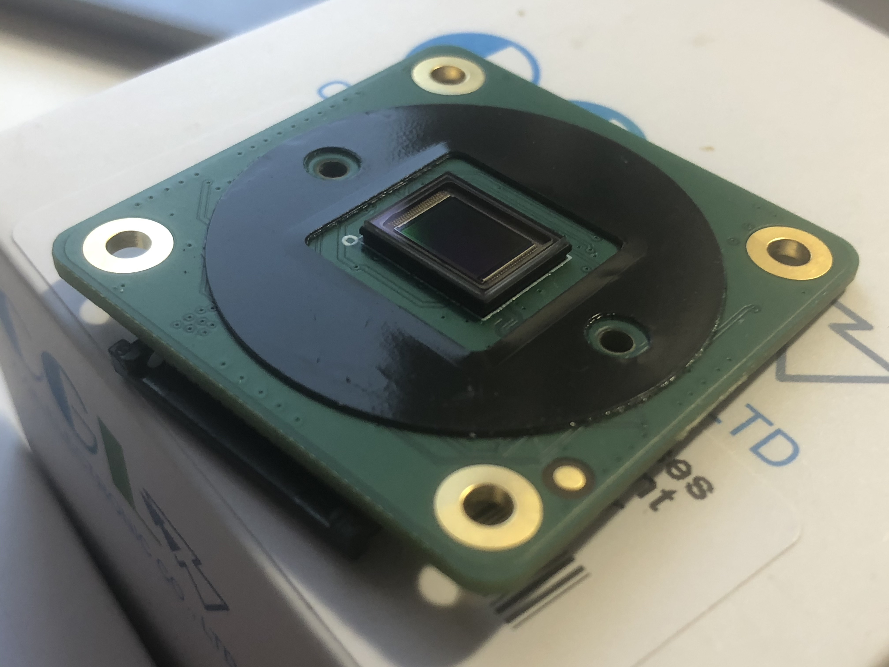
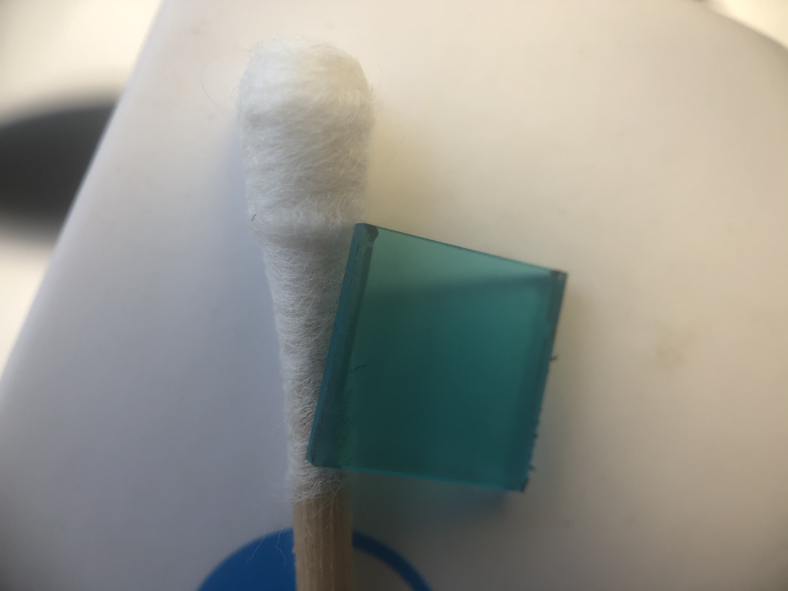
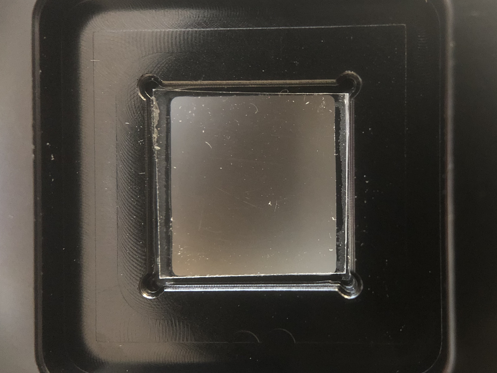

== Camera Modules

There are several official Raspberry Pi camera modules. The original 5-megapixel model was https://www.raspberrypi.com/news/camera-board-available-for-sale/[released] in 2013, and an 8-megapixel https://www.raspberrypi.com/products/camera-module-v2/[Camera Module v2] was https://www.raspberrypi.com/news/new-8-megapixel-camera-board-sale-25/[released] in 2016. For both iterations, there are visible light and https://www.raspberrypi.com/products/pi-noir-camera-v2/[infrared] versions. A 12-megapixel https://www.raspberrypi.com/products/raspberry-pi-high-quality-camera/[High Quality Camera] was https://www.raspberrypi.com/news/new-product-raspberry-pi-high-quality-camera-on-sale-now-at-50/[released] in 2020. There is no infrared version of the HQ Camera, however the xref:camera.adoc#raspberry-pi-hq-camera-filter-removal[IR Filter can be removed] if required.

=== Installing a Raspberry Pi camera

WARNING: Cameras are sensitive to static. Earth yourself prior to handling the PCB. A sink tap or similar should suffice if you don't have an earthing strap.

==== Connecting the Camera

The flex cable inserts into the connector labelled CAMERA on the Raspberry Pi, which is located between the Ethernet and HDMI ports. The cable must be inserted with the silver contacts facing the HDMI port. To open the connector, pull the tabs on the top of the connector upwards, then towards the Ethernet port. The flex cable should be inserted firmly into the connector, with care taken not to bend the flex at too acute an angle. To close the connector, push the top part of the connector towards the HDMI port and down, while holding the flex cable in place.

We have created a video to illustrate the process of connecting the camera. Although the video shows the original camera on the original Raspberry Pi 1, the principle is the same for all camera boards:

video::GImeVqHQzsE[youtube]

Depending on the model, the camera may come with a small piece of translucent blue plastic film covering the lens. This is only present to protect the lens while it is being mailed to you, and needs to be removed by gently peeling it off.

=== Preparing the Software

Before proceeding, we recommend ensuring that your kernel, GPU firmware and applications are all up to date. Please follow the instructions on xref:../computers/os.adoc#using-apt[keeping your operating system up to date].

Then, please follow the relevant setup instructions either for xref:camera.adoc#getting-started[`libcamera`] or for xref:camera.adoc#enabling-the-camera[_Raspicam_].

=== Hardware Specification

|===
|  | Camera Module v1 | Camera Module v2 | HQ Camera

| Net price
| $25
| $25
| $50

| Size
| Around 25 × 24 × 9 mm
|
| 38 x 38 x 18.4mm (excluding lens)

| Weight
| 3g
| 3g
|

| Still resolution
| 5 Megapixels
| 8 Megapixels
| 12.3 Megapixels

| Video modes
| 1080p30, 720p60 and 640 × 480p60/90
| 1080p30, 720p60 and 640 × 480p60/90
| 1080p30, 720p60 and 640 × 480p60/90

| Linux integration
| V4L2 driver available
| V4L2 driver available
| V4L2 driver available

| C programming API
| OpenMAX IL and others available
| OpenMAX IL and others available
|

| Sensor
| OmniVision OV5647
| Sony IMX219
| https://www.sony-semicon.co.jp/products/common/pdf/IMX477-AACK_Flyer.pdf[Sony IMX477]

| Sensor resolution
| 2592 × 1944 pixels
| 3280 × 2464 pixels
| 4056 x 3040 pixels

| Sensor image area
| 3.76 × 2.74 mm
| 3.68 x 2.76 mm (4.6 mm diagonal)
| 6.287mm x 4.712 mm (7.9mm diagonal)

| Pixel size
| 1.4 µm × 1.4 µm
| 1.12 µm x 1.12 µm
| 1.55 µm x 1.55 µm

| Optical size
| 1/4"
| 1/4"
|

| Full-frame SLR lens equivalent
| 35 mm
|
|

| S/N ratio
| 36 dB
|
|

| Dynamic range
| 67 dB @ 8x gain
|
|

| Sensitivity
| 680 mV/lux-sec
|
|

| Dark current
| 16 mV/sec @ 60 C
|
|

| Well capacity
| 4.3 Ke-
|
|

| Depth of field
| approx. 1 m to infinity
| adjustable with supplied tool
| N/A

| Focal length
| 3.60 mm +/- 0.01
| 3.04 mm
| Depends on lens

| Horizontal field of view
| 53.50  +/- 0.13 degrees
| 62.2 degrees
| Depends on lens

| Vertical field of view
| 41.41 +/- 0.11 degrees
| 48.8 degrees
| Depends on lens

| Focal ratio (F-Stop)
| 2.9
| 2.0
| Depends on lens
|===

=== Software Features

==== `libcamera` stack

[cols=2]
|===

| Picture formats
| JPEG, JPEG + DNG (raw), BMP, PNG, YUV420, RGB888

| Video formats
| raw h.264 (accelerated), MJPEG

| Post-processing
| User-definable image effects, customisable DRC and HDR, motion detection, OpenCV integration, TensorFlowLite integration

| Exposure modes
| normal, short, long, fixed fps, customisable

| Metering modes
| centre-weighted, average, spot, customisable

| Automatic white balance modes
| off, auto, incandescent, tungsten, fluorescent, indoor, daylight, cloudy, customisable

| Triggers
| Keypress, UNIX signal, timeout

| Extra modes
| timelapse, circular buffer, motion detection, segmented video, many features through flexible post-processing
|===

==== Legacy stack

[cols=2]
|===

| Picture formats
| JPEG (accelerated), JPEG + RAW, GIF, BMP, PNG, YUV420, RGB888

| Video formats
| raw h.264 (accelerated)

| Effects
| negative, solarise, posterize, whiteboard, blackboard, sketch, denoise, emboss, oilpaint, hatch, gpen, pastel, watercolour, film, blur, saturation

| Exposure modes
| auto, night, nightpreview, backlight, spotlight, sports, snow, beach, verylong, fixedfps, antishake, fireworks

| Metering modes
| average, spot, backlit, matrix

| Automatic white balance modes
| off, auto, sun, cloud, shade, tungsten, fluorescent, incandescent, flash, horizon

| Triggers
| Keypress, UNIX signal, timeout

| Extra modes
| demo, burst/timelapse, circular buffer, video with motion vectors, segmented video, live preview on 3D models
|===

=== HQ Camera IR Filter Transmission

The HQ Camera uses a Hoya CM500 infrared filter. Its transmission characteristics are as represented in the following graph.

=== Maximum Exposure Times

The maximum exposure times of the three official Raspberry Pi cameras are given in the table below.

[cols=",^"]
|===
| Module | Max exposure (seconds)

| V1 (OMx5647)
| 6

| V2 (IMX219)
| 10

| HQ (IMX417)
| 230
|===

=== Mechanical Drawings

* Camera Module v2 https://datasheets.raspberrypi.com/camera/camera-v2-mechanical-drawing.pdf[PDF]
* HQ Camera Module https://datasheets.raspberrypi.com/hq-camera/hq-camera-mechanical-drawing.pdf[PDF]
* HQ Camera Module lens mount https://datasheets.raspberrypi.com/hq-camera/hq-camera-lensmount-drawing.pdf[PDF]

=== Schematics

* Camera Module v2 https://datasheets.raspberrypi.com/camera/camera-v2-schematics.pdf[PDF]
* HQ Camera Module https://datasheets.raspberrypi.com/hq-camera/hq-camera-schematics.pdf[PDF]

=== Raspberry Pi HQ Camera Filter Removal

The High Quality Camera contains an IR filter, which is used to reduce the camera's sensitivity to infrared light. This ensures that outdoor photos look more natural. However, some nature photography can be enhanced with the removal of this filter; the colours of sky, plants, and water can be affected by its removal. The camera can also be used without the filter for night vision in a location that is illuminated with infrared light.

WARNING: *This procedure cannot be reversed:* the adhesive that attaches the filter will not survive being lifted and replaced, and while the IR filter is about 1.1mm thick, it may crack when it is removed. *Removing it will void the warranty on the product*. Nevertheless, removing the filter will be desirable to some users.

To remove the filter:

. Work in a clean and dust-free environment, as the sensor will be exposed to the air.

. Unscrew the two 1.5 mm hex lock keys on the underside of the main circuit board. Be careful not to let the washers roll away. There is a gasket of slightly sticky material between the housing and PCB which will require some force to separate.

. Lift up the board and place it down on a very clean surface. Make sure the sensor does not touch the surface.
. Before completing the next step, read through all of the steps and decide whether you are willing to void your warranty. *Do not proceed* unless you are sure that you are willing to void your warranty.
. Turn the lens around so that it is "looking" upwards and place it on a table.
You may try some ways to weaken the adhesive, such as a little isopropyl alcohol and/or heat (~20-30 C). Using a pen top or similar soft plastic item, push down on the filter only at the very edges where the glass attaches to the aluminium - to minimise the risk of breaking the filter. The glue will break and the filter will detach from the lens mount.

. Given that changing lenses will expose the sensor, at this point you could affix a clear filter (for example, OHP plastic) to minimize the chance of dust entering the sensor cavity.

. Replace the main housing over the circuit board. Be sure to realign the housing with the gasket, which remains on the circuit board.
. The nylon washer prevents damage to the circuit board; apply this washer first. Next, fit the steel washer, which prevents damage to the nylon washer.
. Screw down the two hex lock keys. As long as the washers have been fitted in the correct order, they do not need to be screwed very tightly.
. Note that it is likely to be difficult or impossible to glue the filter back in place and return the device to functioning as a normal optical camera.
