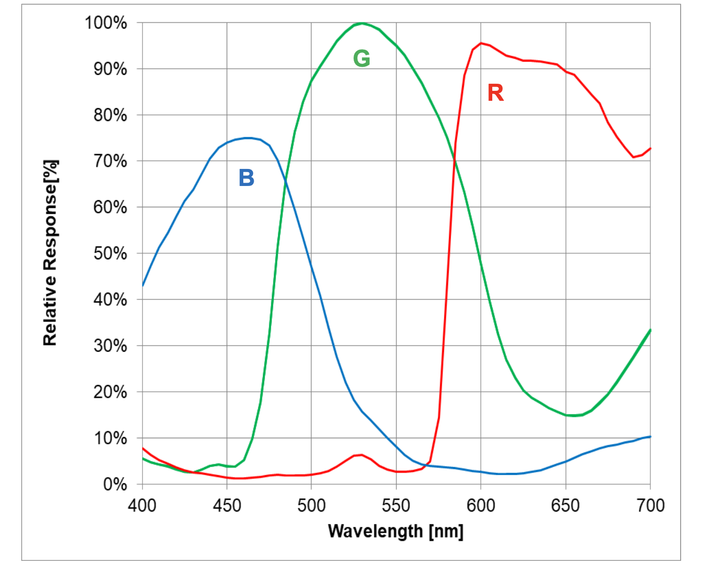

[[camera-module-3]]
== Camera Module 3

This https://www.raspberrypi.com/products/camera-module-3/[12-megapixel camera] is built around the Sony IMX708 sensor with a resolution of 4608 × 2592 pixels. It has https://www.raspberrypi.com/news/new-autofocus-camera-modules/[powered autofocus] and can record an exposure time of up to 112 seconds.

 Camera Module 3 comes in the following variants:

* Standard, normal field of view (FoV)
* Standard, wide FoV
* NoIR, normal FoV
* NoIR, wide FoV

The standard variants capture visible light only; infrared light is filtered out. The NoIR variants don't have an infrared filter; they capture both visible light and infrared light. Use a NoIR camera with infrared lighting to see in the dark or use it with the included square of blue gel to monitor the health of green plants.

.Camera Module 3 (left) and Camera Module 3 Wide (right)
image::images/cm3.jpg[Camera Module 3 normal and wide angle]

.Camera Module 3 NoIR (left) and Camera Module 3 NoIR Wide (right)
image::images/cm3_noir.jpg[Camera Module 3 NoIR normal and wide angle]

For detailed information about the hardware characteristics and capabilities of this camera, see the xref:../accessories/camera.adoc#hardware-specification[hardware specifications].

NOTE: There is https://github.com/raspberrypi/libcamera/issues/43[some evidence] to suggest that the Camera Module 3 might emit RFI at a harmonic of the CSI clock rate. This RFI is in a range to interfere with GPS L1 frequencies (1575 MHz). For details and proposed workarounds, see the https://github.com/raspberrypi/libcamera/issues/43[thread on Github].

=== Transmission characteristics

The IMX708 sensor in Camera Module 3 has the following spectral sensitivity characteristics.

// Do we need another one of these for the NoIR characteristics?

