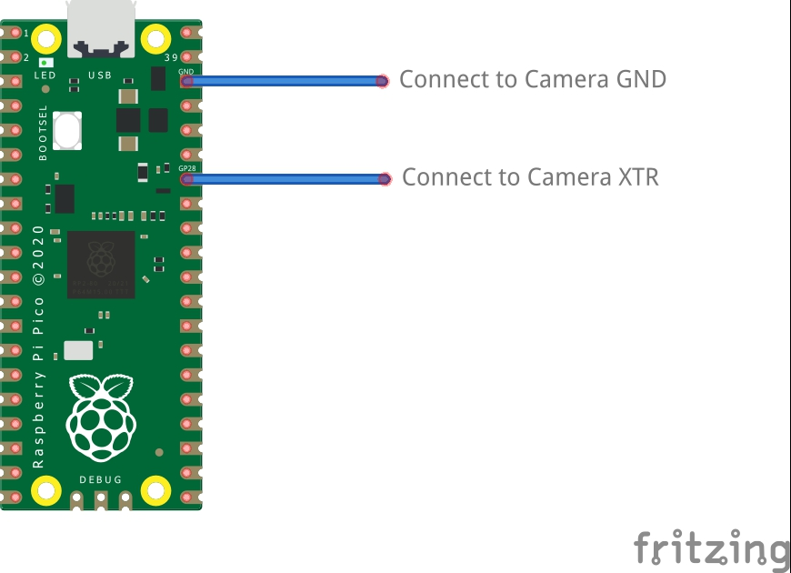

[[external-trigger]]
== External Trigger on the Global Shutter Camera

The Global Shutter (GS) camera can be triggered externally by pulsing the external trigger connection on the board (denoted on the board as XTR). Multiple cameras can be connected to the same pulse, allowing for an alternative way to synchronise two cameras.

The exposure time is equal to the low pulse-width time plus an additional 14.26us. i.e. a low pulse of 10000us leads to an exposure time of 10014.26us. Framerate is directly controlled by how often you pulse the pin. A PWM frequency of 30Hz will lead to a framerate of 30 frames per second.

image::images/external_trigger.jpg[alt="Image showing pulse format",width="80%"]

=== Preparation

WARNING: This modification includes removing an SMD soldered part. You should not attempt this modification unless you feel you are competent to complete it. When soldering to the Camera board, please remove the plastic back cover to avoid damaging it.

If your board has transistor Q2 fitted (shown in blue on the image below), then you will need to remove R11 from the board (shown in red). This connects GP1 to XTR and without removing R11, the camera will not operate in external trigger mode.
The location of the components is displayed below.

image::images/resistor.jpg[alt="Image showing resistor to be removed",width="80%"]

Next, solder a wire to the touchpoints of XTR and GND on the GS Camera board. Note that XTR is a 1.8V input, so you may need a level shifter or potential divider.

We can use a Raspberry Pi Pico to provide the trigger. Connect any Pico GPIO pin (GP28 is used in this example) to XTR via a 1.5 kΩ resistor. Also connect a 1.8 kΩ resistor between XTR and GND to reduce the high logic level to 1.8V. A wiring diagram is shown below.

==== Raspberry Pi Pico MicroPython Code

[source,python]
----
from machine import Pin, PWM

from time import sleep

pwm = PWM(Pin(28))

framerate = 30
shutter = 6000  # In microseconds

frame_length = 1000000 / framerate
pwm.freq(framerate)

pwm.duty_u16(int((1 - (shutter - 14) / frame_length) * 65535))
----

The low pulse width is equal to the shutter time, and the frequency of the PWM equals the framerate.

NOTE: In this example, Pin 28 connects to the XTR touchpoint on the GS camera board.

=== Camera driver configuration

This step is only necessary if you have more than one camera with XTR wired in parallel.

Edit `/boot/firmware/config.txt`. Change `camera_auto_detect=1` to `camera_auto_detect=0`.

Append this line:
[source]
----
dtoverlay=imx296,always-on
----
When using the CAM0 port on a Raspberry Pi 5, CM4 or CM5, append `,cam0` to that line without a space. If both cameras are on the same Raspberry Pi you will need two dtoverlay lines, only one of them ending with `,cam0`.

If the external trigger will not be started right away, you also need to increase the libcamera timeout xref:camera.adoc#libcamera-configuration[as above].

=== Starting the camera

Enable external triggering:

[source,console]
----
$ echo 1 | sudo tee /sys/module/imx296/parameters/trigger_mode
----

Run the code on the Pico, then set the camera running:

[source,console]
----
$ rpicam-hello -t 0 --qt-preview --shutter 3000
----

Every time the Pico pulses the pin, it should capture a frame. However, if `--gain` and `--awbgains` are not set, some frames will be dropped to allow AGC and AWB algorithms to settle.

NOTE: When running `rpicam-apps`, always specify a fixed shutter duration, to ensure the AGC does not try to adjust the camera's shutter speed. The value is not important, since it is actually controlled by the external trigger pulse.
