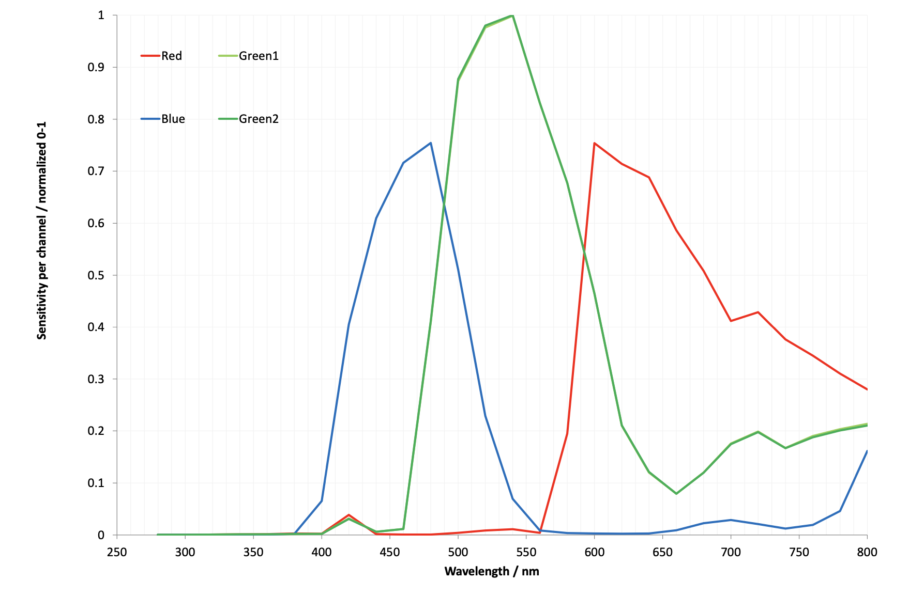
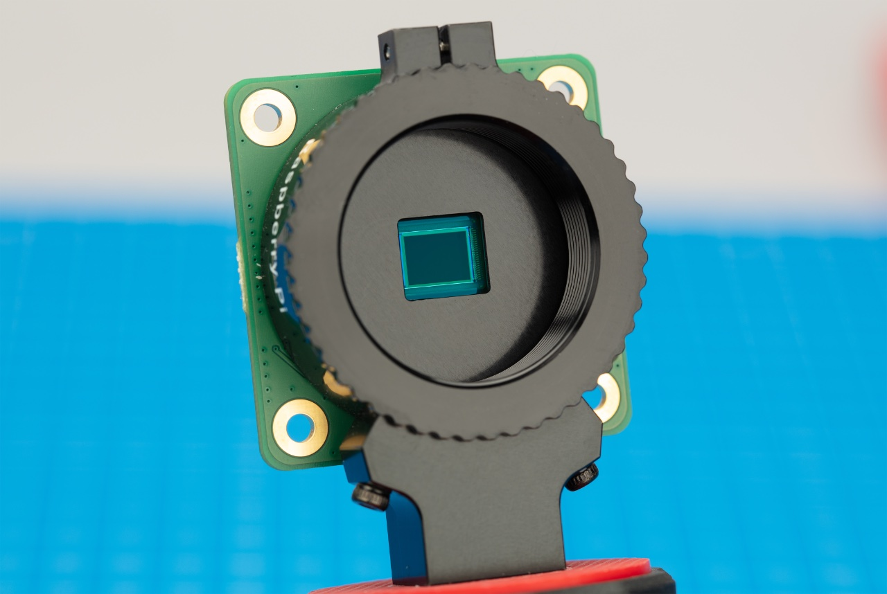
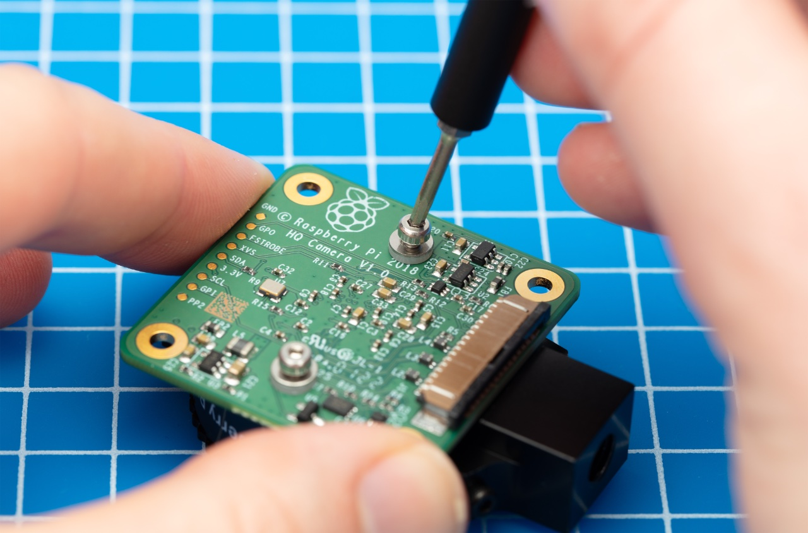
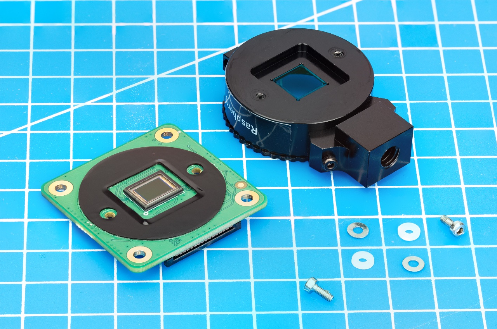
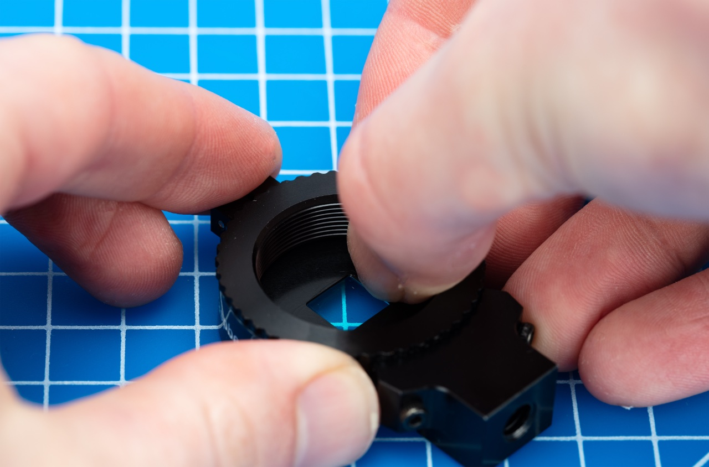
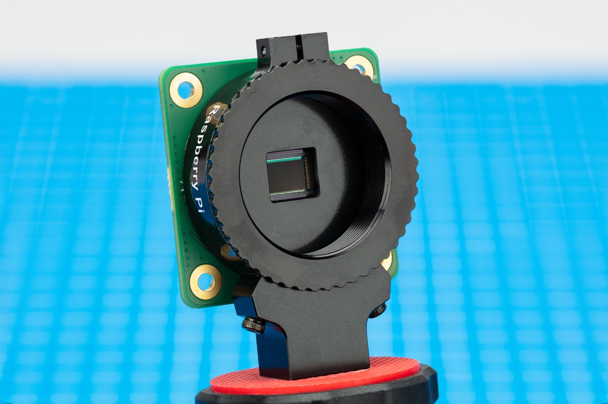

== Camera Filters

Some transmission characteristics are available for the Camera Module 3 and the HQ and GS cameras.

NOTE: These graphs are available as https://datasheets.raspberrypi.com/camera/camera-extended-spectral-sensitivity.pdf[a PDF].

=== Camera Module 3

The Camera Module 3 is built around the IMX708, which has the following spectral sensitivity characteristics.

image::images/cm3-filter.png[Camera Module 3 Transmission Graph, width="65%"]

=== HQ Camera

Raspberry Pi HQ Camera without IR-Cut filter.

image::images/hq.png[HQ Camera Transmission Graph without IR-Cut filter,width="65%"]

=== GS Camera

Raspberry Pi GS Camera without IR-Cut filter.

=== HQ and GS Cameras

The HQ and GS Cameras use a Hoya CM500 infrared filter. Its transmission characteristics are as represented in the following graph.

image::images/hoyacm500.png[CM500 Transmission Graph,width="65%"]

== Filter Removal

NOTE: This procedure applies to both the HQ and GS cameras. 

WARNING: *This procedure cannot be reversed:* the adhesive that attaches the filter will not survive being lifted and replaced, and while the IR filter is about 1.1mm thick, it may crack when it is removed. *Removing it will void the warranty on the product*. Nevertheless, removing the filter will be desirable to some users.

Both the High Quality Camera and Global Shutter Camera contain an IR filter, which is used to reduce the camera's sensitivity to infrared light. This ensures that outdoor photos look more natural. However, some nature photography can be enhanced with the removal of this filter; the colours of sky, plants, and water can be affected by its removal. The camera can also be used without the filter for night vision in a location that is illuminated with infrared light.

WARNING: Before proceeding read through all of the steps and decide whether you are willing to void your warranty. *Do not proceed* unless you are sure that you are willing to void your warranty.

To remove the filter:

* Work in a clean and dust-free environment, as the sensor will be exposed to the air.

*  Unscrew the two 1.5 mm hex lock keys on the underside of the main circuit board. Be careful not to let the washers roll away. There is a gasket of slightly sticky material between the housing and PCB which will require some force to separate.

*  Lift up the board and place it down on a very clean surface. Make sure the sensor does not touch the surface.

* You may try some ways to weaken the adhesive, such as a little isopropyl alcohol and/or heat (~20-30 C). 

image:images/SOLVENT_small.jpg[width="65%"]

*  Turn the lens mount around so that it is "looking" upwards and place it on a table.

* Using a pen top or similar soft plastic item, push down on the filter only at the very edges where the glass attaches to the aluminium - to minimise the risk of breaking the filter. The glue will break and the filter will detach from the lens mount.

*  Given that changing lenses will expose the sensor, at this point you could affix a clear filter (for example, OHP plastic) to minimize the chance of dust entering the sensor cavity.

*  Replace the main housing over the circuit board. Be sure to realign the housing with the gasket, which remains on the circuit board.

*  The nylon washer prevents damage to the circuit board; apply this washer first. Next, fit the steel washer, which prevents damage to the nylon washer.

*  Screw down the two hex lock keys. As long as the washers have been fitted in the correct order, they do not need to be screwed very tightly.

NOTE: It is likely to be difficult or impossible to glue the filter back in place and return the device to functioning as a normal optical camera.

