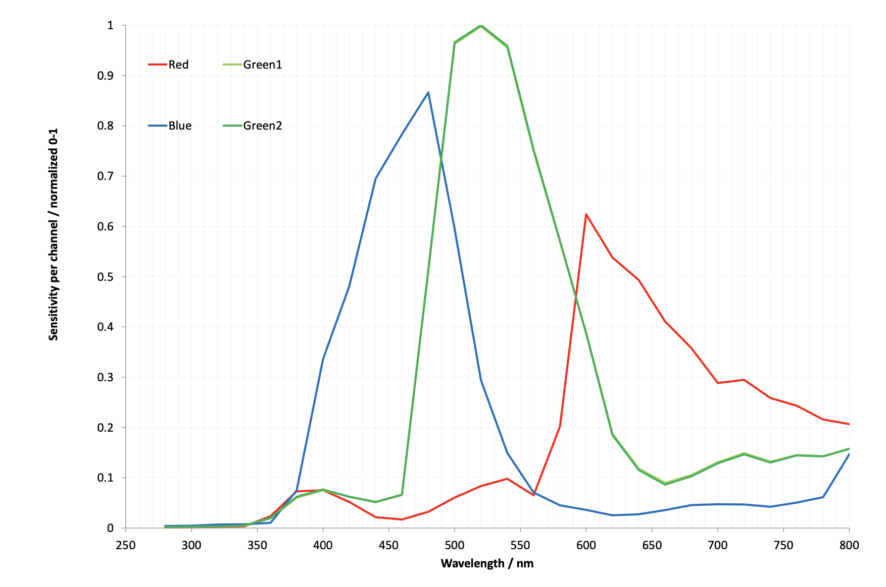

[[hq-camera]]
== High Quality Camera

The 12-megapixel https://www.raspberrypi.com/products/raspberry-pi-high-quality-camera/[High Quality Camera] comes with either an M12-mount or a C/CS-mount for compatibility with a broad variety of lenses. For more information, see xref:../accessories/camera.adoc#lenses[Lenses]. The camera is built around the Sony IMX477 sensor with a resolution of 4056 × 3040 pixels. It can record an exposure time of up to 670.74 seconds.

You can trigger the High Quality Camera by pulsing the external trigger. This feature enables you to synchronise multiple High Quality Cameras. For more information, see xref:../accessories/camera.adoc#synchronous-captures[Synchronous Captures].

.High Quality Camera, M12-mount (left) and C/CS-mount (right)
image::images/hq.jpg[M12- and C/CS-mount versions of the HQ Camera]

For detailed information about the hardware characteristics and capabilities of this camera, see the xref:../accessories/camera.adoc#hardware-specification[hardware specifications].

=== Transmission characteristics

The High Quality Camera uses a Hoya CM500 infrared filter. Its transmission characteristics are as represented in the following graph.

image::images/hoyacm500.png[CM500 Transmission Graph,width="65%"]

If you want to enhance the High Quality Camera's sensitivity to infrared light, you can remove the infrared filter. This action is permanent and voids the warranty. For more information, see xref:../accessories/camera.adoc#ir-filter[IR filter].

Without its filter, Raspberry Pi High Quality Camera has the following transmission characteristics:

