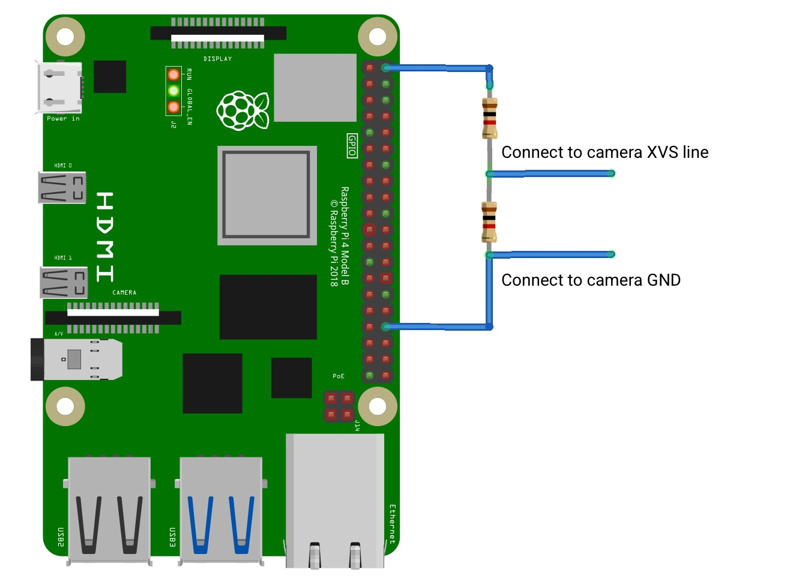

== Synchronous Captures

Both the HQ Camera and the Global Shutter Camera, have support for synchronous captures.
Making use of the XVS pin (Vertical Sync) allows one camera to pulse when a frame capture is initiated.
The other camera can then listen for this sync pulse, and capture a frame at the same time as the other camera.

=== Using the HQ Camera

For correct operation, both cameras require a 1.65V pull up voltage on the XVS line, which is created by a potential divider through the 3.3V and GND pins on the Raspberry Pi.

Connect a potential divider of 2 equally high impedance ( > 2.2kΩ) resistors to 3.3V and ground, creating 1.65V. This can be connected to either Pi.

Solder the GND and XVS test points of each HQ Camera board to each other.

Connect the XVS wires to the 1.65V potential divider pull-up.

==== Boot up both Raspberry Pis

The file `/sys/module/imx477/parameters/trigger_mode` determines which board outputs pulses, or waits to receive pulses (source and sink).
This parameter can only be altered in superuser mode.

On the sink, run:
[,bash]
----
sudo su
echo 2 > /sys/module/imx477/parameters/trigger_mode
exit
----

On the source, run:
[,bash]
----
sudo su
echo 1 > /sys/module/imx477/parameters/trigger_mode
exit
----

Start the sink running:
[,bash]
----
rpicam-vid --frames 300 --qt-preview -o sink.h264
----

Start the source running
[,bash]
----
rpicam-vid --frames 300 --qt-preview -o source.h264
----

Frames should be synchronous. Use `--frames` to ensure the same number of frames are captured, and that the recordings are exactly the same length.
Running the sink first ensures that no frames are missed.

NOTE: The potential divider is needed to pull up the XVS pin to high whilst the source is in an idle state. This ensures that no frames are created or lost upon startup. The source whilst initialising goes from LOW to HIGH which can trigger a false frame.

=== Using the GS Camera

NOTE: The Global Shutter (GS) camera can also be operated in a synchronous mode. However, the source camera will record one extra frame. A much better alternative method to ensure that both cameras capture the same amount of frames is to use the xref:camera.adoc#external-trigger-on-the-gs-camera[external trigger method].

To operate as source and sink together, the Global Shutter Cameras also require connection of the XHS (horizontal sync) pins together. However, these do not need connection to a pullup resistor.

The wiring setup is identical to the xref:camera.adoc#using-the-hq-camera[HQ Camera method], except that you will also need to connect the XHS pins together.

Create a potential divider made of 2 equally high impedance ( > 2.2kΩ) resistors resistors to 3.3V and ground, creating 1.65V. This can be connected to either Raspberry Pi.

Solder 2 wires to the XVS test points on each board and connect both of these wires together to the 1.65V potential divider.

Solder the GND of each Camera board to each other. Also solder 2 wires to the XHS test points on each board and connect these. No pullup is needed for XHS pin.

On the boards that you wish to act as sinks, solder the two halves of the MAS pad together. This tells the sensor to act as a sink, and will wait for a signal to capture a frame.

==== Boot up both Raspberry Pis

Start the sink running:
[,bash]
----
rpicam-vid --frames 300 -o sync.h264
----
Allow a delay before you start the source running (see note below). Needs to be roughly > 2 seconds.

Start the source running:
[,bash]
----
rpicam-vid --frames 299 -o sync.h264
----

[NOTE]
=====
Due to the limitations of the IMX296 sensor, we are unable to get the sink to record exactly the same amount of frames as the source.
**The source will record one extra frame before the sink starts recording.** This will need to be accounted for later in the application.
Because of this, you need to specify that the sink records one less frame in the `--frames` option.

FFmpeg has the ability to resync these two videos. By dropping the first frame from the source, we then get two recordings of the same frame
 length and with the same starting point.

[,bash]
----
ffmpeg -i source.h264 -vf select="gte(n\, 1)" source.h264
----
=====
