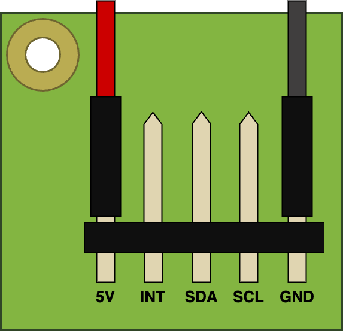

== Raspberry Pi Touch Display

The https://www.raspberrypi.com/products/raspberry-pi-touch-display/[Raspberry Pi Touch Display] is an LCD display which connects to the Raspberry Pi using the DSI connector. While the panel is connected, you can use both it, and the the normal HDMI display output at the same time.

The Touch Display will function with all models of Raspberry Pi. Although the earliest Raspberry Pi models, which lack appropriate mounting holes, require additional mounting hardware to fit the stand-offs on the display PCB.

The display has the following key features: 

* 800×480 RGB LCD display
* 24-bit colour
* Industrial quality: 140-degree viewing angle horizontal, 130-degree viewing angle vertical
* 10-point multi-touch touchscreen
* PWM backlight control and power control over I2C interface
* Metal-framed back with mounting points for Raspberry Pi display conversion board and Raspberry Pi
* Backlight lifetime: 20000 hours
* Operating temperature: -20 to +70 degrees centigrade
* Storage temperature: -30 to +80 degrees centigrade
* Contrast ratio: 500
* Average brightness: 250 cd/m^2^
* Viewing angle (degrees):
 ** Top - 50
 ** Bottom - 70
 ** Left - 70
 ** Right - 70
* Power requirements: 200mA at 5V typical, at maximum brightness.
* Outer dimensions: 192.96 × 110.76mm
* Viewable area: 154.08 × 85.92mm

You can mount a Raspberry Pi to the back of the Touch Display using its stand-offs and then connect the appropriate cables between each device, depending on your use case. You can also mount the Touch Display in a separate chassis if you have one available. The connections remain the same, though you may need longer cables depending on the chassis you use.

.A Raspberry Pi connected to the Touch Display
image::images/GPIO_power-500x333.jpg[Image of Raspberry Pi connected to the Touch Display, width="70%"]

Connect one end of the Flat Flexible Cable (FFC) to the `RPI-DISPLAY` port on the Touch Display PCB. The silver or gold contacts should face away from the display. Then connect the other end of the FFC to the `DISPLAY` port on the Raspberry Pi. The contacts on this end should face inward, towards the Raspberry Pi.

If the FFC isn't fully inserted, or it's not positioned correctly, you will experience issues with the display. You should always double-check this connection when troubleshooting, especially if you don't see anything on your display, or the display is showing a single colour.

NOTE: A https://datasheets.raspberrypi.com/display/7-inch-display-mechanical-drawing.pdf[mechanical drawing] of the Touch Display is available for download.

=== Powering the Touch Display

We recommend using the Raspberry Pi's GPIO to provide power to the Touch Display. However, if you want to power the display directly, you can use a separate micro USB power supply to provide power. 

==== Using the Raspberry Pi

To power the Touch Display using a Raspberry Pi, you need to connect two jumper wires between the 5V and GND pins on xref:../computers/raspberry-pi.adoc#gpio-and-the-40-pin-header[Raspberry Pi's GPIO] and the 5V and GND pins on the display, as shown in the following illustration.

.The location of the display's 5V and GND pins

Before you begin, make sure the Raspberry Pi is powered off and not connected to any power source. Connect one end of the black jumper wire to pin six (GND) on the Raspberry Pi and one end of the red jumper wire to pin four (5V). If pin six isn't available, you can use any other open GND pin to connect the black wire. 

Next, connect the other end of the black wire to the GND pin on the display and the other end of the red wire to the 5V pin on the display. Once all the connections are made, you should see the Touch Display turn on the next time you turn on your Raspberry Pi.

The other three pins on the Touch Display are used to connect the display to an original Raspberry Pi 1 Model A or B. Refer to our documentation on xref:display.adoc#legacy-support[legacy support] for more information.

NOTE: An original Raspberry Pi is easily identified compared to other models; it is the only model with a 26-pin rather than 40-pin GPIO header connector.

==== Using a micro USB supply

If you don't want to use a Raspberry Pi to provide power to the Touch Display, you can use a micro USB power supply instead. We recommend using the https://www.raspberrypi.com/products/micro-usb-power-supply/[Raspberry Pi 12.5W power supply] to make sure the display runs as intended.

Do not connect the GPIO pins on your Raspberry Pi to the display if you choose to use micro USB for power. The only connection between the two boards should be the Flat Flexible Cable.

WARNING: If you use a micro USB cable to power the display it must be mounted inside a chassis that blocks access to the display's PCB while it's in use.

=== Screen orientation

LCD displays have an ideal viewing angle, and it may be necessary to change the orientation of the display to find the perfect angle. If you need to physically rotate the display, or mount it in a specific position, you can use software to adjust the orientation of the screen to better match your setup.

To set the screen orientation from the desktop environment, select **Screen Configuration** from the **Preferences** menu. Right-click on the DSI display rectangle in the layout editor, select **Orientation**, then pick the best option to fit your needs.

image::images/display-rotation.png[Screenshot of orientation options in screen configuration, width="80%"]

To set screen orientation from the command line, you need to edit the kernel's `/boot/firmware/cmdline.txt` file to pass the required orientation to the system.

[source ,bash]
----
sudo nano /boot/firmware/cmdline.txt
----

To rotate the screen, add `video=DSI-1:800x480@60,rotate=90` to the `cmdline.txt` configuration file. Make sure everything is on the same line; do not add any carriage returns. Possible rotation values are 0, 90, 180 and 270.

NOTE: In console mode it is not possible to rotate the DSI display separately from the HDMI display. If you have both attached they need to be set to the same rotation value.

=== Touchscreen orientation

You also have the option to change the rotation of the active touchscreen area independently of the display itself by adding a `dtoverlay` instruction in the xref:../computers/config_txt.adoc[`/boot/firmware/config.txt`] file, as in the following example:

----
dtoverlay=rpi-ft5406,touchscreen-swapped-x-y=1,touchscreen-inverted-x=1
----

The options for the touchscreen are:

|===
| DT parameter | Action

| touchscreen-size-x
| Sets X resolution (default 800)

| touchscreen-size-y
| Sets Y resolution (default 600)

| touchscreen-inverted-x
| Invert X coordinates

| touchscreen-inverted-y
| Invert Y coordinates

| touchscreen-swapped-x-y
| Swap X and Y coordinates
|===
