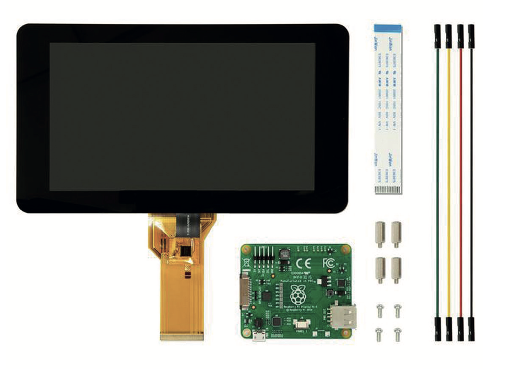
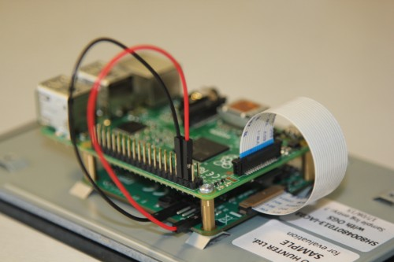
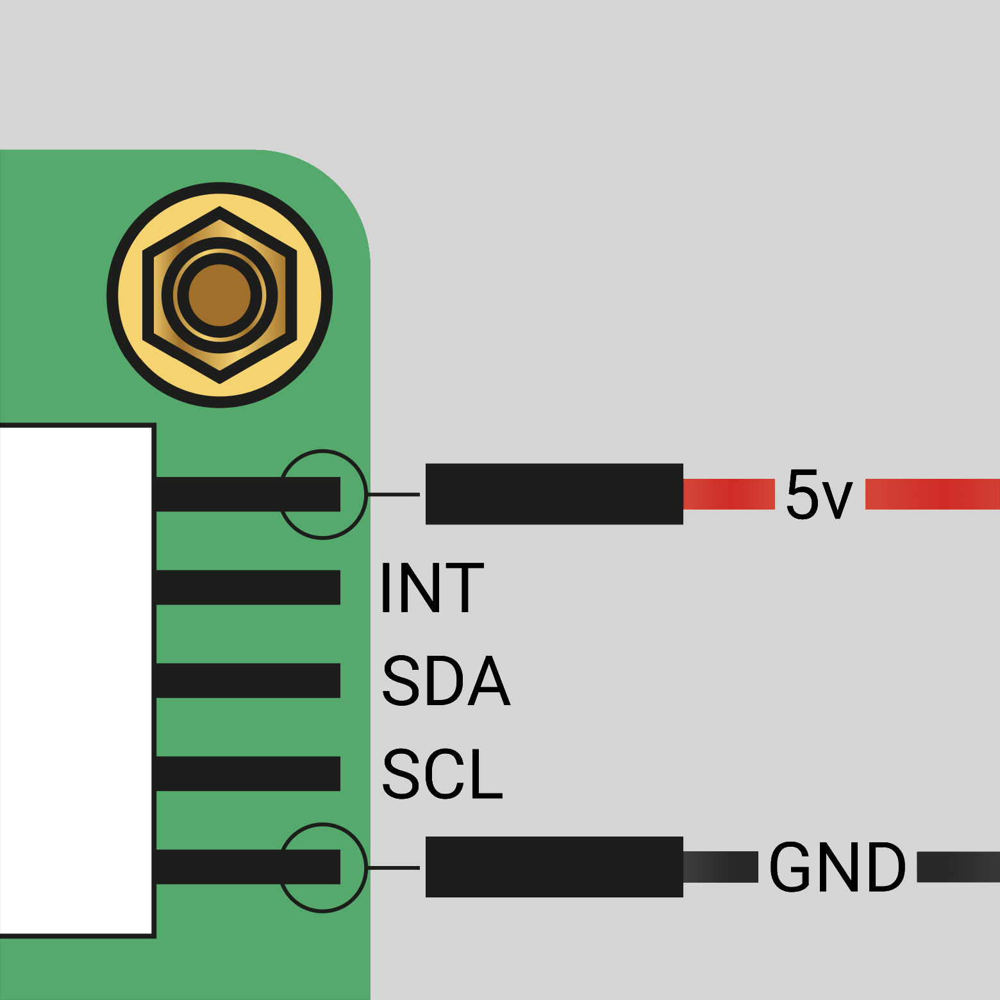
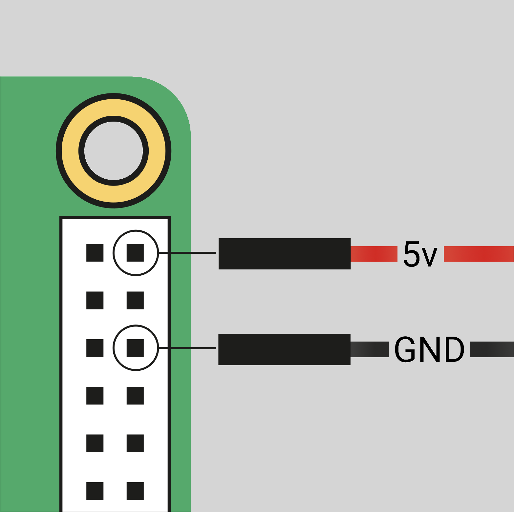
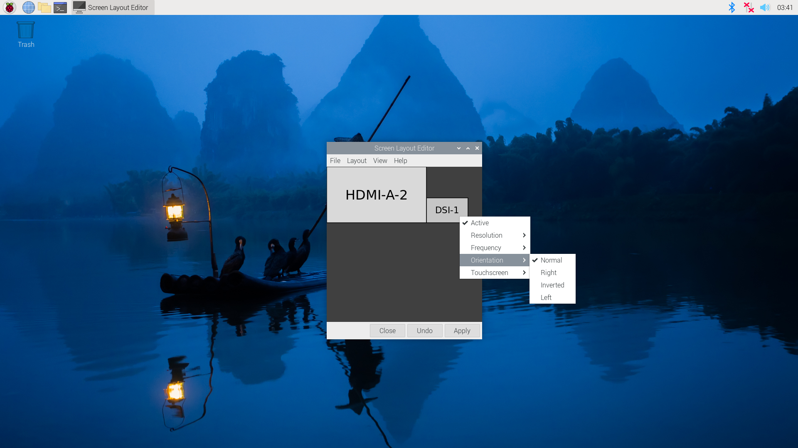

== Raspberry Pi Touch Display

The https://www.raspberrypi.com/products/raspberry-pi-touch-display/[Raspberry Pi Touch Display] is an LCD display that connects to the Raspberry Pi using the DSI connector. While the panel is connected, you can use both it and the the normal HDMI display output at the same time.

.The Raspberry Pi 7-inch Touch Display

The Touch Display functions with all models of Raspberry Pi. However, the earliest Raspberry Pi models lack appropriate mounting holes, requiring additional mounting hardware to fit the stand-offs on the display PCB.

The display has the following key features: 

* 800×480 RGB LCD display
* 24-bit colour
* Industrial quality: 140-degree viewing angle horizontal, 130-degree viewing angle vertical
* 10-point multi-touch touchscreen
* PWM backlight control and power control over I2C interface
* Metal-framed back with mounting points for Raspberry Pi display conversion board and Raspberry Pi
* Backlight lifetime: 20000 hours
* Operating temperature: -20 to +70 degrees centigrade
* Storage temperature: -30 to +80 degrees centigrade
* Contrast ratio: 500
* Average brightness: 250 cd/m^2^
* Viewing angle (degrees):
 ** Top - 50
 ** Bottom - 70
 ** Left - 70
 ** Right - 70
* Power requirements: 200mA at 5V typical, at maximum brightness.
* Outer dimensions: 192.96 × 110.76mm
* Viewable area: 154.08 × 85.92mm

[NOTE]
====
If you use Raspberry Pi OS Bullseye or earlier, you can install an on-screen keyboard by typing `sudo apt install matchbox-keyboard` in a terminal. You can also enable right-click emulation by adding the following section to the `/etc/X11/xorg.conf` file.

[source]
----
Section "InputClass"
   Identifier "calibration"
   Driver "evdev"
   MatchProduct "FT5406 memory based driver"

   Option "EmulateThirdButton" "1"
   Option "EmulateThirdButtonTimeout" "750"
   Option "EmulateThirdButtonMoveThreshold" "30"
EndSection
----

These features are not available when running Raspberry Pi OS Bookworm.
====

=== Mounting the Touch Display 

You can mount a Raspberry Pi to the back of the Touch Display using its stand-offs and then connect the appropriate cables. You can also mount the Touch Display in a separate chassis if you have one available. The connections remain the same, though you may need longer cables depending on the chassis.

.A Raspberry Pi connected to the Touch Display

Connect one end of the Flat Flexible Cable (FFC) to the `RPI-DISPLAY` port on the Touch Display PCB. The silver or gold contacts should face away from the display. Then connect the other end of the FFC to the `DISPLAY` port on the Raspberry Pi. The contacts on this end should face inward, towards the Raspberry Pi.

If the FFC is not fully inserted or positioned correctly, you will experience issues with the display. You should always double check this connection when troubleshooting, especially if you don't see anything on your display, or the display shows only a single colour.

NOTE: A https://datasheets.raspberrypi.com/display/7-inch-display-mechanical-drawing.pdf[mechanical drawing] of the Touch Display is available for download.

=== Powering the Touch Display

We recommend using the Raspberry Pi's GPIO to provide power to the Touch Display. Alternatively, you can power the display directly with a separate micro USB power supply.

==== Using the Raspberry Pi

To power the Touch Display using a Raspberry Pi, you need to connect two jumper wires between the 5V and GND pins on xref:../computers/raspberry-pi.adoc#gpio-and-the-40-pin-header[Raspberry Pi's GPIO] and the 5V and GND pins on the display, as shown in the following illustration.

.The location of the display's 5V and GND pins

Before you begin, make sure the Raspberry Pi is powered off and not connected to any power source. Connect one end of the black jumper wire to pin six (GND) on the Raspberry Pi and one end of the red jumper wire to pin two (5V). If pin six isn't available, you can use any other open GND pin to connect the black wire. If pin two isn't available, you can use any other 5V pin to connect the red wire, such as pin four.

.The location of the Raspberry Pi headers

Next, connect the other end of the black wire to the GND pin on the display and the other end of the red wire to the 5V pin on the display. Once all the connections are made, you should see the Touch Display turn on the next time you turn on your Raspberry Pi.

The other three pins on the Touch Display are used to connect the display to an original Raspberry Pi 1 Model A or B. Refer to our documentation on xref:display.adoc#legacy-support[legacy support] for more information.

NOTE: To identify an original Raspberry Pi, check the GPIO header connector. Only the original model has a 26-pin GPIO header connector; subsequent models have 40 pins.

==== Using a micro USB supply

If you don't want to use a Raspberry Pi to provide power to the Touch Display, you can use a micro USB power supply instead. We recommend using the https://www.raspberrypi.com/products/micro-usb-power-supply/[Raspberry Pi 12.5W power supply] to make sure the display runs as intended.

Do not connect the GPIO pins on your Raspberry Pi to the display if you choose to use micro USB for power. The only connection between the two boards should be the Flat Flexible Cable.

WARNING: When using a micro USB cable to power the display, mount it inside a chassis that blocks access to the display's PCB during usage.

=== Changing the screen orientation

If you want to physically rotate the display, or mount it in a specific position, you can use software to adjust the orientation of the screen to better match your setup.

==== Rotate screen from the desktop

To set the screen orientation from the desktop environment, select **Screen Configuration** from the **Preferences** menu. Right-click on the DSI-1 display rectangle in the layout editor, select **Orientation**, then pick the best option to fit your needs. You can also ensure that the touch overlay is assigned to the correct display with the **Touchscreen** option.

==== Rotate screen without a desktop

To set the screen orientation on a device that lacks a desktop environment, edit the `/boot/firmware/cmdline.txt` configuration file to pass an orientation to the system. Add the following line to `cmdline.txt`:

[source]
----
video=DSI-1:800x480@60,rotate=<rotation-value>
----

Replace the `<rotation-value>` placeholder with one of the following values, which correspond to the degree of rotation relative to the default on your display:

* `0`
* `90`
* `180`
* `270`

For example, a rotation value of `90` rotates the display 90 degrees to the right. `180` rotates the display 180 degrees, or upside-down.

NOTE: It is not possible to rotate the DSI display separately from the HDMI display with `cmdline.txt`. When you use DSI and HDMI simultaneously, they share the same rotation value.

==== Rotate touch input

WARNING: Rotating touch input via device tree can cause conflicts with your input library. Whenever possible, configure touch event rotation in your input library or desktop.

Rotation of touch input is independent of the orientation of the display itself. To change this you need to manually add a `dtoverlay` instruction in xref:../computers/config_txt.adoc[`/boot/firmware/config.txt`]. Add the following line in `config.txt`:

[source]
----
dtoverlay=vc4-kms-dsi-7inch,invx,invy
----

Then, disable automatic display detection by removing the following line from `config.txt`, if it exists:

[source]
----
display_auto_detect=1
----

==== Touch Display device tree option reference

The `vc4-kms-dsi-7inch` overlay supports the following options:

|===
| DT parameter | Action

| `sizex`
| Sets X resolution (default 800)

| `sizey`
| Sets Y resolution (default 480)

| `invx`
| Invert X coordinates

| `invy`
| Invert Y coordinates

| `swapxy`
| Swap X and Y coordinates

| `disable_touch`
| Disables the touch overlay totally
|===

To specify these options, add them, separated by commas, to your `dtoverlay` line in `/boot/firmware/config.txt`. Boolean values default to true when present, but you can set them to false with the suffix "=0". Integer values require a value, e.g. `sizey=240`. For instance, to set the X resolution to 400 pixels and invert both X and Y coordinates, use the following line:

[source]
----
dtoverlay=vc4-kms-dsi-7inch,sizex=400,invx,invy
----
