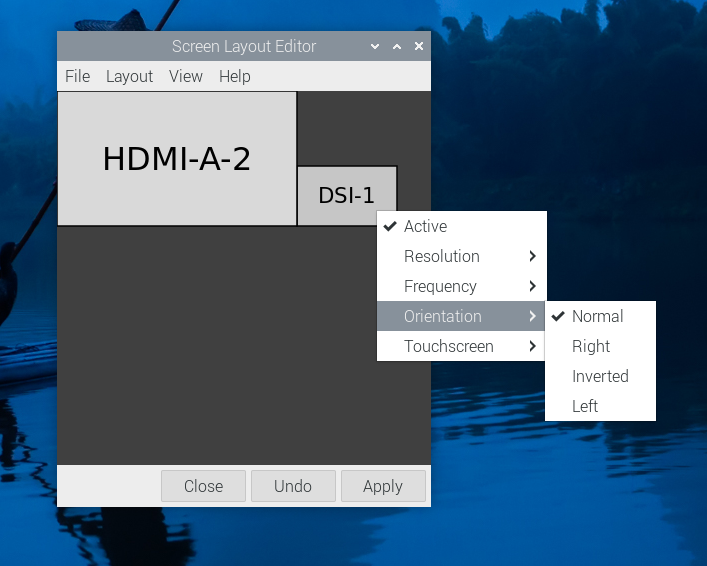

== Raspberry Pi Touch Display

https://www.raspberrypi.com/products/raspberry-pi-touch-display/[Raspberry Pi Touch Display] is a 7-inch touchscreen LCD intended for interactive projects like tablets, entertainment systems, and information dashboards.

.The Raspberry Pi 7-inch Touch Display
image::images/display.png[The Raspberry Pi 7-inch Touch Display, width="70%"]

The display features a metal-framed back and comes with a Raspberry Pi display conversion board and metal stand-offs pre-installed. Download a mechanical drawing of the Touch Display https://pip.raspberrypi.com/documents/RP-008246-DS[here].

== Compatibility

Touch Display is compatible with Raspberry Pi B+ and later.

It isn't compatible with either Raspberry Pi Zero series or Raspberry Pi Keyboard computers, because these don't have DSI connectors.

Raspberry Pi 5 uses a different-sized DSI connector, but you can connect it to the Touch Display using a https://www.raspberrypi.com/products/display-cable/[A 22-way to 15-way flat flexible cable] (sold separately).

Raspberry Pi 5 and Raspberry Pi Compute Modules natively support connecting up to two Touch Displays.

You can mount any Raspberry Pi B+ and later to the back of the Touch Display. However, to mount Raspberry Pi B and earlier, additional mounting hardware is required to fit stand-offs to the display PCB.

== Autodetection

Raspberry Pi B+ and later devices auto-detect Touch Display.

Raspberry Pi A and B can auto-detect the display, but the capability is turned off by default and you must therefore enable it.

Raspberry Pi Compute Modules don't auto-detect DSI displays because they are intended for industrial applications where the integrator can use any and all GPIOs and interfaces for their own purposes.

== Specifications

This section describes the characteristics and capabilities of Touch Display.

=== Features

Touch Display has the following features:

- *800 × 480px RGB LCD* display
- *24-bit RGB display* capable of showing over 16 million colours
- *Multitouch* supports up to ten simultaneous touch points
- *On-screen keyboard.* Supports an on-screen keyboard in place of a physical keyboard
- *Integrated power.* Powered directly by the host Raspberry Pi device, requiring no separate power supply
- *Backlight lifetime*. 20,000 hours

=== Viewing performance

- *Industrial quality*. 140 degree viewing angle horizontal, 120 degree viewing angle vertical
- *PWM backlight control and power control* over I2C interface
- *Contrast ratio* 500
- *Average brightness* 250 cd/m^2^
- *Viewable area* 154.08 × 85.92 mm
- *Viewing angle* (degrees):
 ** Top - 50
 ** Bottom - 70
 ** Left - 70
 ** Right - 70

=== Power

- *Power draw* 200mA at 5V typical, at maximum brightness.

=== Dimensions and environmentals

- *Operating temperature* -20 to +70 degrees centigrade
- *Storage temperature* -30 to +80 degrees centigrade
- *Outer dimensions* 192.96 × 110.76 mm

=== Hardware
The Touch Display box contains the following:

- A Touch Display
- Four standoffs and screws (pre-installed but removable)
- A 15-way to 15-way flat flexible cable
- Four jumper wires

== Mount a Raspberry Pi to the Touch Display

You can mount any Raspberry Pi B+ and later to the back of the Touch Display.

You can also mount the Touch Display in a separate chassis, if you have one available. The connections remain the same, though you may need longer cables depending on the chassis.

.A Raspberry Pi connected to the Touch Display
image::images/GPIO_power-500x333.jpg[Image of Raspberry Pi connected to the Touch Display, width="100%"]

To mount the device to the display:

. Slide the retaining clip outwards from both sides of the FFC connector on the Touch Display.
. Connect one end of the Flat Flexible Cable (FFC) to the `RPI-DISPLAY` port on the Touch Display PCB, then slide the retaining clip back into place to secure the cable.
+
The silver or gold contacts should face away from the display.
. Slide the retaining clip outwards from both sides of the FFC connector on the device.
. Connect the other end of the FFC to the `DISPLAY` port on the Raspberry Pi, then slide the retaining clip back into place to secure the cable.
+
The contacts on this end should face inward, towards the Raspberry Pi.
. Align the four corner stand-offs of your Raspberry Pi with the four mounting points on the back of the Touch Display.
. Insert the M2.5 screws (included) into the four corner stand-offs and tighten until your Raspberry Pi is secure.

If the FFC is not fully inserted or positioned correctly, you will experience issues with the display. Double check this connection if your display is blank, or shows only a single colour, when you power it on.

== Connect to a Raspberry Pi B+ and later

We recommend using the Raspberry Pi's GPIO to provide power to the Touch Display.

Alternatively, you can power the display directly with a separate micro USB power supply.

WARNING: Before you begin, make sure the Raspberry Pi is powered off and disconnected from the power source.

=== Power from a Raspberry Pi

To power the Touch Display using a Raspberry Pi:

. Connect jumper wires between the 5V and `GND` pins on the xref:../computers/raspberry-pi.adoc#gpio[Raspberry Pi's GPIO] and the 5V and `GND` pins on the display.
+
.The location of the display's 5V and `GND` pins
image::images/display_plugs.png[Illustration of display pins, width="40%"]
+
. Connect one end of the black jumper wire to pin six (`GND`) on the Raspberry Pi and one end of the red jumper wire to pin four (5V).
+
If pin six isn't available, use any other open `GND` pin to connect the black wire.
+
If pin four isn't available, use any other 5V pin to connect the red wire, such as pin two.
+
.The location of the Raspberry Pi headers
image::images/pi_plugs.png[Illustration of Raspberry Pi headers, width="40%"]
+
. Connect the other end of the black wire to the `GND` pin on the display, and connect the other end of the red wire to the 5V pin on the display.
. Connect your Raspberry Pi to a power source, then turn it on. The Touch Display turns on.

=== Power from a micro USB supply

If you don't want to use a Raspberry Pi to provide power to the Touch Display, you can use a micro USB power supply instead.

We recommend using the https://www.raspberrypi.com/products/micro-usb-power-supply/[Raspberry Pi 12.5 W power supply] to make sure the display runs as intended.

Do not connect the GPIO pins on your Raspberry Pi to the display if you choose to use micro USB for power. The only connection between the two boards should be the FFC.

WARNING: When using a micro USB cable to power the display, mount it inside a chassis that blocks access to the display's PCB during use.

== Connect to a Raspberry Pi 1 and earlier

These instructions are for the original Raspberry Pi, Model A, and B, boards only.

To identify an original Raspberry Pi, check the GPIO header connector: Only the original model has a 26-pin GPIO header connector. Subsequent models have 40 pins.

The DSI connector on both the Raspberry Pi 1 Model A and B boards does not have the I2C connections required to talk to the touchscreen controller and DSI controller. To work around this, use the additional set of jumper cables provided with the display kit.

DSI display autodetection is disabled by default on these boards.

To connect to the Raspberry Pi Model B and earlier:

. Enable autodetection on the Raspberry Pi by adding this line to the xref:../computers/config_txt.adoc#what-is-config-txt[`/boot/firmware/config.txt`]:
+
[source,ini]
----
ignore_lcd=0
----
+
. Turn off the device, then remove the power source.
. Connect SCL/SDA on the GPIO header to the horizontal pins marked `SCL/SDA` on the display board.
. Power the Touch Display from the Raspberry Pi using the GPIO pins and the supplied jumper cables.
. Connect your Raspberry Pi to a power source, then turn it on. The Touch Display turns on.
. Power the setup via the `PWR IN` micro-USB connector on the display board.
+
 WARNING: Do not power the setup via the Raspberry Pi's micro-USB port. This will exceed the input polyfuse's maximum current rating, since the display consumes approximately 400mA.

[[connect-to-cm]]
== Connect to a Raspberry Pi Compute Module.

Autodetection of the Touch Display is disabled for Compute Modules. This means that the Device Tree fragments required to set up the display must be loaded by any of these methods:

* A dtoverlay entry in config.txt.
* A custom base DT file.
* A HAT EEPROM, if present.

Update your Raspberry Pi Compute Module's system software and firmware to the latest version before starting.

WARNING: Before you begin, make sure the Raspberry Pi Compute Module is powered off and disconnected from the power source.

=== Connect a display to DISP1/DSI1

To connect a display to `DISP1/DSI1`:

. Connect the display to the `DISP1/DSI1` port on the Compute Module IO board through the 22 W to 15 W display adapter.
. Complete the appropriate jumper connections:
  - For *CM1*, *CM3*, *CM3+*, and *CM4S*, connect the following GPIO pins with jumper cables:
    * `0` to `CD1_SDA`
    * `1` to `CD1_SCL`
  - For *CM5*, on the Compute Module 5 IO board, add the appropriate jumpers to J6, as indicated on the silkscreen.
. Connect your Raspberry Pi Compute Module to a power source, then turn it on. The Touch Display turns on.
. Add `dtoverlay=vc4-kms-dsi-7inch` to xref:../computers/config_txt.adoc#what-is-config-txt[`/boot/firmware/config.txt`].
. Reboot your Compute Module using `sudo reboot`. Your device should detect and begin displaying output to your display.

=== Connect a display to DISP0/DSI0

To connect a display to `DISP0/DSI0` on CM1, CM3, and CM4 IO boards:

. Connect the display to the `DISP0/DSI0` port on the Compute Module IO board through the 22 W to 15 W display adapter.
. Complete the appropriate jumper connections:
  - For *CM1*, *CM3*, *CM3+*, and *CM4S*, connect the following GPIO pins with jumper cables:
    * `28` to `CD0_SDA`
    * `29` to `CD0_SCL`
  - For *CM4*, on the Compute Module 4 IO board, add the appropriate jumpers to J6, as indicated on the silkscreen.
. Reconnect the Compute Module to power.
. Add `dtoverlay=vc4-kms-dsi-7inch,dsi0` to `/boot/firmware/config.txt`.
. Reboot your Compute Module with `sudo reboot`. Your device detects and begins displaying output to your display.

== Disable touchscreen

To disable the touchscreen element, but still use the display, add the following line to `/boot/firmware/config.txt`:

[source,ini]
----
disable_touchscreen=1
----

== Disable display

To entirely ignore the display when connected, add the following line to `/boot/firmware/config.txt`:

[source,ini]
----
ignore_lcd=1
----

== Use an on-screen keyboard

Raspberry Pi OS _Bookworm_ and later include the Squeekboard on-screen keyboard by default. When a touch display is attached, the on-screen keyboard should automatically show when it is possible to enter text and automatically hide when it is not possible to enter text.

For applications which do not support text entry detection, use the keyboard icon at the right end of the taskbar to manually show and hide the keyboard.

You can also permanently show or hide the on-screen keyboard in the **Display** tab of Control Centre or the `Display` section of `raspi-config`.

TIP: In Raspberry Pi OS releases prior to _Bookworm_, use `matchbox-keyboard` instead. If you use the Wayfire desktop compositor, use `wvkbd` instead.

== Change screen orientation

If you want to physically rotate the display, or mount it in a specific position, select **Screen Configuration** from the **Preferences** menu. Right-click on the touch display rectangle (likely DSI-1) in the layout editor, select **Orientation**, then pick the best option to fit your needs.

=== Rotate screen without a desktop

To set the screen orientation on a device that lacks a desktop environment, edit the `/boot/firmware/cmdline.txt` configuration file to pass an orientation to the system. Add the following line to `cmdline.txt`:

[source,ini]
----
video=DSI-1:800x480@60,rotate=<rotation-value>
----

Replace the `<rotation-value>` placeholder with one of the following values, which correspond to the degree of rotation relative to the default on your display:

* `0`
* `90`
* `180`
* `270`

For example, a rotation value of `90` rotates the display 90 degrees to the right. `180` rotates the display 180 degrees, or upside-down.

NOTE: It is not possible to rotate the DSI display separately from the HDMI display with `cmdline.txt`. When you use DSI and HDMI simultaneously, they share the same rotation value.

== Rotate touch input

WARNING: Rotating touch input via device tree can cause conflicts with your input library. Whenever possible, configure touch event rotation in your input library or desktop.

Rotation of touch input is independent of the orientation of the display itself. To change this you need to manually add a `dtoverlay` instruction in xref:../computers/config_txt.adoc[`/boot/firmware/config.txt`]. Add the following line at the end of `config.txt`:

[source,ini]
----
dtoverlay=vc4-kms-dsi-7inch,invx,invy
----

Then, disable automatic display detection by removing the following line from `config.txt`, if it exists:

[source,ini]
----
display_auto_detect=1
----

== Touch Display device tree option reference

The `vc4-kms-dsi-7inch` overlay supports the following options:

|===
| DT parameter | Action

| `sizex`
| Sets X resolution (default 800)

| `sizey`
| Sets Y resolution (default 480)

| `invx`
| Invert X coordinates

| `invy`
| Invert Y coordinates

| `swapxy`
| Swap X and Y coordinates

| `disable_touch`
| Disables the touch overlay
|===

To specify these options, add them, separated by commas, to your `dtoverlay` line in `/boot/firmware/config.txt`. Boolean values default to true when present, but you can set them to false using the suffix "=0". Integer values require a value, e.g. `sizey=240`. For instance, to set the X resolution to 400 pixels and invert both X and Y coordinates, use the following line:

[source,ini]
----
dtoverlay=vc4-kms-dsi-7inch,sizex=400,invx,invy
----