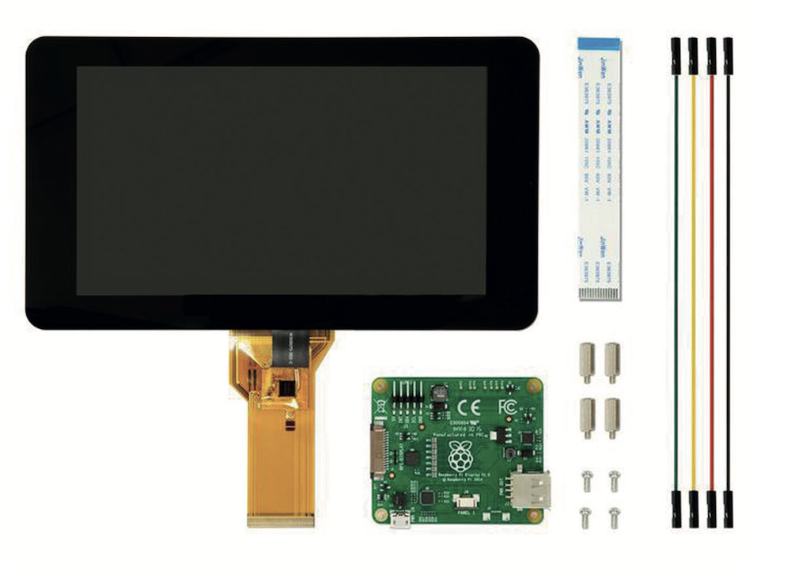
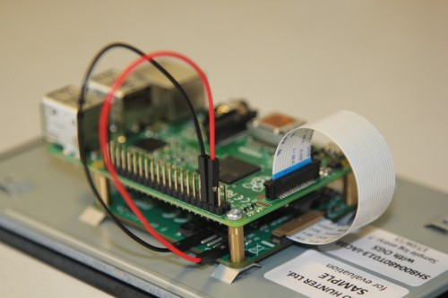
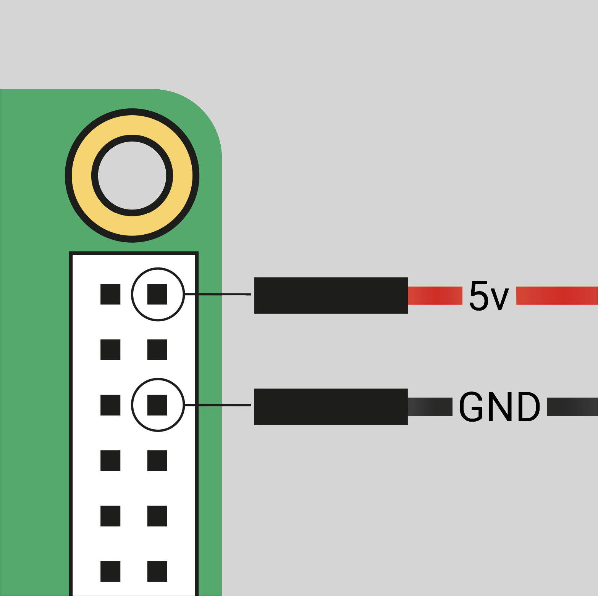
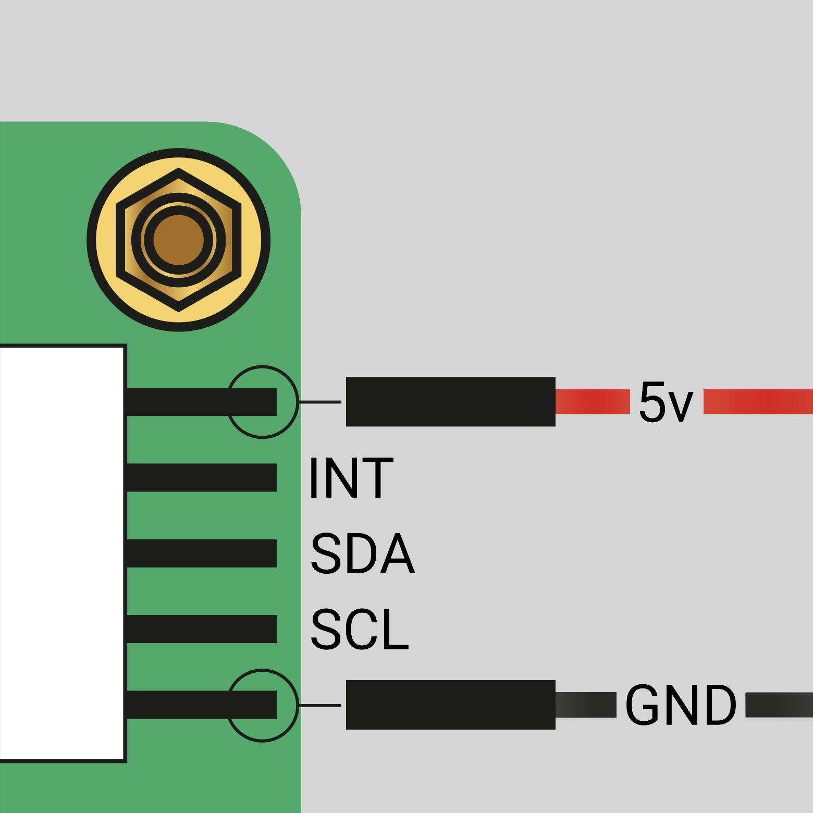
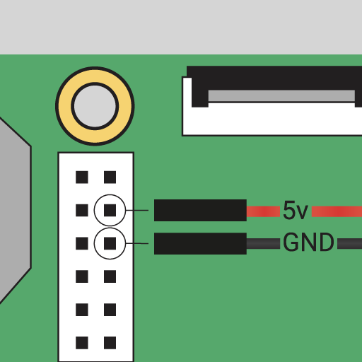

== Raspberry Pi Touch Display

https://www.raspberrypi.com/products/raspberry-pi-touch-display/[Raspberry Pi Touch Display] is a 7-inch touchscreen LCD intended for interactive projects like tablets, entertainment systems, and information dashboards.

.The Raspberry Pi 7-inch Touch Display

The display features a metal-framed back and comes with a Raspberry Pi display conversion board and metal stand-offs pre-installed. Download a mechanical drawing of the Touch Display https://pip.raspberrypi.com/documents/RP-008246-DS[here].

WARNING: The display must be mounted in a suitable enclosure. The enclosure, including any gaps provided for ventilation or cable entry, must ensure all parts of the circuit board are inaccessible during operation.

== Compatibility

Touch Display is compatible with Raspberry Pi B+ and later.

It isn't compatible with either Raspberry Pi Zero series or Raspberry Pi Keyboard computers, because these don't have DSI connectors.

Raspberry Pi 5 uses a different-sized DSI connector, but you can connect it to the Touch Display using a https://www.raspberrypi.com/products/display-cable/[A 22-way to 15-way flat flexible cable] (sold separately).

Raspberry Pi 5 and Raspberry Pi Compute Modules natively support connecting up to two Touch Displays.

You can mount any Raspberry Pi B+ and later to the back of the Touch Display. However, to mount Raspberry Pi B and earlier, additional mounting hardware is required to fit stand-offs to the display PCB.

== Autodetection

Raspberry Pi B+ and later devices auto-detect Touch Display.

Raspberry Pi A and B can auto-detect the display, but the capability is turned off by default and you must therefore enable it.

Raspberry Pi Compute Modules don't auto-detect DSI displays because they are intended for industrial applications where the integrator can use any and all GPIOs and interfaces for their own purposes.

== Specifications

This section describes the characteristics and capabilities of Touch Display.

=== Features

Touch Display has the following features:

- *800 × 480px RGB LCD* display
- *24-bit RGB display* capable of showing over 16 million colours
- *Multitouch* supports up to ten simultaneous touch points
- *On-screen keyboard.* Supports an on-screen keyboard in place of a physical keyboard
- *Integrated power.* Powered directly by the host Raspberry Pi device, requiring no separate power supply
- *Backlight lifetime*. 20,000 hours

=== Viewing performance

- *Industrial quality*. 140 degree viewing angle horizontal, 120 degree viewing angle vertical
- *PWM backlight control and power control* over I2C interface
- *Contrast ratio* 500
- *Average brightness* 250 cd/m^2^
- *Viewable area* 154.08 × 85.92 mm
- *Viewing angle* (degrees):
 ** Top - 50
 ** Bottom - 70
 ** Left - 70
 ** Right - 70

=== Power

- *Power draw* 200mA at 5 V typical, at maximum brightness.

=== Dimensions and environmentals

- *Operating temperature* -20 to +70 degrees centigrade
- *Storage temperature* -30 to +80 degrees centigrade
- *Outer dimensions* 192.96 × 110.76 mm

=== Hardware
The Touch Display box contains the following:

- A Touch Display
- Four standoffs and four M2.5 screws (pre-installed but removable)
- A 15-way to 15-way flat flexible cable
- Four jumper wires

=== Connections
Touch Display connects to a Raspberry Pi device using:

- A *DSI connector*. Attach the appropriate flat flexible cable (FFC) to this to carry video and touch data.
* Raspberry Pi 4 and earlier use the supplied 15-way to 15-way FFC.
* Raspberry Pi 5 and Raspberry Pi Compute Module IO Boards use a Raspberry Pi Standard-Mini FFC (https://www.raspberrypi.com/products/display-cable/[sold separately]).

- The *GPIO header*. The supplied jumper wires carry power from the GPIO header on the Raspberry Pi to the display.

== Connect to a Raspberry Pi device

Follow the appropriate procedures for your device.

No special tools are required to connect your device to the display, but you must have the correct FFC cable ready. You also need your device, its boot media, and its power supply.

To attach your device to the display, use a Phillips/cross-head screwdriver that fits the M2.5 screws included with the display. If you don't want to attach your device to the display, you might need a longer FFC cable.

[tabs]
======
Raspberry Pi B+ and later::
+
--
[discrete]
=== Raspberry Pi B+ and later

WARNING: Disconnect your Raspberry Pi from power before starting Step 1.

[discrete]
==== Step 1. Connect the FFC to the Touch Display

Before you start, check that you have the correct flat flexible cable for your Raspberry Pi model:

- For *Raspberry Pi 5*, use a *22-way to 15-way FFC*.
- For all other Raspberry Pi models, use the supplied *15-way to 15-way FFC*.

To connect the FFC:

. Slide the retaining clip outwards from both sides of the FFC connector on the Touch Display.
. Insert the FFC into the Touch Display FFC connector, then slide the retaining clip back into place to secure the cable.
+
Position the metal contacts facing upwards, away from the Touch Display.
+
If connecting to a Raspberry Pi 5, and therefore using a 22-way to 15-way FFC, the 22-way end is the smaller end of the cable. Insert the larger end of the cable into the Touch Display  FFC connector.

[discrete]
==== Step 2. (Optional) Mount the Raspberry Pi to the Touch Display

You can mount any Raspberry Pi B+ and later to the back of the Touch Display.

.A Raspberry Pi connected to the Touch Display

To mount the device to the display:

. Align the four corner stand-offs of your Raspberry Pi with the four mounting points on the back of the Touch Display.
. Insert the M2.5 screws (included) into the four corner stand-offs and tighten until the Raspberry Pi is secure.

[discrete]
==== Step 3. Connect the FFC to the Raspberry Pi

CAUTION: Take care not to pinch the FFC in this step.

. Slide the retaining clip upwards from both sides of the FFC connector on the Raspberry Pi. This is labelled `DISPLAY` on Raspberry Pi 4B and earlier.
. Connect the other end of the FFC to the port on the Raspberry Pi, then slide the retaining clip back into place to secure the cable.
+
The metal contacts must face towards the Ethernet and USB-A ports.

[discrete]
==== Step 4. Connect power to the display, then power it on

WARNING: Before applying power, the display must be mounted in an enclosure that ensures all parts of the circuit board are inaccessible.

We recommend using xref:../computers/raspberry-pi.adoc#gpio[Raspberry Pi's GPIO header] to provide power to the Touch Display.

Alternatively, you can power the display directly with a separate micro USB power supply.

[discrete]
===== Connect to the GPIO header:

. Connect jumper wires between the 5 V and `GND` pins on the xref:../computers/raspberry-pi.adoc#gpio[Raspberry Pi's GPIO] and the 5 V and `GND` pins on the display.
+
.The location of the Raspberry Pi headers

+
. Connect one end of the black jumper wire to pin six (`GND`) on the Raspberry Pi.
. Connect one end of the red jumper wire to pin four (5 V).
+
If pin six isn't available, use any other `GND` pin to connect the black wire.
+
If pin four isn't available, use the other 5 V pin (pin two) to connect the red wire.
+
.The location of the display's 5 V and `GND` pins

+
. Connect the other end of the black wire to the `GND` pin on the display.
. Connect the other end of the red wire to the 5 V pin on the display.
. Connect your Raspberry Pi to a power source, then turn it on. The Touch Display turns on.

[discrete]
===== Connect using a micro USB supply

If you don't want to use a Raspberry Pi to provide power to the Touch Display, you can use a micro USB power supply instead. We recommend using the https://www.raspberrypi.com/products/micro-usb-power-supply/[Raspberry Pi 12.5 W power supply] to make sure the display runs as advertised.

CAUTION: Don't connect the GPIO pins on your Raspberry Pi to the display if you choose to use micro USB for power.

. Plug in the micro USB power cable.

[discrete]
===== Power on the Raspberry Pi

. Connect your boot media to the Raspberry Pi.
. Connect the Raspberry Pi to your power supply.
+
The Touch Display turns on when the device boots, but it can take up to one minute for Raspberry Pi OS to start displaying output on the screen.
--

Raspberry Pi Compute Module::
+
--

[discrete]
[[connect-to-cm]]
=== Raspberry Pi Compute Module

This section assumes that you're familiar with your Compute Module. For more information, see xref:../computers/compute-module.adoc[Raspberry Pi Compute Module].

You can connect a Touch Display to a Raspberry Pi Compute Module that is attached to an IO Board. A Raspberry Pi Standard-Mini FFC (sold separately) is required to do this.

Before you begin, update your Compute Module's system software and firmware to the latest version.

[discrete]
==== Step 1. Specify the display in `config.txt`

Raspberry Pi Compute Modules don't automatically detect Touch Displays.

Configure the Compute Module for the device it is connecting to by adding an overlay entry in `config.txt`. The default connection is port `1`, but you can also use port `0`.

To complete this step, either connect the Compute Module to a monitor, or use a remote method such as SSH or Raspberry Pi Connect's screen sharing or remote shell.

NOTE: If you're using a Raspberry Pi Compute Module that has eMMC memory, make sure you edit the *configuration file that is used to boot the device*: either the one stored on the eMMC or one on external boot media if you've reconfigured the boot order.  For more information, see xref:../computers/compute-module.adoc#flash-compute-module-emmc[rpiboot].

To enable Touch Display:

. Boot your Compute Module, then open xref:../computers/config_txt.adoc#what-is-config-txt[`/boot/firmware/config.txt`].
+
- To connect the display to `DISP1/DSI1`, add `dtoverlay=vc4-kms-dsi-7inch` to the end of the file.
- To connect the display to `DISP0/DSI0`, add `dtoverlay=vc4-kms-dsi-7inch,dsi0` to the end of the file.
. Remove the `display_auto_detect` line, if it exists.
. Shut down the device.

[discrete]
==== Step 2. Connect the Touch Display to the Compute Module IO Board

IMPORTANT: Disconnect the IO Board from power before continuing.

Connect the Touch Display to whichever IO Board port chosen in Step 1 (either `DISP1/DSI1` or `DISP0/DSI0`). Once you've connected the FFC, set the appropriate jumpers, then connect the power cables between the display and the board.

To connect to the Touch Display:

. Slide the retaining clip outwards from both sides of the FFC connector on the Touch Display.
. Insert one end of the FFC into the Touch Display FFC connector, then slide the retaining clip back into place to secure the cable.
. Insert the other end of the FFC into the port chosen in Step 1, then slide the retaining clip back into place.
. Reference the table below and set the jumpers that correspond to the overlay entry you created in Step 1.
+
[cols="1,2,2"]
|===
|Display |Board |Action

|`DISP1/DSI1`
|*CM1*, *CM3*, *CM3+*, or *CM4S* on the CMIO1 or CMIO3 Boards.
|Connect GPIO `0` to `CD1_SDA` and `1` to `CD1_SCL` with jumper cables.

|`DISP1/DSI1`
|*CM4* on the *CM4IO Board*.
|No additional jumpers are required.

|`DISP1/DSI1`
|*CM5* on the *CM5IO Board*.
|Add jumpers to `J6`, as indicated on the silkscreen.

|`DISP0/DSI0`
|*CM1*, *CM3*, *CM3+*, or *CM4S* on the CMIO1 or CMIO3 Boards.
|Connect GPIO `28` to `CD0_SDA` and `29` to `CD0_SCL` with jumper cables.

|`DISP0/DSI0`
|*CM4* on the *CM4IO Board*.
|Add jumpers to `J6`, as indicated on the silkscreen.

|`DISP0/DSI0`
|*CM5* on the *CM5IO Board*.
|No additional jumpers are required.
|===
+
. Connect one end of the black jumper wire to pin six (`GND`) of the GPIO header on the IO Board.
. Connect one end of the red jumper wire to pin four, 5 V, of the GPIO header on the IO Board.
+
.The location of the Raspberry Pi GPIO headers on an CM4IO Board.

+
. Connect the other end of the black wire to the `GND` pin on the display.
. Connect the other end of the red wire to the 5 V pin on the display.
+
.The location of the display's 5 V and `GND` pins

[discrete]
==== Step 3. Power on the Compute Module

WARNING: Before applying power, the display must be mounted in an enclosure that ensures all parts of the circuit board are inaccessible.

To power on the Compute Module:

. Connect the boot media to the Compute Module – skip this if you're booting from eMMC.
. Connect the Raspberry Pi device to the power supply.
. If the IO Board has one, press and release the *Power Button*.
+
The Touch Display turns on when the device boots, but it can take up to one minute for Raspberry Pi OS to start displaying output on the screen.
--
======

== Troubleshooting

Your display is now ready to use, but if it's not turning on or not displaying anything, check the following:

* *DSI connections*. Check the FFC cable is seated properly at both ends, that the metal strips point towards the connections correctly, and that it is connected to the correct DSI connector.
* *Power*. Check your device is powered on and has boot media attached (if required). If you're using a Compute Module with a power switch, check that it has been pressed.
* *GPIO connections*. If the display is powered by your device, check that the power cables are seated properly, and connected to the correct pins on the display and the GPIO header.
* *Micro USB connection*. If the display is powered by micro USB, check the connection and the power supply.
* *`config.txt`*. If you're using a Compute Module, check the syntax of the overlay you added to `config.txt` in Step 1. Check also that you've specified the correct display port and that you removed any `display_auto_detect` line in the file.
* *EEPROM boot order*. If you're using a Compute Module with onboard boot media, or you have multiple drives attached to your Compute Module, make sure the `config.txt` file you edited in Step 1 is on the boot media you're booting from.

If none of these things help, visit the https://forums.raspberrypi.com/viewforum.php?f=108[Raspberry Pi forums] to get further assistance.

== On-screen keyboard

Raspberry Pi OS _Bookworm_ and later include the **Squeekboard on-screen keyboard**.

With Touch Display, this keyboard automatically appears when you can enter text. It automatically disappears when you can't.

For applications that don't support text entry detection, you can manually show or hide the keyboard by selecting the keyboard icon at the top-right of the taskbar.

To always show, or to always disable, the on-screen keyboard using the Raspberry Pi graphical interface:

. From the Raspberry Pi menu, go to **Preferences > Control Centre > Display**.
. Select **Enabled always** or **Disabled**, as required.

To permanently show, or to disable, the on-screen keyboard using the command line:

. Open a terminal, and enter `sudo raspi-config`.
. Navigate to the **Display** section of `raspi-config`, then choose your keyboard setting.

== Disable display

NOTE: To reverse this action, use an SSH connection (such as Raspberry Pi Connect's remote access), an HDMI display, or a separate computer with the Raspberry Pi's boot media attached.

To disable the display when connected to a Raspberry Pi:

. Open `/boot/firmware/config.txt`
. Add the following line `ignore_lcd=1`
. Reboot by typing `sudo reboot` in the command line.

== Disable touchscreen

You can disable the touchscreen and continue to use the Touch Display as a standard screen.

To disable the touchscreen:

. Open `/boot/firmware/config.txt`
. Add the following line `disable_touchscreen=1`
. Reboot by typing `sudo reboot` into the command line.

== Change display orientation

If you're using Raspberry Pi OS with a desktop environment, you can change the orientation of Touch Display with the Raspberry Pi Control Centre application. This allows you to independently change the orientation of multiple connected displays.

If you're using Raspberry Pi OS Lite (which has no desktop environment), you can change the orientation of Touch Display by editing `/boot/firmware/cmdline.txt`. However, if you have multiple displays connected, this method changes the orientation of them all.

There are four orientations to choose from:

- **Normal** (default). Portrait format.
- **Left**. Display rotated 90 degrees clockwise.
- **Inverted**. Display rotated 180 degrees.
- **Right**. Display rotated 270 degrees clockwise.

=== With the desktop

To change the display orientation using the Raspberry Pi desktop:

. Go to **Preferences > Control Centre > Screens**.
. Right-click the rectangle in the layout editor that represents your Touch Display (likely labelled `DSI-1`).
. Select **Orientation**.
. Choose between **Normal**, **Left**, **Inverted**, or **Right**, to rotate the display.
. Select **Apply**, then select **OK** to keep your change or **Cancel** to discard it.

=== With the kernel command line

NOTE: It's not possible to rotate the DSI display separately from the HDMI display with `cmdline.txt`. When DSI and HDMI connections are used simultaneously, they share the same rotation value.

To change the display orientation in console mode by editing the kernel command line:

. Open the `/boot/firmware/cmdline.txt` file, which contains parameters that Raspberry Pi OS reads when it boots.
. Add the following to the end of the file, replacing `<rotation-value>` with the number of degrees clockwise to rotate by (`0`, `90`, `180`, or `270`):
+
[source,ini]
----
video=DSI-1:800x480@60,rotate=<rotation-value>
----
+
The `rotate=` setting only rotates the text-mode console. For applications that write directly to DRM, such as `cvlc` or the libcamera apps, use the rotation options that come with them (if available).

== Change display brightness

. Go to **Preferences > Control Centre > Screens**.
. Right-click the rectangle in the layout editor that represents your Touch Display (likely labelled `DSI-1`).
. Select **Brightness**.
. Choose a brightness level.
+
The brightness level changes immediately.

== Customise touchscreen settings

NOTE: These settings are only required when rotating the display and using touch inputs in a non-desktop environment.

Use the Device Tree overlay to tell Raspberry Pi OS how to configure the Touch Display at boot. The overlay is called `vc4-kms-dsi-7inch`.

To modify the Device Tree overlay in the boot configuration:

. Open `/boot/firmware/config.txt`.
. Add the required Device Tree parameters to a `dtoverlay` line, separated by commas. See the Device Tree options table for details.

=== Device Tree options

The `vc4-kms-dsi-7inch` overlay supports the following options:

[cols="1,2", options="header"]

|===
| DT parameter | Action

| `sizex`
| Sets X touch resolution (default 800)

| `sizey`
| Sets Y touch resolution (default 480)

| `invx`
| Invert X coordinates

| `invy`
| Invert Y coordinates

| `swapxy`
| Swap X and Y coordinates

| `disable_touch`
| Disables the touch overlay
|===
--
- Booleans (`invx`, `invy`, `swapxy`, and `disable_touch`) default to true if present, but you can set them to false using the suffix `=0`.
- Integers (`sizex` and `sizey`) require a number, for example, `sizey=240`.
--

Example

In the following example the X touch resolution is set to 400 pixels, and both X and Y coordinates are inverted:

[source,ini]
----
dtoverlay=vc4-kms-dsi-7inch,sizex=400,invx,invy
----

=== Rotate touch input

WARNING: Rotating touch input using the device tree can cause conflicts with your input library. When possible, configure touch event rotation in your input library or desktop.

Rotation of touch input is independent of the orientation of the display itself.

To change touch input orientation:

. Open xref:../computers/config_txt.adoc[`/boot/firmware/config.txt`].
. Add `dtoverlay` at the end of file.
. Reboot using `sudo reboot` from the command line.

[source,ini]
----
dtoverlay=vc4-kms-dsi-7inch,invx,invy
----

Then, disable automatic display detection by removing the following line from `config.txt`, if it exists:

[source,ini]
----
display_auto_detect=1
----