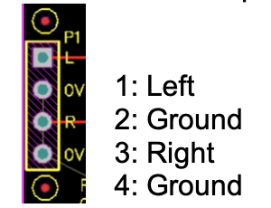

=== Raspberry Pi Codec Zero

Raspberry Pi Codec Zero is a Raspberry Pi Zero sized audio HAT (Hardware Attached on Top). It delivers bi-directional digital audio signals (I2S) between Raspberry Pi Zero and its onboard Dialog Semiconductor DA7212 codec. Codec Zero supports a range of input and output devices.

* High performance 24-bit audio codec
* Supports common audio sample rates between 8-96kHz
* Built in MEMS (micro-electro-mechanical) microphone (Mic2)
* Mono Electret microphone (Mic2 left)
* Automatic MEMS disabling on Mic2 insert detect
* Supports additional (no fit) Mono Electret microphone (Mic1 right)
* Stereo auxiliary input channel (AUX IN) - PHONO/RCA connectors
* Stereo auxiliary output channel (Headphone / AUX OUT) - 3.5mm Stereo jack
* Flexible analog and digital mixing paths
* DSP (Digital Signal Processors) for ALC (Automatic Level Control)
* 5-band EQ (Equalisation)
* Mono line-out / mini speaker driver: 1.2W @ 5V, THD<10%, R=8Ω

image::images/codec_zero.png[width="80%"]

Codec Zero includes the HAT EEPROM allowing for auto configuration of the Linux environment if needed.

Built in MEMS microphone and supports mono Electret microphone or mono speaker (1.2W / 8Ω).

It also has GREEN (GPIO23) and RED (GPIO24) LEDs, that can be used for status and a tactile programmable 
button (GPIO27) that can be used to start an event.

The Codec Zero makes a great starting point for many projects such as a walkie talkie, intelligent doorbell, vintage radio
hack or smart speaker.

P1 and P2 will support external PHONO / RCA sockets if needed. P1: AUX IN, P2: AUX OUT.

Pin 1 is square:

