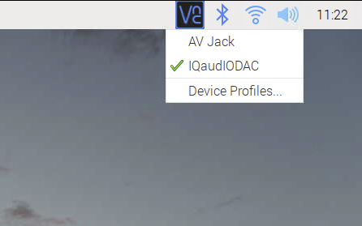

== Configuration

All Raspberry Pi audio boards include a pre-programmed EEPROM (Electrically Erasable Programmable Read-only Memory). This allows Raspberry Pi OS to autodetect and autoconfigure itself allowing Raspberry Pi audio boards to be plug and play. Using Raspberry Pi OS (32-bit) with the Desktop environment and your board attached, you can utilise the built in GUI (Graphical User Interface) by right clicking on the audio settings in the top right hand corner of your screen, allowing you to switch between the HAT and the on-board audio settings:

There are a number of 3rd party audio software applications available for Raspberry Pi that will support the plug and play feature of our audio boards. Often these are used with a "Headless" setup, that is to say that they don't need a keyboard, mouse and display to be physically attached to Raspberry Pi. They are controlled via a PC or Mac application or by a web-server installed on Raspberry Pi as part of the software, with interaction through a webpage.

If you need to configure Raspberry Pi OS yourself, perhaps you are running a headless system of your own and therefore don't have the option of control via the GUI, then there are a few extra steps to complete. Using a Terminal session connected to your Raspberry Pi either directly using a keyboard, mouse and monitor or via a SSH (Secure Shell), run the following command to edit the `/boot/config.txt` file:

----
$ sudo nano /boot/config.txt
----

Depending on the model of your board add one of the following lines to the end of the file:

[cols="1,2"]
|===
| Board | *`/boot/config.txt`* 

| DAC Pro | `dtoverlay=iqaudio-dacplus`
| DAC{plus} | `dtoverlay=iqaudio-dacplus`
| DigiAMP{plus} | `dtoverlay=iqaudio-dacplusdtoverlay=iqaudio-dacplus,unmute_amp` or `dtoverlay=iqaudio-dacplus,auto_mute_amp`
| Codec Zero | `dtoverlay=iqaudio-codec`
|===

CTRL + X, then Y and ENTER to save.

Alternatively, the `/boot/config.txt` file can be edited directly onto the Raspberry Pi microSD card inserted into your usual computer. Using the default file manager open the `boot` volume on the card and edit the `config.txt` file using an appropriate text editor, such as Notepad or Notepad++, then save the file, eject the microSD card and reinsert it back into your Raspberry Pi.

=== Disabling on-board audio

To make your Raspberry Pi audio card the primary device in Raspberry Pi OS you will need to
disable the Raspberry Pi’s on-board audio card and again, this is done by editing the `/boot/config.txt` file. Find the `dtparam=audio=on` line in your `/boot/config.txt` file and comment it out by placing a # symbol at the start of the line. Anything written after the `#` symbol in any given line will be disregarded by the program. Your ``/boot/config.txt`` file should now have the following entry:

----
#dtparam=audio=on
----

Save the file and reboot your Raspberry Pi for the settings to take effect.

=== Attaching the HAT

The Raspberry Pi range of sound boards attach to the Raspberry Pi’s 40-pin header.
They are designed to be supported on the Raspberry Pi using the supplied circuit board standoffs and screws. In
general no soldering is required on the Raspberry Pi audio boards for normal operation with the exception when utilising hardwired connections for specific connectors, XLR (External Line Return) connections on the DAC Pro for example.

The Raspberry Pi range of boards are supplied with the necessary mounting hardware (PCB
spacers and screws). If additional parts, such as 2 piece speaker connectors, are required these are
included.

image::images/hat.png[width="80%"]

The PCB spacers should be screwed, finger tight only, to the Raspberry Pi before adding the audio
board. The remaining screws are then screwed into the spacers from above.

=== Codec Zero Configuration

The Raspberry Pi Codec Zero board uses the Dialog Semiconductor DA7212 codec. This allows
the recording of audio from the built in MEMS microphone, from stereo Phono sockets (AUX
IN) or 2 x mono external Electret microphones. Playback is through stereo Phono sockets (AUX OUT)
or a mono speaker connector.

Each input and output device has its own “mixer” allowing the audio levels and volume to be adjusted
independently. Within the codec itself other mixers and switches exist to allow the output to be Mono’d
for single speaker output. Signals may also be inverted and there is a 5 band Equaliser to adjust
certain frequency bands. These settings can be controlled interactively using Alsamixer (a graphical mixer program used in Terminal) or programatically.

It is important to note that the AUX IN and AUX OUT are both 1V RMS. It may be necessary to adjust
the AUX IN’s mixer to ensure the input signal doesn’t saturate the ADCs. (Analogue to Digital
Convertors). Similarly, the output mixers may been to be adjusted to get the best possible output.

There is a set of preconfigured scripts (loadable ALSA settings) available on GitHub. https://github.com/iqaudio/Pi-Codec.

These cover several use cases such as:
 
* Mono MEMS mic recording, mono speaker playback
* Mono MEMS mic recording, mono AUX OUT playback
* Stereo AUX IN recording, stereo AUX OUT playback
* Stereo MIC1/MIC2 recording, stereo AUX OUT playback

The Codec Zero DA7212 chip needs to know which of these input and output settings are for each new cycle of power for it to operate correctly. Using a Terminal session connected to your Raspberry Pi either directly using a keyboard, mouse and monitor or via a SSH (Secure Shell), run the following command to download the scripts:

----
$ git clone https://github.com/iqaudio/Pi-Codec.git
----

If git is not installed run the following command to install it:

----
$ sudo apt install git
----

The following command will set your device, in this case using the on-board MEMS microphone and output for speaker playback:

----
$ sudo alsactl restore -f /home/pi/Pi-Codec/IQaudIO_Codec_OnboardMIC_record_and_SPK_playback.state
----

In order for your project to operate with your required settings when it is powered on the easiest way is to add to the `/etc/rc.local` file. The contents of this file are run at the end of every boot process so it is ideal for this purpose. Edit the file using the following:

----
$ sudo nano /etc/rc.local
----

Add the chosen script command above the exit 0 line and then Ctrl X, Y and Enter to save. The file should now look similar to this depending on your chosen setting:

----
#!/bin/sh -e
#
# rc.local
#
# This script is executed at the end of each multiuser runlevel.
# Make sure that the script will "exit 0" on success or any other
# value on error.
#
# In order to enable or disable this script just change the execution
# bits.
#
# By default this script does nothing.

sudo alsactl restore -f /home/pi/Pi-Codec/IQaudIO_Codec_OnboardMIC_record_and_SPK_playback.state

exit 0
----

Reboot your device for the settings to take effect:

----
$ sudo reboot
----

=== Muting and unmuting the DigiAMP{plus}

The DigiAMP{plus} MUTE state is toggled by GPIO22 on Raspberry Pi. The latest audio device tree
supports the unmute of the DigiAMP{plus} through additional parameters.

Firstly a "one-shot" unmute when kernel module loads.

----
dtoverlay=iqaudio-dacplus,unmute_amp
----

Unmute amp when ALSA device opened by a client. Mute, with 5 second delay
when ALSA device closed. (Re-opening the device within the 5 second close
window, will cancel mute.)

----
dtoverlay=iqaudio-dacplus,auto_mute_amp
----

If you do not want to control Mute state through device tree then you can also script your own
solution. 

The amp will startup MUTED to unmute the amp:

----
$ sudo sh -c "echo 22 > /sys/class/gpio/export"
$ sudo sh -c "echo out >/sys/class/gpio/gpio22/direction"
$ sudo sh -c "echo 1 >/sys/class/gpio/gpio22/value"
----

to mute the amp once more:

----
$ sudo sh -c "echo 0 >/sys/class/gpio/gpio22/value"
----

