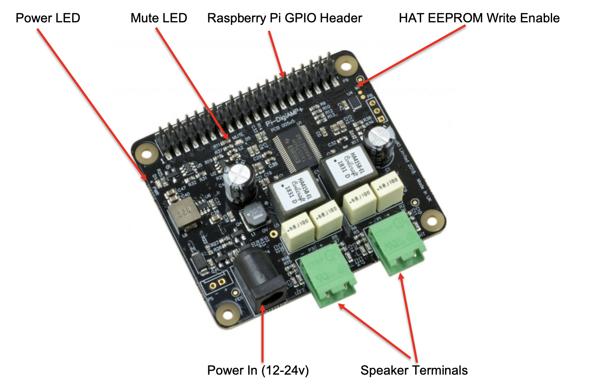

=== DigiAMP{plus}

IQAudio DigiAMP{plus} delivers direct connection to passive stereo speakers at up to 2x35wpc with variable output. Ideal for a Raspberry Pi-based hi-fi system.

* DigiAMP{plus} must be powered from an external supply, and requires a 12-24V DC power source (the XP Power VEC65US19 power supply is recommended)
* Uses the Texas Instruments TAS5756M PowerDAC

WARNING: DO NOT APPLY POWER TO THE RASPBERRY PI’s OWN POWER INPUT WHEN USING DIGIAMP{plus}.

NOTE: DigiAMP{plus} is a HAT compliant add-on accessory for the Raspberry Pi.

DigiAMP{plus} uses the Texas Instruments TAS5756M PowerDAC to deliver direct connection to
PASSIVE stereo speakers at up to 2×35Watts per channel with variable output. Ideal for a Pi based HiFi.

DigiAMP{plus} can be connected to the Raspberry Pi A{plus}/B{plus}/RPi2/RPi3 or RPi4's 40-pin header
without any additional soldering.

DigiAMP{plus} must be powered from an external supply and requires a 12 to 24DC power source to
operate. DigiAMP{plus}’s barrel connector is 5.5mmx2.5mm. DigiAMP{plus} has been designed to provide
power to the Raspberry Pi and DigiAMP{plus} combination in parallel, delivering 5.1v at 2.5Amp to the Pi.

The amplifier is by default muted at power on (mute LED lit). The mute state / LED is under software
control (Raspberry Pi GPIO22).

P5:: Alternative power input for hard wired installations. 

WARNING: POLARITY MUST BE OBSERVED.

P8:: TAS5756m Internal GPIO1/2/3