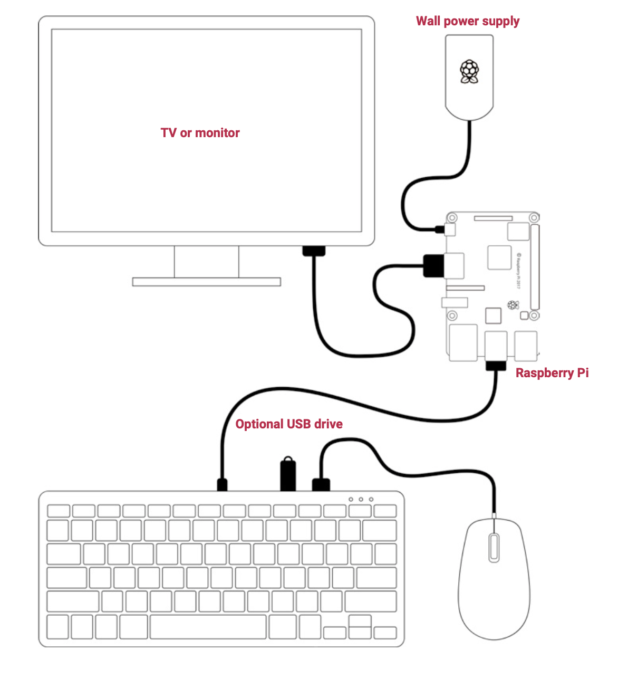

== Connecting it all Together

This is the configuration we recommend for using your Raspberry Pi, official keyboard and hub, and official mouse together. The hub on the keyboard ensures easy access to USB drives, and the mouse’s cable is tidy, while being long enough to allow you to use the mouse left- or right-handed.

NOTE: It is important that the power supply is connected to the Raspberry Pi and the keyboard is connected to the Raspberry Pi. If the power supply were connected to the keyboard, with the Raspberry Pi powered via the keyboard, then the keyboard would not operate correctly.

