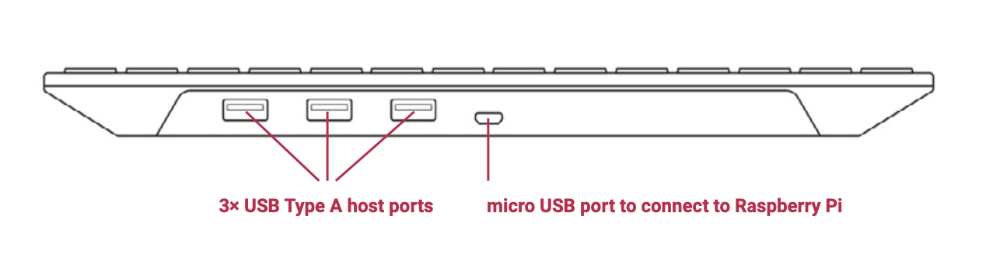
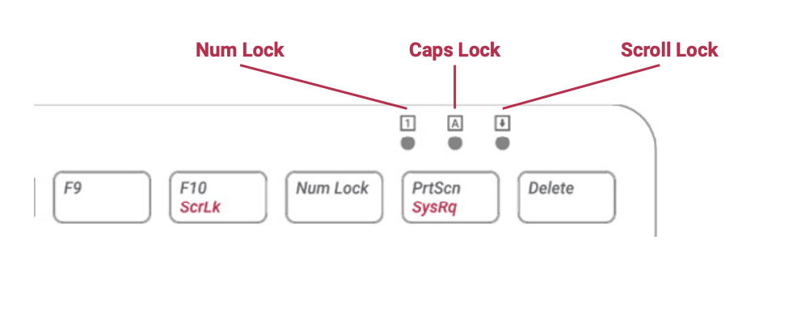

== Getting Started with your Keyboard

Our official keyboard includes three host USB ports for connecting external devices, such as USB mice, USB drives, and other USB- controlled devices.

The product’s micro USB port is for connection to the Raspberry Pi. Via the USB hub built into the keyboard, the Raspberry Pi controls, and provides power to, the three USB Type A ports.

=== Keyboard Features

The Raspberry Pi keyboard has three lock keys: `Num Lock`, `Caps Lock`, and `Scroll Lock`. There are three LEDs in the top right-hand corner that indicate which locks are enabled.

`Num Lock`:: Allows use of the red number keys on the letter keys, effectively creating a numeric keypad. This mode is enabled and disabled by pressing the `Num Lock` key.

`Caps Lock`:: Allows typing capital letters; press the `Shift` key to type lower-case letters in this mode. This mode is enabled and disabled by pressing the `Caps Lock` key.

`Scroll Lock (ScrLk)`:: Allows use of the cursor keys for browsing web pages and spreadsheets without the mouse. This mode is enabled and disabled by pressing the `ScrLk` key while holding the Fn key.
