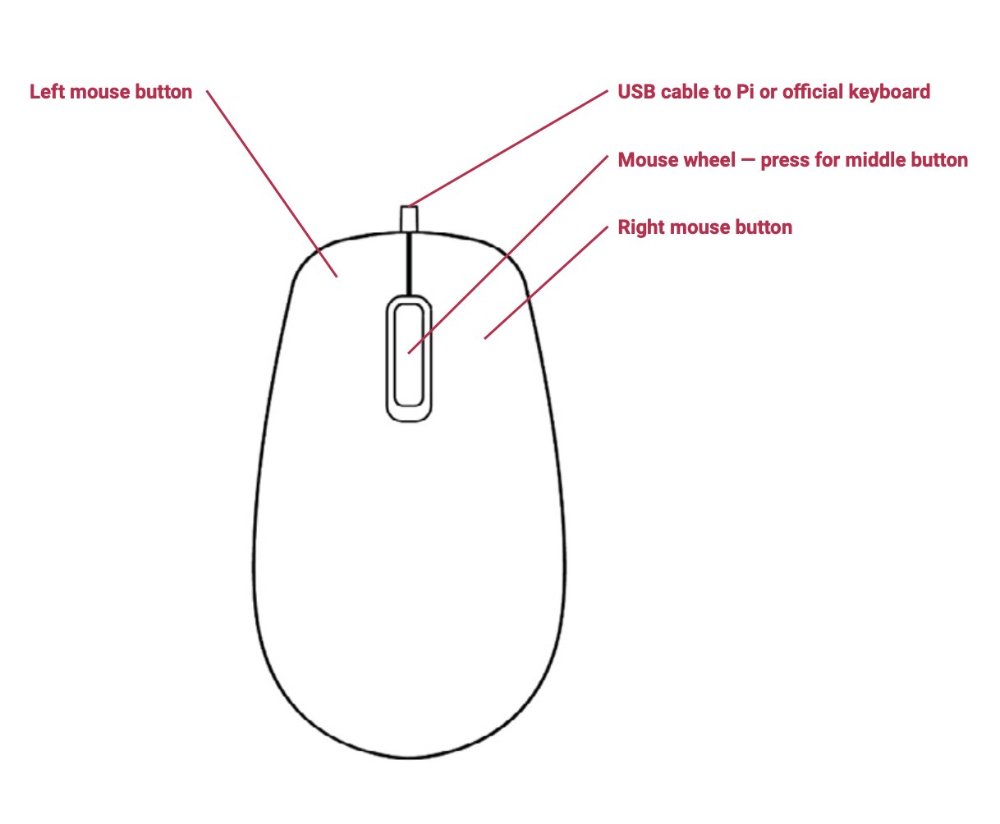

== Getting Started with your Mouse

Our official mouse has three buttons, which activate high-quality micro-switches. The wheel is for quick scrolling when browsing documents and web pages.

Always place the mouse on a flat, stable surface while using it. The mouse optically detects movement on the surface on which it is placed. On featureless surfaces, e.g. PVC or acrylic table tops, the mouse cannot detect movement. When you are working on such a surface, place the mouse on a mouse mat.
