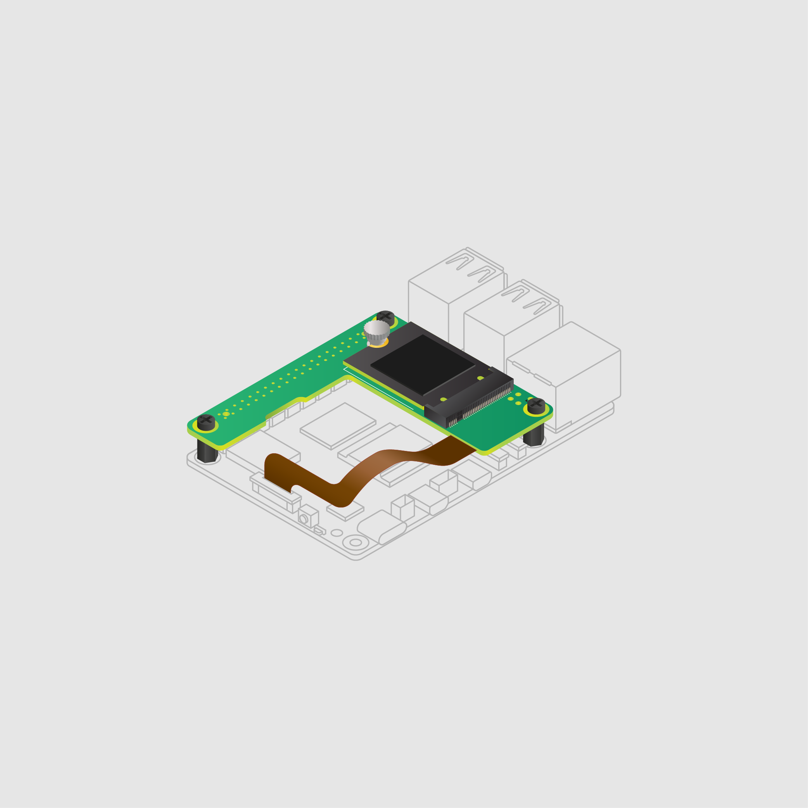

[[m2-hat-plus]]
== About

[.clearfix]
--
[.left]
.The Raspberry Pi M.2 HAT+
image::images/m2-hat-plus.jpg[width="100%"]
[.left]
.The Raspberry Pi M.2 HAT+ Compact in the Raspberry Pi Case
image::images/m2-hat-plus-compact-with-case.jpg[width="100%"]
--

The Raspberry Pi M.2 HAT+ M Key and M.2 HAT+ Compact M Key enable you to connect M.2 peripherals such as NVMe drives and other PCIe accessories to Raspberry Pi 5's PCIe interface.

The M.2 HAT+ and M.2 HAT+ Compact adapter boards convert between the PCIe connector on Raspberry Pi 5 and a single M.2 M key edge connector. The M.2 HAT+ supports any device that uses the 2230 or 2242 form factor; the M.2 HAT+ Compact supports any device that uses the 2230 form factor.

We provide the M.2 HAT+ in a standard and a compact format to serve different use cases:

* The M.2 HAT+ includes threaded spacers that provide ample room to fit the Raspberry Pi Active Cooler beneath it. However, the M.2 HAT+ is _only_ compatible with the https://www.raspberrypi.com/products/raspberry-pi-5-case/[Raspberry Pi Case for Raspberry Pi 5] _if you remove the lid and the included fan_.

* The M.2 HAT+ Compact is designed to fit around the included fan in the https://www.raspberrypi.com/products/raspberry-pi-5-case/[Raspberry Pi Case for Raspberry Pi 5]. However, you can't fit the Active Cooler beneath it.

Both the M.2 HAT+ and M.2 HAT+ Compact conform to the https://datasheets.raspberrypi.com/hat/hat-plus-specification.pdf[Raspberry Pi HAT+ specification], which allows Raspberry Pi OS to automatically detect the HAT+ and any connected devices.

== Features

The M.2 HAT+ and M.2 HAT+ Compact both have the following features:

* Single-lane PCIe 2.0 interface (500 MB/s peak transfer rate)
* Support for devices that use the M.2 M key edge connector
* Up to 3 A supply to connected M.2 devices
* Power and activity LEDs

The M.2 HAT+ and M.2 HAT+ Compact differ in the following ways:

* M.2 HAT+ supports devices with the 2230 or 2242 form factor; M.2 HAT+ Compact only supports the 2230 form factor.

=== Hardware

The Raspberry Pi M.2 HAT+ or M.2 HAT+ Compact box contains the following parts:

* Ribbon cable
* Threaded spacers
* Screws
* 1 knurled double-flanged drive attachment screw to secure and support the M.2 peripheral

The M.2 HAT+ also includes a 16 mm GPIO stacking header; M.2 HAT+ Compact doesn't include this component.

To use the M.2 HAT+ or M.2 HAT+ Compact, you also need:

* A Raspberry Pi 5

[[m2-hat-plus-installation]]
== Prepare your Raspberry Pi

. Ensure that your Raspberry Pi runs the latest software. Run the following command to update:
+
[source,console]
----
$ sudo apt update && sudo apt full-upgrade
----

. xref:../computers/raspberry-pi.adoc#update-the-bootloader-configuration[Ensure that your Raspberry Pi firmware is up-to-date]. Run the following command to see what firmware you're running:
+
[source,console]
----
$ sudo rpi-eeprom-update
----
+
If you see December 6, 2023 or a later date, proceed to the next step. If you see a date earlier than December 6, 2023, run the following command to open the Raspberry Pi Configuration CLI:
+
[source,console]
----
$ sudo raspi-config
----
+
Under `Advanced Options` > `Bootloader Version`, choose `Latest`. Then, exit `raspi-config` with `Finish` or the *Escape* key.
+
Run the following command to update your firmware to the latest version:
+
[source,console]
----
$ sudo rpi-eeprom-update -a
----
+
Then, reboot with `sudo reboot`.

. Disconnect the Raspberry Pi from power before beginning installation.

[[standard-installation]]
== Install the M.2 HAT+

Follow these steps to install the M.2 HAT+. To install the M.2 HAT+ Compact go to <<compact-installation>> instead.

=== (Optional) Install the Active Cooler

. The M.2 HAT+ is compatible with the Raspberry Pi 5 Active Cooler. If you have an Active Cooler, install it before installing the M.2 HAT+.
+
--
image::images/m2-hat-plus-installation-01.png[width="60%"]
--

=== Install the mounting hardware

. Install the spacers using the provided screws.

. Firmly press the GPIO stacking header on top of the Raspberry Pi GPIO pins; orientation doesn't matter as long as all pins fit into place.

. Disconnect the ribbon cable from the M.2 HAT+. Insert the other end into the PCIe port of your Raspberry Pi. Lift the ribbon cable holder from both sides, then insert the cable with the copper contact points facing inward, towards the USB ports. With the ribbon cable fully and evenly inserted into the PCIe port, push the cable holder down from both sides to secure the ribbon cable firmly in place.

--
image::images/m2-hat-plus-installation-02.png[width="60%"]
--

=== Install the board

. Set the M.2 HAT+ on top of the spacers and use the remaining screws to secure it in place.
+
--
image::images/m2-hat-plus-installation-03.png[width="60%"]
--

. Insert the ribbon cable into the slot on the M.2 HAT+.
+
Lift the ribbon cable holder from both sides, then insert the cable with the copper contact points facing up. With the ribbon cable fully and evenly inserted into the port, push the cable holder down from both sides to secure the ribbon cable firmly in place.
+
--
image::images/m2-hat-plus-installation-04.png[width="60%"]
--

=== Install your M.2 drive

. Remove the drive attachment screw by turning the screw counter-clockwise. Insert your M.2 SSD into the M.2 key edge connector, sliding the drive into the slot at a slight upward angle. Do not force the drive into the slot: it should slide in gently.
+
--
image::images/m2-hat-plus-installation-05.png[width="60%"]
--

. Push the notch on the drive attachment screw into the slot at the end of your M.2 drive. Push the drive flat against the M.2 HAT+, and insert the SSD attachment screw by turning the screw clockwise until the SSD feels secure. Do not over-tighten the screw.
+
--
image::images/m2-hat-plus-installation-06.png[width="60%"]
--

Congratulations, you have successfully installed the M.2 HAT+.

.Installed M.2 HAT+
image::images/m2-hat-plus-installation-07.png[width="80%"]

[[compact-installation]]
== Install the M.2 HAT+ Compact

Follow these steps to install the M.2 HAT+ Compact. To install the M.2 HAT+ go to <<standard-installation>> instead.

=== Install the mounting hardware

. Install the spacers using the provided screws.
+
--

--

=== Install the board

. Set the M.2 HAT+ Compact on top of the spacers and use the remaining screws to secure it in place.
+
--

--

. Insert the ribbon cable into the PCIe port of your Raspberry Pi.
+
Lift the ribbon cable holder from both sides, then insert the cable with the copper contact points facing inward, towards the USB ports. With the ribbon cable fully and evenly inserted into the PCIe port, push the cable holder down from both sides to secure the ribbon cable firmly in place.
+
--

--

=== Install your M.2 drive

. Remove the drive attachment screw by turning the screw counter-clockwise. Insert your M.2 SSD into the M.2 key edge connector, sliding the drive into the slot at a slight upward angle. Do not force the drive into the slot: it should slide in gently.
+
--
image::images/m2-hat-plus-compact-installation-05.png[width="60%"]
--

. Push the notch on the drive attachment screw into the slot at the end of your M.2 drive. Push the drive flat against the M.2 HAT+ Compact, and insert the SSD attachment screw by turning the screw clockwise until the SSD feels secure. Do not over-tighten the screw.
+
--

--

Congratulations, you have successfully installed the M.2 HAT+ Compact.

.Installed M.2 HAT+ Compact

== Start your Raspberry Pi

. Connect your Raspberry Pi to power; Raspberry Pi OS automatically detects the M.2 HAT+ or M.2 HAT+ Compact. If you use Raspberry Pi Desktop, you see an icon representing the drive on your desktop. If you don't use a desktop, you can find the drive at `/dev/nvme0n1`.

. To make your drive automatically available for file access, consider xref:../computers/configuration.adoc#automatically-mount-a-storage-device[configuring automatic mounting].

WARNING: Always disconnect your Raspberry Pi from power before connecting or disconnecting a device from the M.2 slot.

== Boot from NVMe

To boot from an NVMe drive attached to the M.2 HAT+ or M.2 HAT+ Compact, complete the following steps:

. xref:../computers/getting-started.adoc#raspberry-pi-imager[Install an operating system to your NVMe drive by using Raspberry Pi Imager]. You can do this from your Raspberry Pi if you already have an SD card with a Raspberry Pi OS image.
. Reboot your Raspberry Pi.
* If you don't have an SD card inserted in your Raspberry Pi 5, it boots automatically from your NVMe drive.
* If you do have an SD card inserted in your Raspberry Pi 5, it attempts to boot from the SD card first. You can change the boot order on your Raspberry Pi by completing the following steps:
.. Boot your Raspberry Pi into Raspberry Pi OS using an SD card.
.. In a terminal on your Raspberry Pi, run `sudo raspi-config` to open the Raspberry Pi Configuration CLI.
.. Under `Advanced Options` > `Boot Order`, choose `NVMe/USB boot`.
.. Exit `raspi-config` with `Finish` or the *Escape* key.
.. Reboot your Raspberry Pi with `sudo reboot`.

For more information, see xref:../computers/raspberry-pi.adoc#nvme-ssd-boot[NVMe boot].

== Enable PCIe Gen 3

WARNING: The Raspberry Pi 5 is not certified for Gen 3.0 speeds. PCIe Gen 3.0 connections may be unstable.

To enable PCIe Gen 3 speeds, follow the instructions at xref:../computers/raspberry-pi.adoc#pcie-gen-3-0[enable PCIe Gen 3.0].

== Schematics

The schematics for the M.2 HAT+ are available as a https://datasheets.raspberrypi.com/m2-hat-plus/raspberry-pi-m2-hat-plus-schematics.pdf[PDF]

== Product brief

For more information about the M.2 HAT+ and M.2 HAT+ Compact, including mechanical specifications and operating environment limitations, see the https://datasheets.raspberrypi.com/m2-hat-plus/raspberry-pi-m2-hat-plus-product-brief.pdf[product brief].
