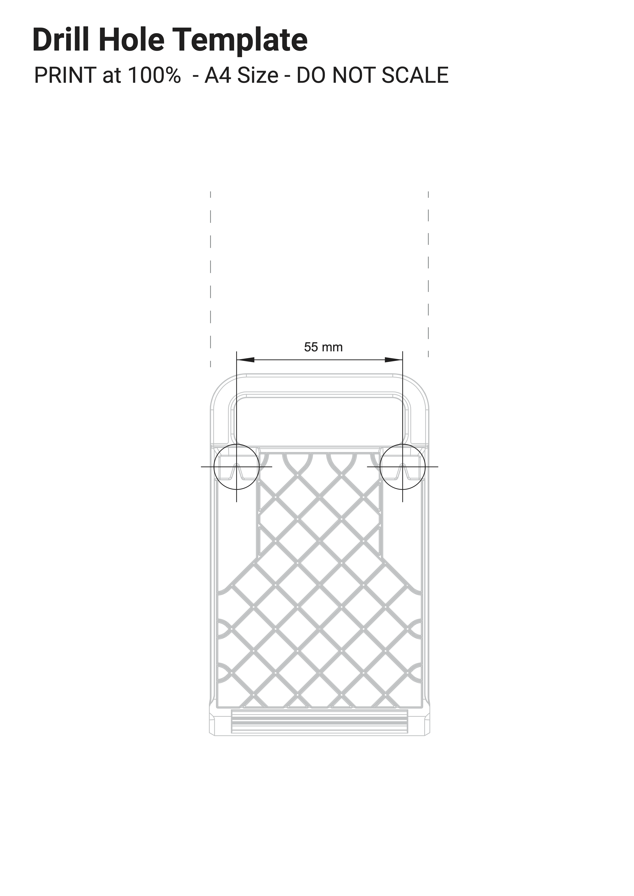
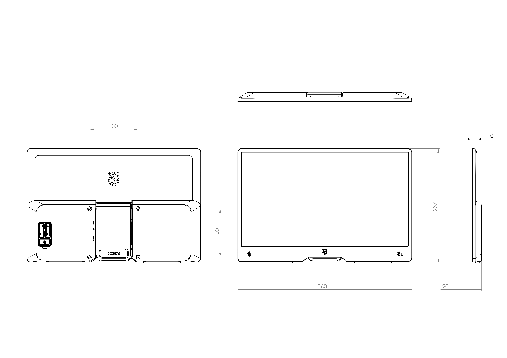

== Raspberry Pi Monitor

The https://www.raspberrypi.com/products/raspberry-pi-monitor/[Raspberry Pi Monitor] is a 15.6" 1920 × 1080p IPS LCD display that connects to a computer using an HDMI cable. The Monitor also requires a USB-C power source. For full brightness and volume range, this must be a USB-PD source capable of at least 1.5A of current.

.The Raspberry Pi Monitor

The Monitor is compatible with all models of Raspberry Pi that support HDMI output.

=== Controls

The back of the Monitor includes the following controls:

* a button that enters and exits Standby mode (indicated by the ⏻ (power) symbol)
* buttons that increase and decrease display brightness (indicated by the 🔆 (sun) symbol)
* buttons that increase and decrease speaker volume (indicated by the 🔈 (speaker) symbol)

=== On screen display messages

The on-screen display (OSD) may show the following messages:

[cols="1a,6"]
|===
| Message | Description

| image::images/no-hdmi.png[No HDMI signal detected]
| No HDMI signal detected.

| image::images/no-valid-hdmi-signal-standby.png[Standby mode]
| The monitor will soon enter standby mode to conserve power.

| image::images/not-supported-resolution.png[Unsupported resolution]
| The output display resolution of the connected device is not supported.

| image::images/power-saving-mode.png[Power saving mode]
| The monitor is operating in Power Saving mode, with reduced brightness and volume, because the monitor is not connected to a power supply capable of delivering 1.5A of current or greater.
|===

Additionally, the OSD shows information about display brightness changes using the 🔆 (sun) symbol, and speaker volume level changes using the 🔈 (speaker) symbol. Both brightness and volume use a scale that ranges from 0 to 100.

TIP: If you attempt to exit Standby mode when the display cannot detect an HDMI signal, the red LED beneath the Standby button will briefly light, but the display will remain in Standby mode.

=== Position the Monitor

Use the following approaches to position the Monitor:

* Angle the Monitor on the integrated stand.
* Mount the Monitor on an arm or stand using the four VESA mount holes on the back of the red rear plastic housing.
+
IMPORTANT: Use spacers to ensure adequate space for display and power cable egress.
* Flip the integrated stand fully upwards, towards the top of the monitor. Use the drill hole template to create two mounting points spaced 55 mm apart. Hang the Monitor using the slots on the back of the integrated stand.
+
.Drill hole template

=== Power the Monitor

The Raspberry Pi Monitor draws power from a 5V https://en.wikipedia.org/wiki/USB_hardware#USB_Power_Delivery[USB Power Delivery] (USB-PD) power source. Many USB-C power supplies, including the official power supplies for the Raspberry Pi 4 and Raspberry Pi 5, support this standard.

When using a power source that provides at least 1.5A of current over USB-PD, the Monitor operates in **Full Power mode**. In Full Power mode, you can use the full range (0%-100%) of display brightness and speaker volume.

When using a power source that does _not_ supply at least 1.5A of current over USB-PD (including all USB-A power sources), the Monitor operates in **Power Saving mode**. Power Saving mode limits the maximum display brightness and the maximum speaker volume to ensure reliable operation. In Power Saving mode, you can use a limited range (0-50%) of display brightness and a limited range (0-60%) of speaker volume. When powered from a Raspberry Pi, the Monitor operates in Power Saving mode, since Raspberry Pi devices cannot provide 1.5A of current over a USB-A connection.

To switch from Power Saving mode to Full Power mode, press and hold the *increase brightness* button for 3 seconds.

[TIP]
====
If the Monitor flashes on and off, your USB power supply is not capable of providing sufficient current to power the monitor. This can happen if you power the Monitor from a Raspberry Pi 5, 500, or 500+ which is itself powered by a 5V/3A power supply. Try the following fixes to stop the Monitor from flashing on and off:

* reduce the display brightness and volume (you may have to connect your monitor to another power supply to access the settings)
* switch to a different power source or cable

====

=== Specification

Diagonal: 15.6"

Resolution: 1920 × 1080

Type: IPS LCD

Colour gamut: 45%

Contrast: 800:1

Brightness: 250cd/m^2^

Screen coating: Anti-glare 3H hardness

Display area: 344 × 193 mm

Dimensions: 237 × 360 × 20 mm

Weight: 850g

Supported resolutions:

* 1920 × 1080p @ 50/60Hz
* 1280 × 720p @ 50/60Hz
* 720 × 576p @ 50/60Hz
* 720 × 480p @ 50/60Hz
* 640 × 480p @ 50/60Hz

Input: HDMI 1.4; supports DDC-CI

Power input: USB-C; requires 1.5A over USB-PD at 5V for full brightness and volume range

Power consumption: 4.5-6.5 W during use; < 0.1 W at idle

Speakers: 2 × 1.2 W (stereo)

Ports: 3.5 mm audio jack

=== Mechanical drawing

.Mechanical Drawing

