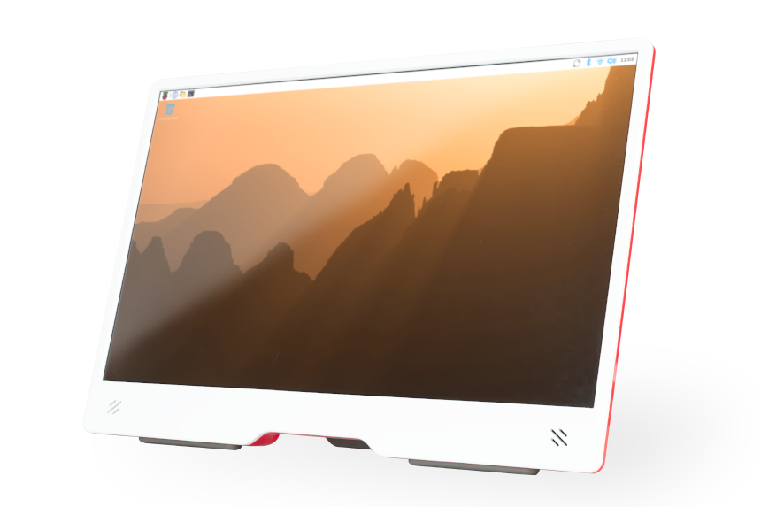

== Raspberry Pi Monitor

The https://www.raspberrypi.com/products/raspberry-pi-monitor/[Raspberry Pi Monitor] is an LCD display that connects to a Raspberry Pi using an HDMI cable.

.The Raspberry Pi Monitor

The Monitor is compatible with all models of Raspberry Pi that have an HDMI, micro HDMI, or mini HDMI port.

=== Mount the Touch Display

* stand
* mounting
* VESA mount

=== Power the Touch Display

[tabs%sync]
======
from a Raspberry Pi::
+
when powered from a Raspberry Pi

from a separate power supply
::
+
when powered from a separate supply
======
