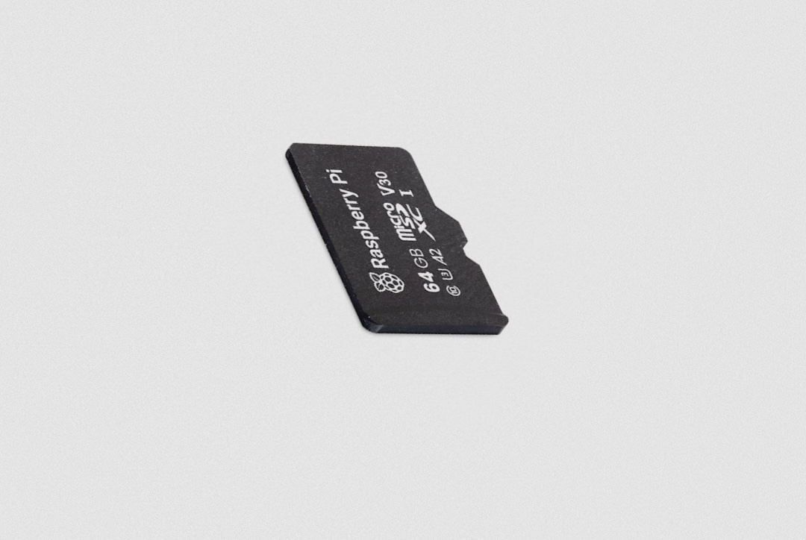

== About

.A 64GB Raspberry Pi SD Card

SD card quality is a critical factor in determining the overall user experience for a Raspberry Pi computer. Slow bus speeds and lack of command queueing can reduce the performance of even the most powerful Raspberry Pi models.

Raspberry Pi's official microSD cards support DDR50 and SDR104 bus speeds. Additionally, Raspberry Pi SD cards support the command queueing (CQ) extension, which permits some pipelining of random read operations, ensuring optimal performance.

You can even buy Raspberry Pi SD cards pre-programmed with the latest version of Raspberry Pi OS.

Raspberry Pi SD cards are available in the following sizes:

* 32GB
* 64GB
* 128GB

== Specifications

Raspberry Pi SD cards have the following specifications:

Speed Class: C10, U3, V30, A2

Random 4KB read performance:

* 3,200 IOPS on Raspberry Pi 4 (DDR50)
* 5,000 IOPS on Raspberry Pi 5 (SDR104)

Random 4KB write performance:

* 1,200 IOPS on Raspberry Pi 4 (DDR50)
* 2,000 IOPS on Raspberry Pi 5 (SDR104)

Form factor: microSDHC/microSDXC

SD specification: SD6.1
