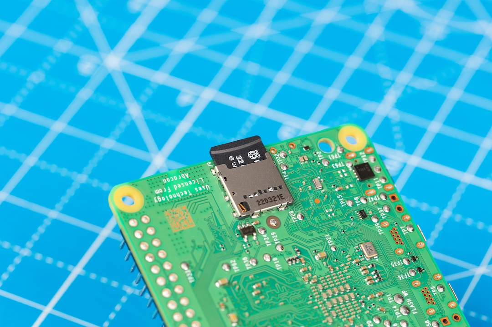
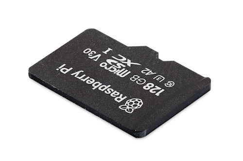

== About

.A Raspberry Pi SD Card inserted into a Raspberry Pi 5

SD card quality is a critical factor in determining the overall user experience for a Raspberry Pi. Slow bus speeds and lack of command queueing can reduce the performance of even the most powerful Raspberry Pi models.

Raspberry Pi's official microSD cards support DDR50 and SDR104 bus speeds. Additionally, Raspberry Pi SD cards support the command queueing (CQ) extension, which permits some pipelining of random read operations, ensuring optimal performance.

You can even buy Raspberry Pi SD cards pre-programmed with the latest version of Raspberry Pi OS.

Raspberry Pi SD cards are available in the following sizes:

* 32 GB
* 64 GB
* 128 GB

== Specifications

.A 128 GB Raspberry Pi SD Card

Raspberry Pi SD cards use the SD6.1 SD specification.

Raspberry Pi SD cards use the microSDHC/microSDXC form factor.

Raspberry Pi SD cards have the following Speed Class ratings: C10, U3, V30, A2.

The following table describes the read and write speeds of Raspberry Pi SD cards using 4 kB of random data:

|===
| Raspberry Pi Model | Interface | Read Speed | Write Speed

| 4 | DDR50  | 3,200 IOPS | 1,200 IOPS
| 5 | SDR104 | 5,000 IOPS | 2,000 IOPS
|===

