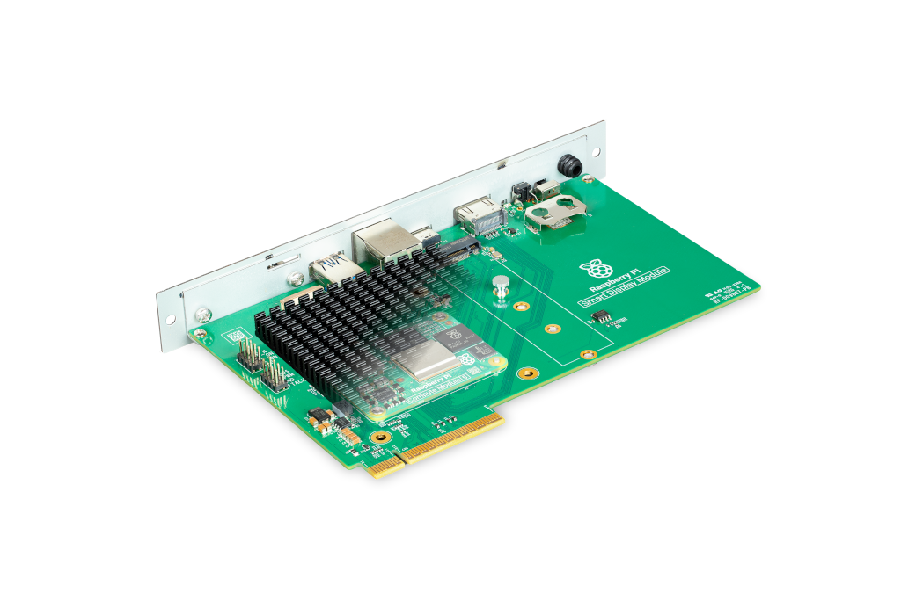
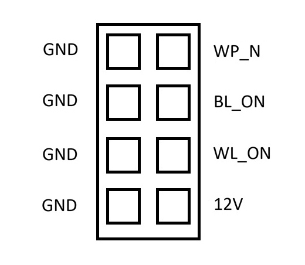
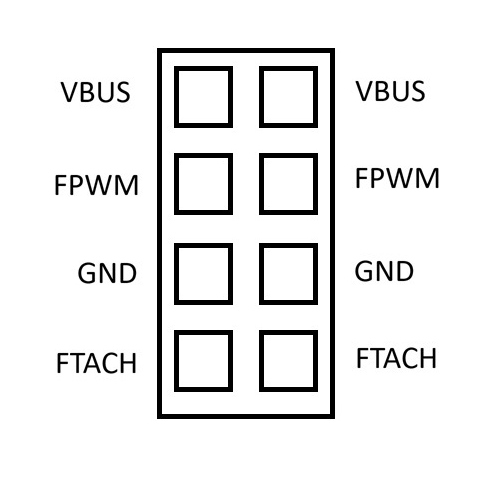
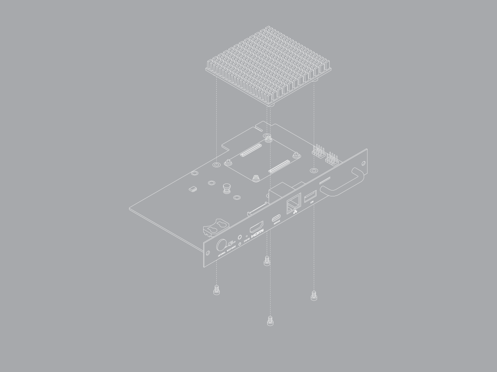
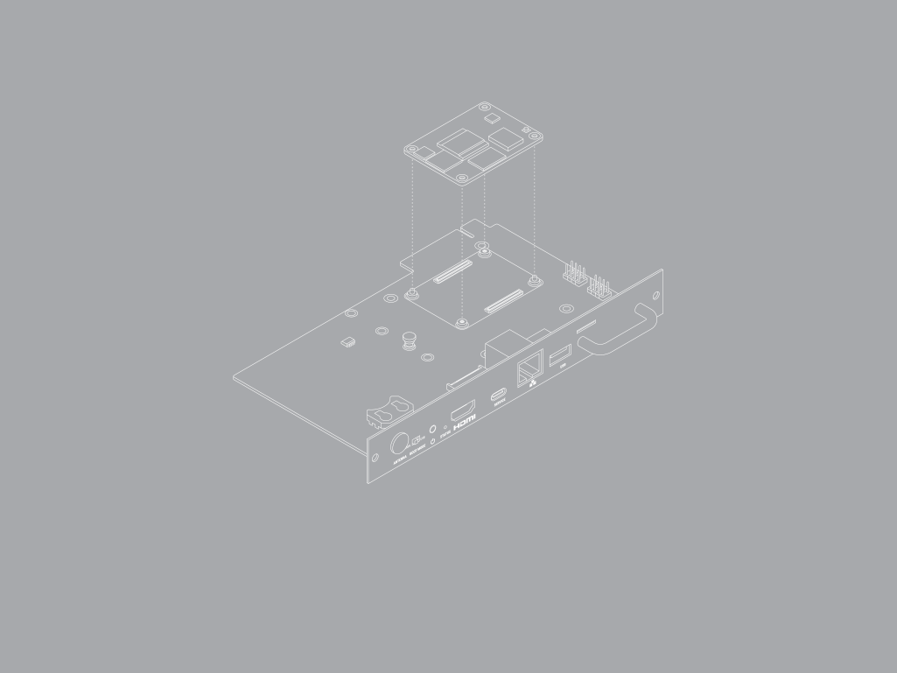
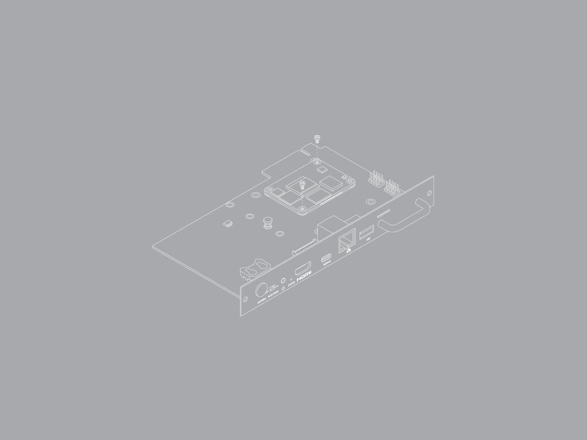
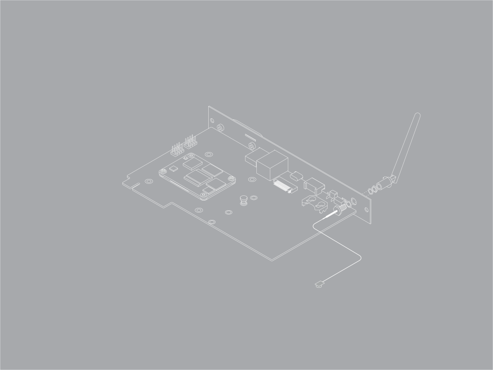

Raspberry Pi Smart Display Module is an adapter board for Raspberry Pi Compute Module 5 (CM5) that enables you to integrate your CM5 into compatible digital signage without requiring external cabling or an external power source.

For more information, see the https://www.raspberrypi.com/products/smart-display-module[product page].

.The Raspberry Pi Smart Display Module

If you purchase your Raspberry Pi Smart Display Module from Sharp, it comes with a configured CM5 already installed in the module. For more information, see https://business.sharpusa.com/computing[the Sharp website].

== Specifications

This section describes the physical characteristics and capabilities of Raspberry Pi Smart Display Module, including features, hardware, and dimensions.

=== Features

Smart Display Module includes the following features:

* *Compatibility with the Intel® Smart Display Module (SDM) specification.* The adapter board slots directly into host displays that support this specification.
* *Compatibility with Compute Module 5.* The CM5 mounts on the Smart Display Module.
* *Heatsink.* The heatsink fits within the SDM form factor and conducts heat away from the CM5.
* *Integrated power.* The host display directly powers the CM5.
* *M.2 M key expansion.* The M.2 M key PCIe socket, compatible with the 2230, 2242, 2260, and 2280 form factors, provides expansion space to add storage or add an AI accelerator.
* *Space for an external antenna.* With the xref:../computers/compute-module.adoc#antenna[Raspberry Pi Antenna Kit], you can install an external antenna outside of the host display.
* *HDMI output.* Supports a second, independent video stream.
* *Connectors.* Exposes various <<connectors>> to the outside of the host display.
* *Boot mode switch.* Switches the CM5 between booting from eMMC (labelled *NORMAL*) and booting from USB device mode (labelled *USB*).
* *External power button.* Power cycles the CM5 independently from the display.
* *LED indicator.* Indicates the power status and storage activity of the CM5. This indicator shows the same LED behaviour as Raspberry Pi 5. For more information, see xref:../computers/configuration.adoc#led-behaviour[LED behaviour].

=== Hardware

The Smart Display Module box contains the following parts:

* A Smart Display Module.
* A passive aluminium heatsink.
* Four M3 screws to secure the heatsink.
* Two M2 screws to secure the CM5.
* A drive attachment screw to secure an M.2 device.

=== Dimensions

The dimensions of the Raspberry Pi Smart Display Module are compatible with the https://www.intel.com/content/www/us/en/products/docs/smart-display-module/overview.html[Intel® SDM specification].

The Smart Display Module has an SDM-L form factor. The dimensions of the main board and its components are 175 × 100 × 20 mm. Including the face plate, handle, and gold finger interface, the full dimensions of the module are 193 × 125 × 25 mm.

Alone, the Smart Display Module weighs approximately 146 g. When assembled with a CM5, heatsink, and screws, it weighs approximately 225 g.

=== Connectors

The Smart Display Module connects directly to a Raspberry Pi Compute Module 5. It connects to the host display by a gold finger interface (the Intel SDM edge connector) at the inside edge of the adapter board.

The Intel SDM edge connector transmits the following interfaces or signals from the CM5 to the host display:

[cols="2,2", options="header"]
|===
|CM5 interface |Intel SDM interface

|HDMI0
|HDMI

|USB 3.0 port 1
|USB3

|GPIO7/9/10/11 (SPI0)
|GSPI

|GPIO14/GPIO15 (UART0)
|UART

|GPIO2/GPIO3 (I2C1)
|I2C0 (CM5 is the target)

|GPIO38/39 (I2C0)
|I2C1 (CM5 is the controller)

|PWR_Button
|Power Button

|PMIC_Enable
|Power Reset

|GPIO5/GPIO17
|SLP_S4

|GPIO4
|System Fan Control

|HDMI0_CEC
|HDMI CEC

|===

NOTE: The Raspberry Pi SDM doesn't connect DisplayPort, PCIe, or Ethernet interfaces over the Intel SDM edge connector.

On the outside of the host display, Smart Display Module exposes the following connectors:

* HDMI 2.0. This connects to HDMI1 on the CM5.
* USB-C (USB 2.0). This port supports only device mode and is intended for programming your CM5 after installation.
* Ethernet (RJ45) connector.
* USB-A (USB 3.0). This connects to USB 3.0 port 0 on the CM5.

On the inside, Smart Display Module exposes the following connectors:

* 22-way camera and display connector. This connects to CAM/DISP 0 on the CM5.
* RTC battery holder (CR2032).
* M.2 M key PCIe socket.
* CM5 slot.

On the inside, Smart Display Module also exposes the following pins on the short edge closest to the CM5.

The pins are labelled in sets of two. With the pin labels in the correct orientation, the top four pairs of pins have a ground pin on the left and an active pin on the right; the bottom four pairs of pins each have two active pins with the same function.

.Pinout for the top four pairs of pins

.Pinout for the bottom four pairs of pins

[cols="1,1,3", options="header"]
|===
|Label |CM5 pin name |Description

|*WP_N*
|`EEPROM_nWP`
|Connect the adjacent ground pin to the active pin to prevent changes to the contents of the on-board EEPROM.

|*BL_ON*
|`BT_nDisable`
|Connect the adjacent ground pin to the active pin to disable the Bluetooth functionality.

|*WL_ON*
|`WL_nDisable`
|Connect the adjacent ground pin to the active pin to disable the Wi-Fi functionality.

|*12V*
|Not applicable
|Power supply from the host display (12 V). Be careful not to connect the 12 V pin to a ground connection; doing so damages the board.

|*VBUS*
|`VBUS_EN`
|Signals to apply power to the external USB 3.0 port.

|*FPWM*
|`Fan_PWM`
|Drives a variety of PWM-controlled fans.

|*GND*
|`GND`
|Ground (0 V)

|*FTACH*
|`Fan_Tacho`
|Read the tachometer output signal that is present on many
PWM fans.

|===

For more information about these pins and how to use them, see the https://pip.raspberrypi.com/documents/RP-008180-DS[Compute Module 5 datasheet] and https://pip.raspberrypi.com/documents/RP-008182-DS[Compute Module 5 IO Board datasheet].

[[set-up-sdm]]
== Set up your Smart Display Module

You can mount your Compute Module 5 on your Smart Display Module, attach optional additional components, and then install the whole module in your host display.

If you purchased your Raspberry Pi Smart Display Module from Sharp, the CM5 is already configured and installed under the heatsink. You don't need to follow this procedure, but might want to refer to some steps if installing optional components.

Required equipment for this process:

* Smart Display Module.
* Included heatsink and screws.
* A Compute Module 5.
* A Phillips crosshead screwdriver.
* Optionally, the Raspberry Pi Antenna Kit.
* Optionally, an M.2 M key device.
* A host display with an SDM-compatible slot.

IMPORTANT: Disconnect your host display from the power supply before completing the following steps. Even if the display is turned off and in standby, it might still power the SDM slot unless fully disconnected from the power.

To configure and assemble your Smart Display Module:

. Configure your Compute Module 5 by installing an operating system image and any required software for your use case. For more information, see xref:../computers/compute-module.adoc#flash-compute-module-emmc[Flash an image to a Compute Module].
+
Alternatively, you can complete this step after you've assembled your Smart Display Module. For more information, see <<program-in-situ>>.

. Remove the heatsink from the Smart Display Module to access the Compute Module 5 mounting point.
+

+
Use a Phillips crosshead screwdriver to unfasten the four M3 screws that hold the heatsink in place. Retain these screws to use later.

. Use a Phillips crosshead screwdriver to unfasten the two M2 screws in the CM5 slot. Retain these screws to use later.
+
image::images/sdm-assembly-w-antenna-step-3.png[alt="The SDM with the retaining screws removed from the CM5 slot", width="80%"]

. Mount your CM5 in the Smart Display Module.
.. With the Raspberry Pi logo facing up and correctly oriented on both your CM5 and your Smart Display Module, place the CM5 in the space labelled *COMPUTE MODULE 5* with its holes aligned over the mounting pegs.
.. Gently press the CM5 down onto the connectors until it's secure.
+

. Use the M2 screws to secure the CM5 to the board. The recommended torque on these screws is 0.15 Nm.
+

. Optionally, install an M.2 M key device. If you want to install an M.2 NVMe drive or AI accelerator, it's easier to do so before installing the heatsink.
.. With your fingers, remove the drive attachment screw.
.. Insert your M.2 device into the M.2 edge connector, sliding the drive into the slot at a slight upward angle. Don't force the drive into the slot; slide it in gently.
.. Push the notch on the drive attachment screw into the slot at the end of your M.2 drive.
.. Push the M.2 device flat against the board, and insert the drive attachment screw by turning the screw clockwise with your fingers until it feels secure. Don't over-tighten the screw.

. Optionally, if your CM5 has on-board WiFi, you can attach an external antenna. If you want to install an antenna on your unit, do this before installing the heatsink.
+

.. Remove the rubber plug from the antenna port on the inside of the Smart Display Module.
.. Ensure the toothed washer is on the SMA connector.
.. From the inside of  the Smart Display Module, push the SMA connector (with the flat side towards the other ports) into the antenna port so that it extends through and is accessible from the outside.
.. From the outside, add the split washer and twist the retaining hexagonal nut onto the SMA connector in a clockwise direction until it sits securely in place. To prevent damage, avoid excessive force when tightening.
.. Attach the antenna to the SMA connector with the antenna facing outward and twist the antenna clockwise to secure it.
.. Move the antenna into its final position by turning it to the appropriate angle for your display.
.. If an M.2 device is fitted, avoid routing the antenna cable across it. Instead, route the antenna cable between the M.2 slot and the outer face of the Smart Display Module.
+
image::images/sdm-assembly-w-antenna-step-13.png[alt="The SDM with the route of the antenna cable indicated", width="80%"]
.. Connect the U.FL connector on the antenna cable to the U.FL-compatible connector on your Compute Module 5, next to the top-left mounting hole of your CM5.
+
image::images/sdm-assembly-w-antenna-step-15.png[alt="The SDM with the antenna installed", width="80%"]

. Install the heatsink. One of the heatsink mounting points is offset; this ensures that the heatsink is mounted the correct way.
.. Remove the sleeve and the paper over the thermal pads from the heatsink.
.. If you installed the antenna, ensure that the route of the antenna cable avoids the heatsink mounting points.
.. Place the heatsink over your Compute Module 5 so its mounting points line up with the holes on the Smart Display Module board.
+
image::images/sdm-assembly-w-antenna-step-16.png[alt="The SDM with CM5 and antenna attached and the position of the heatsink indicated.", width="80%"]
.. Use a Phillips crosshead screwdriver to fasten the M3 screws through the board and into the heatsink mounting points. Tighten the screws evenly. The recommended torque for these screws is 0.25 Nm.
+
image::images/sdm-assembly-w-antenna-step-17.png[alt="The assembled SDM with CM5, antenna, and heatsink attached.", width="80%"]

. Optionally, install a CR2032 battery in the RTC battery holder.

. Optionally, attach a 22-way camera FFC or 22-way display FFC to the camera/display connector, routing the cable through the IO bracket cutout. The CM5 doesn't automatically detect these devices. You must configure the devices in the `config.txt` file. For more information, see xref:../computers/compute-module.adoc#attach-a-camera-module[Attach a Camera Module] or xref:../accessories/touch-display-2.adoc#connect-to-raspberry-pi[Connect a Touch Display 2].

. Ensure that your host display is fully disconnected from a power supply.

. Install the Smart Display Module in your host display. For more information about this installation process, see your host display documentation.

. Power your host display and turn it on. The host display powers your Smart Display Module and your CM5 boots.

Depending on your host display's default behaviour, you might need to select the Smart Display Module as its input. For more information, see your host display documentation.

[[program-in-situ]]
== Program your CM5 in position

You can provision your CM5 after you have installed it in the Smart Display Module and installed the Smart Display Module in the host display.

To do this, you need the following equipment:

* Your host display with Smart Display Module installed.
* A computer with https://www.raspberrypi.com/software/[Raspberry Pi Imager] version 2.0.11 or later installed.
* A USB-C cable.

Complete the following steps:

. On your computer, start Raspberry Pi Imager.
. Configure Raspberry Pi Imager so that it can use `rpiboot` to detect the CM5 and treat it as a mass storage device.
.. Open *Debug Options*:
*** On Windows or Linux, type *Ctrl + Alt + S*.
*** On macOS, type *Cmd + Option + S*.
.. Scroll to *Advanced Features*.
.. Use the toggle to select *Enable Rpiboot/Fastboot Support*.
.. Select *Apply* to save your changes and exit the *Debug Options* dialog.
. Ensure that the host display is fully disconnected from a power supply.
. Use the USB-C cable to connect the computer to the USB-C connector labelled *SERVICE* on the Smart Display Module.
. Switch the boot mode switch from *NORMAL* to *USB*.
. Power on the host display. The CM5 appears to Raspberry Pi Imager as a mass storage device.
. On your computer, use Raspberry Pi Imager to install an operating system on the CM5. When the installation is complete, the computer ejects the mass storage device.
. Disconnect the cable from the Smart Display Module.
. Power off your display.
. Switch the boot mode switch from *USB* back to *NORMAL*.
. Power on your display.

[[remove-sdm]]
== Remove your Smart Display Module

For information about this process, see your host display documentation.

[IMPORTANT]
====
* Disconnect your host display from the power supply before removing the Smart Display Module. Even if the display is turned off and in standby mode, it might still power the SDM slot unless fully disconnected from the power.
* When removing the Smart Display Module, use the handle to pull it straight out from the host display.
====
