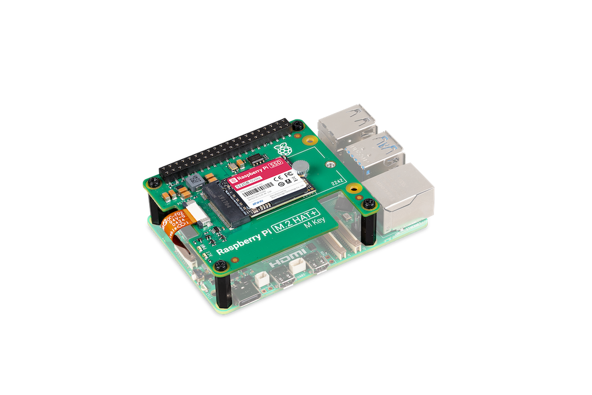

== About

.A 512 GB Raspberry Pi SSD Kit

The Raspberry Pi SSD Kit bundles a xref:../accessories/m2-hat-plus.adoc[Raspberry Pi M.2 HAT+] with a xref:../accessories/ssds.adoc[Raspberry Pi SSD].

The Raspberry Pi SSD Kit includes a 16 mm stacking header, spacers, and
screws to enable fitting on Raspberry Pi 5 alongside a Raspberry Pi Active Cooler.

== Install

To install the Raspberry Pi SSD Kit, follow the xref:../accessories/m2-hat-plus.adoc#m2-hat-plus-installation[installation instructions for the Raspberry Pi M.2 HAT+].
