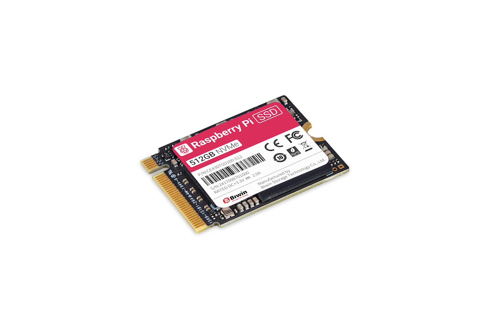

== About

.A 512 GB Raspberry Pi SSD

SSD quality is a critical factor in determining the overall user experience for a Raspberry Pi.
Raspberry Pi provides official SSDs that are tested to ensure compatibility with Raspberry Pi models and peripherals.

Raspberry Pi SSDs are available in the following sizes:

* 256 GB
* 512 GB
* 1 TB

To use an SSD with your Raspberry Pi, you need a Raspberry Pi 5-compatible M.2 adapter, such as the xref:../accessories/m2-hat-plus.adoc[Raspberry Pi M.2 HAT+ or M.2 HAT+ Compact].

== Specifications

Raspberry Pi SSDs are PCIe Gen 3-compliant.

Raspberry Pi SSDs use the NVMe 1.4 register interface and command set.

Raspberry Pi SSDs use the M.2 2230 form factor.

The following table describes the read and write speeds of Raspberry Pi SSDs using 4 kB of random data:

[cols="1,2,2"]
|===
| Size | Read Speed | Write Speed

| 256 GB | 40,000 IOPS | 70,000 IOPS
| 512 GB | 50,000 IOPS | 90,000 IOPS
| 1 TB   | 90,000 IOPS | 90,000 IOPS
|===
