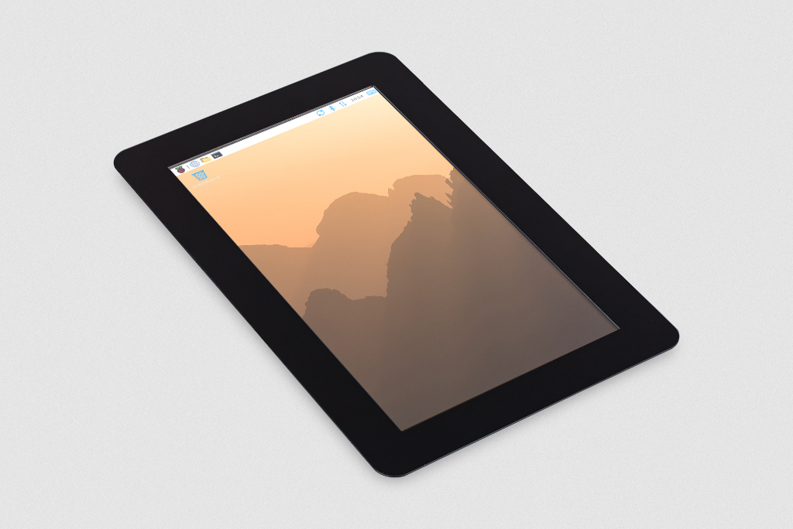
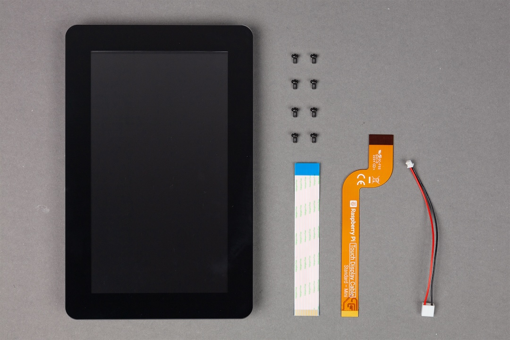
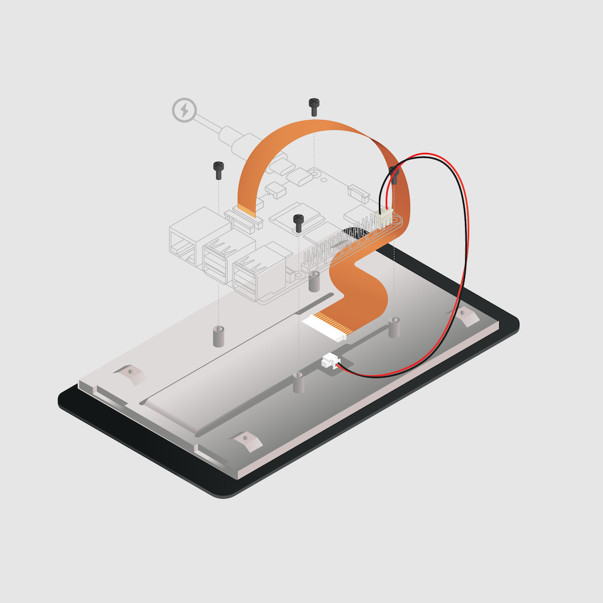
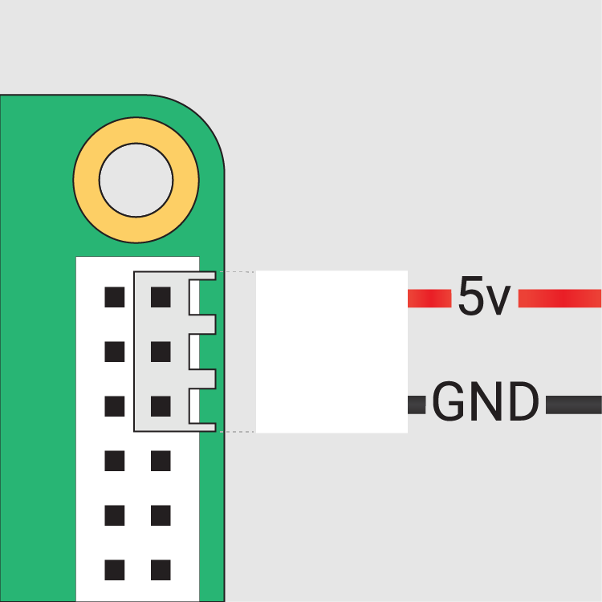

The https://www.raspberrypi.com/products/touch-display-2/[Raspberry Pi Touch Display 2] is a portrait orientation touchscreen LCD (with rotation options) designed for interactive projects like tablets, entertainment systems, and information dashboards.

.The Raspberry Pi Touch Display 2

== Specifications

This section describes the physical characteristics and capabilities of Touch Display 2, including dimensions, features, and hardware.

=== Dimensions

The Touch Display 2 is available in two sizes: 5-inch and 7-inch (measured diagonally). Aside from the physical size, these two displays have identical features and functionality. The following table summarises the dimensions of these two displays:

[cols="1,1,1,1,1"]
|===
|
|*Depth*
|*Outline dimensions*
|*Viewing area*
|*Active area*

|*5-inch display*
|16 mm
|143.5 x 91.5 mm
|111.5 x 63 mm
|110.5 x 62 mm

|*7-inch display*
|15 mm
|189.5 x 120 mm
|155.5 x 88 mm
|154.5 x 87 mm
|===

=== Features
Touch Display 2 (both 5-inch and 7-inch) includes the following features:

* **720 x 1280 pixel resolution.** High-definition output.
* **24-bit RGB display.** Capable of showing over 16 million colours.
* **Multitouch.** Supports up to five simultaneous touch points.
* **Mouse-equivalence.** Supports full desktop control without a physical mouse, for example, selecting, dragging, scrolling, and long-pressing for menus.
* **On-screen keyboard.** Supports a visual keyboard in place of a physical keyboard.
* **Integrated power.** Powered directly by the host Raspberry Pi, requiring no separate power supply.

=== Hardware

The Touch Display 2 box contains the following parts:

- A Touch Display 2
- Eight M2.5 screws
- A 15-way to 15-way FFC
- A 22-way to 15-way FFC for Raspberry Pi 5
- A GPIO power cable

The following image shows these items from top to bottom, left to right.

.Parts included in the Touch Display 2 box

=== Connectors

The Touch Display 2 connects to a Raspberry Pi using:

- A **DSI connector** for video and touch data.
- The **GPIO header** for power.

To make the DSI connection, use a **Flat Flexible Cable (FFC)** included with your display. The type of FFC you need depends on your Raspberry Pi model:

- For **Raspberry Pi 5**, use the **22-way to 15-way FFC**.
- For all other Raspberry Pi models, use the **15-way to 15-way FFC**.

The Touch Display 2 is compatible with all models of Raspberry Pi from Raspberry Pi 1B+ onwards, except the Zero series and Keyboard series, which lack a DSI connector.

== Connect to Raspberry Pi

After determining the correct FFC for your Raspberry Pi model, you can connect your Touch Display 2 to your Raspberry Pi. After completing the following steps, you can reconnect your Raspberry Pi to power. It can take up to one minute for Raspberry Pi OS to start displaying output to the Touch Display 2 screen.

.A Raspberry Pi 5 connected and mounted to the Touch Display 2

IMPORTANT: Disconnect your Raspberry Pi from power before completing the following steps.

=== Step 1. Connect FFC to Touch Display 2

. Slide the retaining clip outwards from both sides of the FFC connector on the Touch Display 2.
. Insert one 15-way end of your FFC into the Touch Display 2 FFC connector, with the metal contacts facing upwards, away from the Touch Display 2.
    - If you're connecting to a Raspberry Pi 5, and therefore using the **22-way to 15-way FFC**, the 22-way end is the smaller end of the cable. Insert the larger end of the cable into the Touch Display 2 FFC connector.
    - If you're using the **15-way to 15-way FFC**, insert either end of the cable into the Touch Display 2 FFC connector.
. Hold the FFC firmly in place and simultaneously push the retaining clip back in to the Touch Display 2 FFC connector from both sides.

=== Step 2. Connect FFC to Raspberry Pi

. Slide the retaining clip upwards from both sides of the DSI connector of your Raspberry Pi.
    - This port should be marked with some variation of the term **DISPLAY**, **CAM/DISP**, or **DISP**.
    - If your Raspberry Pi has multiple DSI connectors, we recommend using the port labelled **1**.
. Insert the other end of your FFC into the Raspberry Pi DSI connector, with the metal contacts facing the Ethernet and USB-A ports.
. Hold the FFC firmly in place and simultaneously push the retaining clip back down on the FFC connector of the Raspberry Pi to secure the cable.

=== Step 3. Connect the GPIO power cable

. Plug the smaller end of the GPIO power cable into the **J1** port on the Touch Display 2.
. Connect the three-pin end of the GPIO power cable to your xref:../computers/raspberry-pi.adoc#gpio[Raspberry Pi's GPIO].

This connects the red cable (5 V power) to pin 2 and the black cable (ground) to pin 6. Viewed from above, with the Ethernet and USB-A ports facing down, these pins are located in the top-right corner of the board, with pin 2 in the top right-most position.

.The GPIO connection to the Touch Display 2

WARNING: Connecting the power cable incorrectly might cause damage to the display.

=== Step 4. Mount your Raspberry Pi to the Touch Display 2 (optional)

Optionally, use the included M2.5 screws to mount your Raspberry Pi to the back of your Touch Display 2.

. Align the four corner stand-offs of your Raspberry Pi with the four mounting points that surround the FFC connector and J1 port on the back of the Touch Display 2.
. Insert the M2.5 screws (included) into the four corner stand-offs and tighten until your Raspberry Pi is secure.

Take care not to pinch the FFC.

== Use an on-screen keyboard

Raspberry Pi OS **Bookworm** and later already includes the **Squeekboard on-screen keyboard**. With a Touch Display 2 attached, the keyboard automatically appears when you can enter text, and automatically disappears when you can't.

For applications that don't support text entry detection, you can manually show or hide the keyboard using the keyboard icon at the right side of the taskbar. You can also permanently show or hide the on-screen keyboard using the Raspberry Pi graphical interface or the command line.

- **Raspberry Pi desktop interface:** From the Raspberry Pi menu, go to **Preferences > Control Centre > Display** and choose your on-screen keyboard setting.
- **Command line:** Open a terminal and enter `sudo raspi-config`. Navigate to the **Display** section of `raspi-config` and then choose your keyboard setting.

== Change screen orientation

You can change the orientation behaviour of the Touch Display 2, both with a desktop and without a desktop. This is useful if you want to physically rotate the screen or mount it in a landscape position.

You have four rotation options:

- **0** maintains the default display position, which is a portrait orientation.
- **90** rotates the display 90 degrees to the right (clockwise), making it a landscape orientation.
- **180** rotates the display 180 degrees to the right (clockwise), which flips the display upside down.
- **270** rotates the display 270 degrees to the right (clockwise), which is the same as rotating the display 90 degrees to the left (counter-clockwise), making it a landscape orientation.

=== With a desktop
If you have the Raspberry Pi OS desktop running, you can rotate the display through the **Screen Configuration** tool:

. Go to **Preferences > Screen Configuration**. This opens the layout editor where you can see your connected displays.
. Right-click the rectangle in the layout editor that represents your Touch Display 2 (likely labelled `DSI-1`).
. Select **Orientation**.
. Choose a rotation: *0°*, *90°*, *180°*, or *270°*. This rotates the display by the specified number of degrees to the right.

=== Without a desktop

To rotate the display without a desktop, edit the `/boot/firmware/cmdline.txt` file, which contains parameters that Raspberry Pi OS reads when it boots. Add the following to the end of `cmdline.txt`, replacing `<rotation-value>` with the number of degrees to rotate by (`0`, `90`, `180`, or `270`):

[source,ini]
----
video=DSI-1:720x1280@60,rotate=<rotation-value>
----

This `rotate=` setting only rotates the text-mode console; any applications that write directly to DRM (such as `cvlc` or the libcamera apps) won't be rotated, and will instead need to use their own rotation options (if available).

NOTE: You can't rotate the DSI display separately from the HDMI display with `cmdline.txt`. When you use DSI and HDMI simultaneously, they share the same rotation value.

== Customise touchscreen settings

You can use the Device Tree overlay to tell Raspberry Pi OS how to configure the Touch Display 2 at boot.

- For the 5-inch display, the overlay is called `vc4-kms-dsi-ili9881-5inch`.
- For the 7-inch display, the overlay is called `vc4-kms-dsi-ili9881-7inch`.

You can modify the Device Tree overlay in the boot configuration file (`/boot/firmware/config.txt`).

Open `/boot/firmware/config.txt` and then add the required Device Tree parameters to the `dtoverlay` line, separated by commas.

- Booleans (`invx`, `invy`, `swapxy`, and `disable_touch`) default to true if present, but you can set them to false using the suffix `=0`.
- Integers (`sizex` and `sizey`) require a number, for example, `sizey=240`.

See the table below for details.

=== Device Tree options

|===
| Parameter | Action

| `sizex`
| Sets the touch horizontal resolution (default 720)

| `sizey`
| Sets the touch vertical resolution (default 1280)

| `invx`
| Inverts the touch X-axis (left/right)

| `invy`
| Inverts the touch Y-axis (up/down)

| `swapxy`
| Swaps the touch X and Y axes (rotate 90° logically)

| `disable_touch`
| Disables the touchscreen functionality
|===

=== Example

In the following example, `invx` flips the X axis and `invy` flips the Y axis for a 7-inch Touch Display 2:

[source,ini]
----
dtoverlay=vc4-kms-dsi-ili9881-7inch,invx,invy
----

== Connect to a Compute Module

Unlike Raspberry Pi single board computers (SBC), which automatically detect the official Raspberry Pi Touch displays, Raspberry Pi Compute Modules don't automatically detect connected devices; you must tell it what display is attached.

This is because the connections between the SoC and DSI connectors on a Raspberry Pi are fixed and the system knows what hardware is connected; auto-detection ensures that the correct Device Tree settings are passed to the Linux kernel, so the display works without additional configuration.

Compute Modules, intended for industrial and custom applications, expose all GPIOs and interfaces. This provides greater flexibility for connecting hardware, but means that a Compute Module can't automatically detect devices like the Touch Display 2. This means that, for Compute Modules, the Device Tree fragments, which tell the kernel how to interact with the display, must be manually specified. You can do this in three ways:

- By adding an overlay entry in `config.txt`. This is the simplest option. For configuration instructions, see the xref:../computers/compute-module.adoc#attaching-the-touch-display-2-lcd-panel[Compute Module hardware documentation].
- Using a custom base device tree file. This is an advanced method not covered in this online documentation.
- Using a HAT EEPROM (if present).

