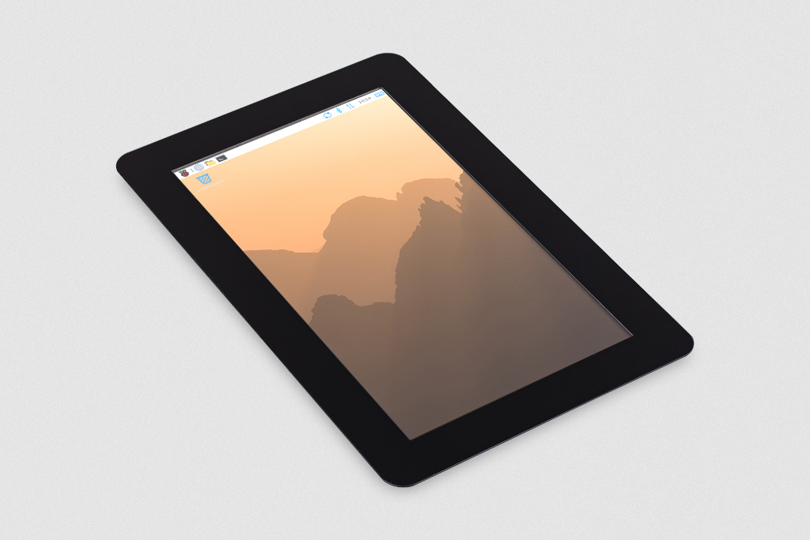
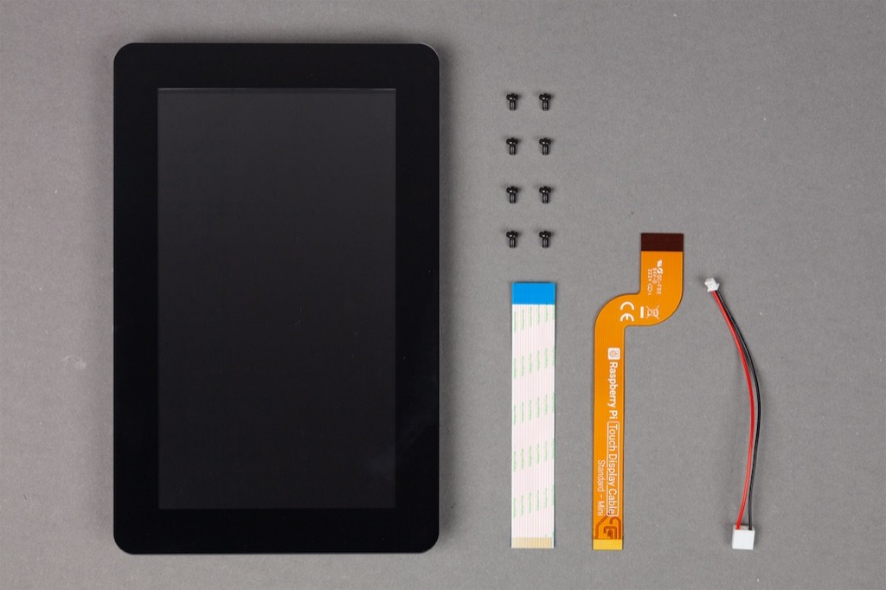
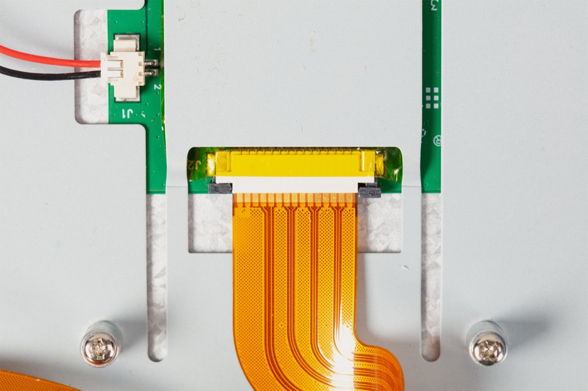
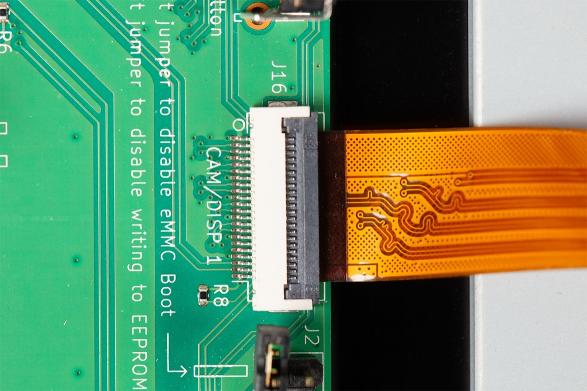
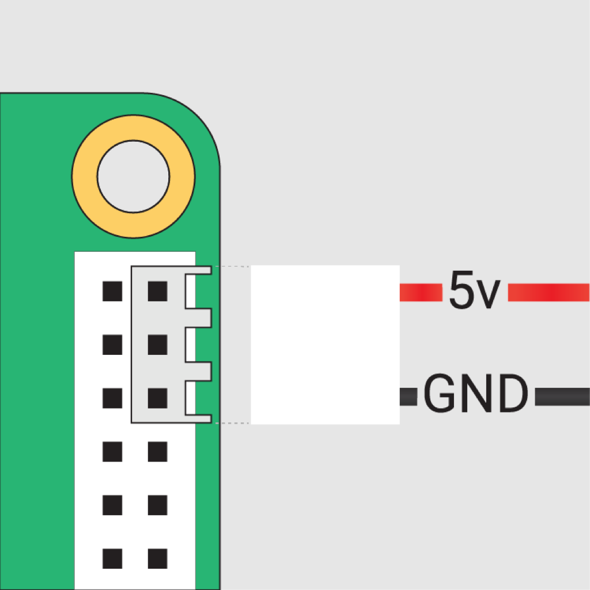
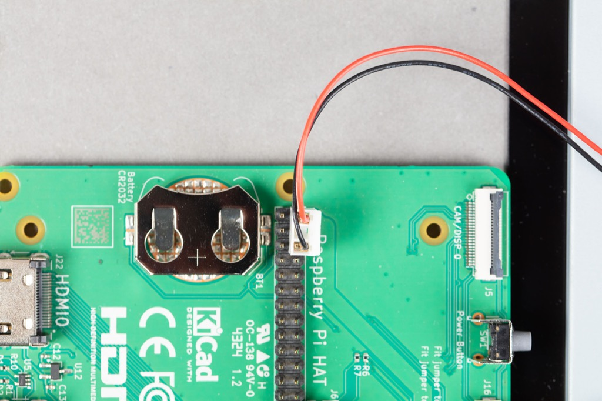
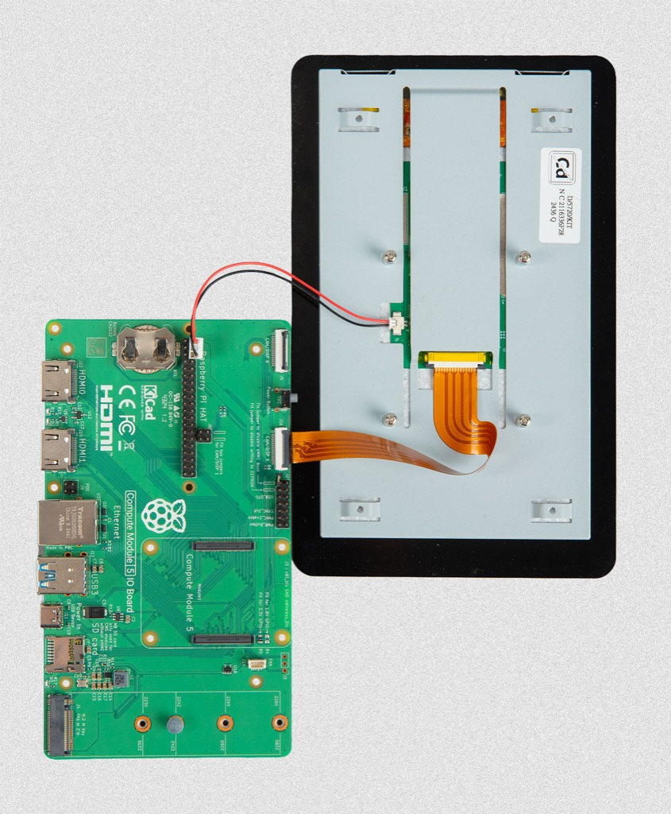
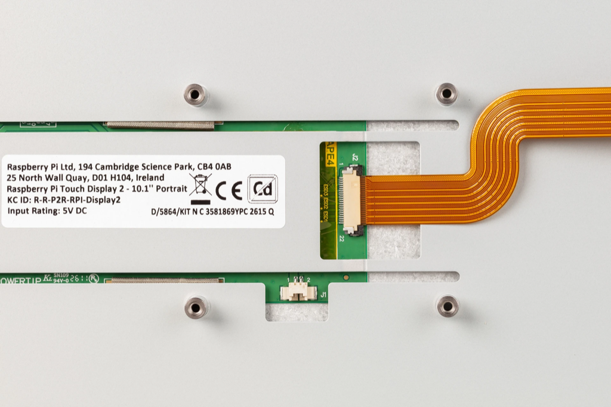
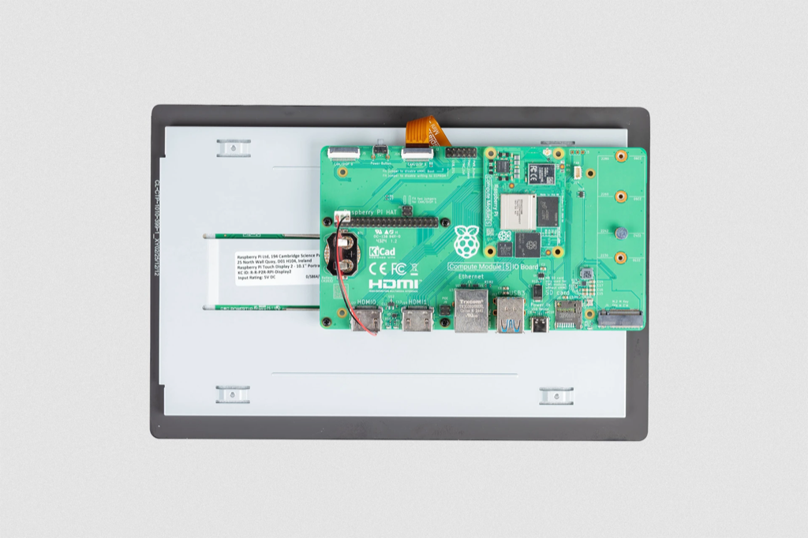

== Raspberry Pi Touch Display 2

https://www.raspberrypi.com/products/touch-display-2/[Raspberry Pi Touch Display 2] is a touchscreen LCD that is available in 5-inch, 7-inch, and 10-inch versions. It is intended for interactive use cases like tablets, entertainment systems, and information dashboards.

.The Raspberry Pi Touch Display 2.

== Compatibility

[cols="1,1,1,1"]
|===
|Touch Display 2|Compatible With |Incompatible With |Multiple Touch Display 2 Support

.^|*5-inch* and *7-inch*
a|
* Raspberry Pi B+ and later.
* All Raspberry Pi Compute Module Interface (CMIO) Boards.
a|
* Raspberry Pi Zero series.
* Raspberry Pi Keyboard computers.
a|
* Raspberry Pi 5 and later.
* All Raspberry Pi Compute Module Interface (CMIO) Boards.

.2+.^|*10-inch*
a|
* Raspberry Pi CM4IO Board and earlier.

Connect to the Board using `DISP1` port, only.
.2+.^a|
* Raspberry Pi 4B and earlier.
* Raspberry Pi Zero series.
* Raspberry Pi Keyboard computers.
.2+.^a|
* Raspberry Pi 5 and later.
* Raspberry Pi CM5IO Board and later.

a|
* Raspberry Pi 5 and later.
* Raspberry Pi CM5IO Board and later.

Connect to the Board using either `DISP` port.

|===

You can mount any SBC form-factor Raspberry Pi directly to the back of the Touch Display 2.

== Autodetection

Raspberry Pi Model B+ and later devices auto-detect Touch Display 2.

Raspberry Pi Compute Modules don't auto-detect DSI displays because they are intended for industrial applications where the integrator can use any and all GPIOs and interfaces for their own purposes.

== Specifications

This section describes the characteristics and capabilities of Touch Display 2.

=== Features

Touch Display 2 has the following features:

- *720 x 1280 pixel resolution.* High-definition output for 5-inch and 7-inch models.
- *1200 x 1920 pixel resolution.* High-definition output for 10-inch model.
- *24-bit RGB display.* Capable of showing over 16 million colours.
- *Multitouch.* Supports five-finger touch in 5-inch and 7-inch models, and ten-finger touch in the 10-inch model.
- *Mouse-equivalence.* Supports full desktop control without a physical mouse, for example, selecting, dragging, scrolling, and long-pressing for menus.
- *On-screen keyboard.* Supports an on-screen keyboard in place of a physical keyboard.
- *Integrated power.* Powered directly by the host Raspberry Pi device, requiring no separate power supply.

=== Dimensions
Touch Display 2 has the following dimensions:

[cols="1,1,1,1,1"]
|===
|*Touch Display 2*
|*Depth*
|*Outline dimensions*
|*Viewing area*
|*Active area*

|*5-inch*
|16 mm
|91.5 x 143.5 mm
|63 x 111.5 mm
|62 x 110.5 mm

|*7-inch*
|15 mm
|120 x 189.5 mm
|88 x 155.5 mm
|87 x 154.5 mm

|*10-inch*
|16 mm
|161.8 x 247.3 mm
|136.4 x 217.6 mm
|135.4 x 216.6 mm
|===

=== Hardware
The Touch Display 2 box contains the following:

[cols="2,1,3,2"]
|===
|Touch Display 2|Screws |Flat Flexible Cable |GPIO Power Cable

|*5-inch* / *7-inch*
.2+.^|Eight M2.5 screws
a|
* 15-way to 15-way (Raspberry Pi 4 and earlier)
* 22-way to 15-way *Standard – Mini* (Raspberry Pi 5)
.2+.^|GPIO power cable

|*10-inch*
a|
* 22-way to 22-way *Mini – Mini* (Raspberry Pi 5)

|===

.Parts included in the Touch Display 2 box for 5-inch and 7-inch models.

=== Connections

[cols="1,3,2"]
|===
| Touch Display 2 |*DSI Connector* (carries video and touch data) |*GPIO Header* (carries power)

|*5-inch* and *7-inch*
a|
* Raspberry Pi 5 and later, and all CMIO Boards: supplied *Standard – Mini* 22-way to 15-way FFC
* Raspberry Pi 4 and earlier: supplied 15-way to 15-way FFC
.2+.^|Supplied GPIO power cable connects the GPIO header on the Raspberry Pi to the display.

|*10-inch*
a|
* Raspberry Pi 5 and later, and all CMIO Boards: supplied *Mini – Mini* 22-way to 22-way FFC
|===

== Connect to a Raspberry Pi device

Follow the appropriate procedures for your Touch Display 2.

You don't need any special tools to connect your device to the display, but you must have the correct FFC cable ready. If you don't want to mount your device to the display, you might need a longer FFC cable.

You also need your device, its boot media, and its power supply.

If you want to mount your device to the display, you need a Phillips/cross-head screwdriver that fits the M2.5 screws that are included with the display.

=== Connect to a 5-inch or 7-inch Touch Display 2

[tabs]
======
Raspberry Pi B+ and later::
+
--
[discrete]
=== Raspberry Pi B+ and later

WARNING: Disconnect your Raspberry Pi from power before starting Step 1.

[discrete]
==== Step 1. Connect the FFC to the Touch Display 2

Before you start, check that you have selected the correct flat flexible cable for your Raspberry Pi model:

- For *Raspberry Pi 5*, use the *22-way to 15-way FFC*.
- For all other Raspberry Pi models, use the *15-way to 15-way FFC*.

To connect the FFC:

. Slide the retaining clip outwards from both sides of the FFC connector on the Touch Display 2.
. Insert the FFC into the Touch Display 2 FFC connector, then slide the retaining clip back into place to secure the cable.
+
The metal contacts must face upwards, away from the Touch Display 2.
+
If you're connecting to a Raspberry Pi 5, and therefore using the 22-way to 15-way FFC, the 22-way end is the smaller end of the cable. Insert the larger end of the cable into the Touch Display 2 FFC connector.

.The flat flexible cable and GPIO power cable (see Step 3) correctly attached to the Touch Display 2.

[discrete]
==== Step 2. Connect the FFC to the Raspberry Pi

CAUTION: Take care not to pinch the FFC in this step.

. Slide the retaining clip upwards from both sides of the FFC connector on the Raspberry Pi. This is labelled `DISPLAY` on Raspberry Pi 4B and earlier.
. Connect the other end of the FFC to the connector, then slide the retaining clip back into place to secure the cable.
+
The metal contacts must face towards the Ethernet and USB-A ports.
+
.The FFC connector attached to a Raspberry Pi device.

[discrete]
==== Step 3. Connect the GPIO power cable between the device and the display

WARNING: Connecting the power cable incorrectly can damage the display.

. Plug the smaller end of the GPIO power cable into the `J1` port on the Touch Display 2.
. Connect the three-pin end of the GPIO power cable to your xref:../computers/raspberry-pi.adoc#gpio[Raspberry Pi's GPIO].
+
With the USB and Ethernet ports facing down, the power cable must be attached vertically to the top-right of the GPIO header. This means the red 5 V power cable is at the top-right of the pin block.
+
This results in the red cable connecting to pin 2 (top-right), and the black cable (ground) connecting to pin 6.
+
.The GPIO cable from the Touch Display 2 attaches to the top-right of the GPIO header on the Raspberry Pi device.

. (optional) To physically attach the Raspberry Pi to the Touch Display 2, align the device with the four corner stand-offs on the Touch Display 2, then insert the four M2.5 screws (included) into the stand-offs, and tighten until your Raspberry Pi is secure.

[discrete]
==== Step 4. Power on the Raspberry Pi

Now you've connected the Raspberry Pi to the Touch Display 2, power it on.

. Connect your boot media to the Raspberry Pi.
. Connect the Raspberry Pi to your power supply.
+
The Touch Display 2 turns on when the device boots, but it can take up to one minute for Raspberry Pi OS to start displaying output on the screen.
--

Raspberry Pi Compute Module::
+
--

[discrete]
=== Raspberry Pi Compute Module

This section assumes that you're familiar with your Compute Module. For more information, see xref:../computers/compute-module.adoc[Raspberry Pi Compute Module].

You can connect a Touch Display 2 to a Raspberry Pi Compute Module that is attached to an IO Board. You need a Raspberry Pi Standard-Mini FFC (sold separately) to do this.

[discrete]
==== Step 1. Specify the display in `config.txt`

Raspberry Pi Compute Modules don't automatically detect Touch Display 2s.

You must configure the Compute Module for the devices it is connecting to by adding an overlay entry in `config.txt`. The default connection is the port labelled `1`, but you can use the port labelled `0`.

NOTE: If you're using a Raspberry Pi Compute Module that has eMMC memory, make sure you edit the *configuration file that is used to boot the device*: either the one stored on the eMMC or one on external boot media if you've reconfigured the boot order.  See xref:../computers/compute-module.adoc#flash-compute-module-emmc[rpiboot].

To enable Touch Display 2:

. Boot your Raspberry Pi Compute Module, then open `/boot/firmware/config.txt`.
+
If you're running a headless setup, either open the boot media on another computer or remotely connect to the device using Raspberry Pi Connect or SSH.

. Edit the `config.txt` file to *add* one of the following:
+
- For the *5-inch* display, enter `dtoverlay=vc4-kms-dsi-ili9881-5inch`
- For the *7-inch* display, enter `dtoverlay=vc4-kms-dsi-ili9881-7inch`
+
To use the `CAM/DISP 0` or `DISP0` port,  append `,dsi0` to the overlay name:
+
- For the *5-inch* display, enter `dtoverlay=vc4-kms-dsi-ili9881-5inch,dsi0`
- For the *7-inch* display, enter `dtoverlay=vc4-kms-dsi-ili9881-7inch,dsi0`
. Power down your device, then disconnect the power supply.

[discrete]
==== Step 2. Connect the FFC to the Touch Display 2

IMPORTANT: If you haven't already done so, disconnect your Raspberry Pi Compute Module from power before continuing.

To connect the FFC to the display:

. Slide the retaining clip outwards from both sides of the FFC connector on the Touch Display 2.
. Insert the widest end of the FFC into the Touch Display 2 FFC connector, then slide the retaining clip back into place to secure the cable.
+
The metal contacts must face upwards, away from the Touch Display 2.
. Add two jumpers to `J6`, as required:
- If connecting to `CAM/DISP 1` on Raspberry Pi Compute Module 5 IO Board.
- If connecting to the `DSIO` interface on Raspberry Pi Compute Module 4 IO Board.

.The FFC attached to the Touch Display 2.

[discrete]
==== Step 3. Connect the FFC to the Raspberry Pi Compute Module IO Board

. Open the retaining clip on the FFC connector on the Raspberry Pi Compute Module IO Board. Make sure you select the connector you set (`CAM/DISP 1` or `CAM/DISP 0`) in the configuration file in Step 1.
. Insert the other end of the FFC into the connector port, then close the retaining clip to secure the cable.
+
The metal contacts must face downwards.

.The FFC connector attached to a Raspberry Pi device. Note that the DSI port is oriented horizontally on some devices and vertically on others.

[discrete]
==== Step 4. Connect the GPIO power cable between the device and the display

WARNING: Connecting the power cable incorrectly can damage the display.

To connect the GPIO power cable (supplied with the display) to Raspberry Pi Compute Module 4 IO Board and later:

. Plug the smaller end of the GPIO power cable into the `J1` port on the Touch Display 2.
. Position the Compute Module IO Board with the USB and HDMI ports facing left.
. Connect the three-pin end of the GPIO power cable to the top right of the GPIO header (labelled `Rasperry Pi HAT` on the silkscreen).

.The GPIO power cable attached to the GPIO header on a Raspberry Pi Compute Module Board.

[discrete]
==== Step 5. Power on your Compute Module

.A Raspberry Pi Compute Module IO Board connected to a Touch Display 2.

Now you have connected the Raspberry Pi Compute Module to the Touch Display 2, power the Compute Module on.

. Connect your boot media to the Raspberry Pi device – skip this if you're booting from eMMC.
. Connect the Raspberry Pi device to your power supply.
. If your IO board has one, press and release the *Power Button*.
+
The Touch Display 2 turns on when the device boots, but it can take up to one minute for Raspberry Pi OS to start displaying output on the screen.
--
======

=== Connect to a 10-inch Touch Display 2

[tabs]
======
Raspberry Pi 5 and later::
+
--
[discrete]
=== Raspberry Pi 5 and later

[discrete]
[[update-software]]
==== Step 1. Update the Raspberry Pi device's software and bootloader

. Run the following from the command line to update the device's operating system:
+
[source,console]
----
$ sudo apt update && sudo apt full-upgrade
----
. Run the following from the command line to update the device's EEPROM bootloader:
+
[source,console]
----
$ sudo rpi-eeprom-update -a
----

[discrete]
==== Step 2. Connect the FFC to the Touch Display 2

WARNING: Disconnect the Raspberry Pi device from power before starting Step 2.

To connect the *Mini – Mini* 22-way to 22-way FFC:

. Slide the retaining clip outwards from both sides of the FFC connector on the Touch Display 2.
. Insert the FFC into the Touch Display 2 FFC connector, then slide the retaining clip back into place to secure the cable.
+
The metal contacts must face upwards, away from the Touch Display 2.

.The flat flexible cable correctly attached to the Touch Display 2 10-inch model.

[discrete]
==== Step 3. Connect the FFC to the Raspberry Pi

CAUTION: Take care not to pinch the FFC in this step.

. Slide the retaining clip upwards from both sides of the FFC connector on the Raspberry Pi.
. Connect the other end of the FFC to the connector, then slide the retaining clip back into place to secure the cable.
+
The metal contacts must face towards the Ethernet and USB-A ports.
+

[discrete]
==== Step 4. Connect the GPIO power cable between the device and the display

WARNING: Connecting the power cable incorrectly can damage the display.

. Plug the smaller end of the GPIO power cable into the `J1` port on the Touch Display 2.
. Connect the three-pin end of the GPIO power cable to your xref:../computers/raspberry-pi.adoc#gpio[Raspberry Pi's GPIO].
+
With the USB and Ethernet ports facing down, the power cable must be attached vertically to the top-right of the GPIO header. This means the red 5 V power cable is at the top-right of the pin block.
+
This results in the red cable connecting to pin 2 (top-right), and the black cable (ground) connecting to pin 6.
+
.The GPIO cable from the Touch Display 2 attaches to the top-right of the GPIO header on the Raspberry Pi device.

. (optional) To physically attach the Raspberry Pi to the Touch Display 2, align the device with the four corner stand-offs on the Touch Display 2, then insert the four M2.5 screws (included) into the stand-offs, and tighten until your Raspberry Pi is secure.

[discrete]
==== Step 5. Power on the Raspberry Pi

Now you've connected the Raspberry Pi to the Touch Display 2, power it on.

. Connect your boot media to the Raspberry Pi.
. Connect the Raspberry Pi to a power supply.
+
The Touch Display 2 turns on when the device boots, but it can take up to one minute for Raspberry Pi OS to start displaying output on the screen.
+
. To enlarge the UI elements for easier viewing, select *Preferences > Control Centre*, then select *Defaults > For Large Screens: > Set Defaults*.
--

Raspberry Pi Compute Module::
+
--

[discrete]
=== Raspberry Pi Compute Module

This section assumes that you're familiar with your Compute Module. For more information, see xref:../computers/compute-module.adoc[Raspberry Pi Compute Module].

You can connect a Touch Display 2 to a Raspberry Pi Compute Module that is attached to an IO Board. For this, use the supplied *Mini – Mini* FFC.

NOTE: The 10-inch display requires four lanes of DSI data. On the CM5 Board and later, you can use either `DISP` port. On the CM4 Board an earlier, only port `DISP1` supports this.

[discrete]
==== Step 1. Specify the display in `config.txt`

Raspberry Pi Compute Modules don't automatically detect Touch Display 2 devices.

You must configure the Compute Module for the devices it is connecting to by adding an overlay entry in `config.txt`. The default connection is the port labelled `1`, but you can use the port labelled `0`.

NOTE: If you're using a Raspberry Pi Compute Module that has eMMC memory, make sure you edit the *configuration file that is used to boot the device*: either the one stored on the eMMC or one on external boot media if you've reconfigured the boot order.  See xref:../computers/compute-module.adoc#flash-compute-module-emmc[rpiboot].

To enable Touch Display 2:

. Boot your Raspberry Pi Compute Module, then open `/boot/firmware/config.txt`.
+
If you're running a headless setup, either open the boot media on another computer or remotely connect to the device using Raspberry Pi Connect or SSH.

. Edit the `config.txt` file to *add* the following:
+
- `dtoverlay=vc4-kms-dsi-ili79600-10-1inch`

[discrete]
==== Step 2. Connect the FFC to the Touch Display 2

IMPORTANT: If you haven't already done so, disconnect your Raspberry Pi Compute Module from power before continuing.

To connect the FFC to the display:

. Slide the retaining clip outwards from both sides of the `DISP1` FFC connector on the Touch Display 2.
. Insert the widest end of the FFC into the connector, then slide the retaining clip back into place to secure the cable.
+
The metal contacts must face upwards, away from the Touch Display 2.
. If connecting to a Raspberry Pi Compute Module 5 IO Board, add two jumpers to `J6`.

.The flat flexible cable correctly attached to the Touch Display 2 10-inch model.

[discrete]
==== Step 3. Connect the FFC to the Raspberry Pi Compute Module IO Board

. Open the retaining clip on the FFC connector on the Raspberry Pi Compute Module IO Board. Make sure you select the connector you set (`CAM/DISP 1` or `CAM/DISP 0`) in the configuration file in Step 1.
. Insert the other end of the FFC into the connector port, then close the retaining clip to secure the cable.
+
The metal contacts must face downwards.

[discrete]
==== Step 4. Connect the GPIO power cable between the device and the display

WARNING: Connecting the power cable incorrectly can damage the display.

To connect the GPIO power cable (supplied with the display) to Raspberry Pi Compute Module 4 IO Board and later:

. Plug the smaller end of the GPIO power cable into the `J1` port on the Touch Display 2.
. Position the Compute Module IO Board with the USB and HDMI ports facing left.
. Connect the three-pin end of the GPIO power cable to the top right of the GPIO header (labelled `Raspberry Pi HAT` on the silkscreen).

.The GPIO power cable attached to the GPIO header on a Raspberry Pi Compute Module IO Board.

[discrete]
==== Step 5. Power on your Compute Module

.A Raspberry Pi Compute Module IO Board mounted and connected to a Touch Display 2 10-inch model.

Now you have connected the Raspberry Pi Compute Module to the Touch Display 2, power the Compute Module on.

. Connect your boot media to the Raspberry Pi device – skip this if you're booting from eMMC.
. Connect the Raspberry Pi device to your power supply.
. If your IO board has one, press and release the *Power* button.
+
The Touch Display 2 turns on when the device boots, but it can take up to one minute for Raspberry Pi OS to start displaying output on the screen.
--
======

== Troubleshooting

Your display is now ready to use, but if it's not turning on or not displaying anything, check the following:

* *Software updates*. Make sure you're running the latest version of Raspberry Pi OS and that you have the latest EEPROM bootloader firmware installed. See <<update-software,Update software and bootloader>>.
* *DSI connections*. Check the FFC cable is seated properly at both ends, that the metal strips point towards the connections correctly, and that it's connected to the correct DSI connector.
* *GPIO connections*. The display is powered by the GPIO cable from your device, so make sure both ends of the cable are seated properly and that the three-pin end of the cable is attached to the correct pins of the GPIO header.
* *Power*. Check your device is powered on and has boot media attached (if required). If you're using a Compute Module with a power switch, check that it has been pressed.
* *config.txt*. If you're using a Compute Module, check the syntax of the overlay you added to `config.txt` in Step 1. Check also that you've specified the correct screen size in the overlay.
* *EEPROM boot order*. If you're using a Compute Module with onboard boot media, or you have multiple drives attached to your Compute Module, make sure the `config.txt` file you edited in Step 1 is on the boot media you're booting from.

If none of these things help, visit the https://forums.raspberrypi.com/viewforum.php?f=108[Raspberry Pi forums] to get further assistance.

== On-screen keyboard

Raspberry Pi OS _Bookworm_ and later include the **Squeekboard on-screen keyboard**.

With Touch Display 2, this keyboard automatically appears when you can enter text. It automatically disappears when you can't.

For applications that don't support text entry detection, you can manually show or hide the keyboard by selecting the keyboard icon at the top-right of the taskbar.

To always show, or to always disable, the on-screen keyboard using the Raspberry Pi graphical interface:

. From the Raspberry Pi menu, go to **Preferences > Control Centre > Display**.
. Select **Enabled always** or **Disabled**, as required.

To permanently show, or to disable, the on-screen keyboard using the command line:

. Open a terminal, and enter `sudo raspi-config`.
. Navigate to the **Display** section of `raspi-config`, then choose your keyboard setting.

== Change display orientation

If you're using Raspberry Pi OS with a desktop environment, you can change the orientation of Touch Display 2 with the Raspberry Pi Control Centre application. This allows you to independently change the orientation of multiple connected displays.

If you're using Raspberry Pi OS Lite (which has no desktop environment), you can change the orientation of Touch Display 2 by editing `/boot/firmware/cmdline.txt`. However, if you have multiple displays connected, this method changes the orientation of them all.

There are four orientations to choose from:

- **Normal** (default). Portrait format.
- **Left**. Display rotated 90 degrees clockwise.
- **Inverted**. Display rotated 180 degrees.
- **Right**. Display rotated 270 degrees clockwise.

=== With the desktop

To rotate the display using the Raspberry Pi desktop:

. Go to **Preferences > Control Centre > Screens**.
. Right-click the rectangle in the layout editor that represents your Touch Display 2 (likely labelled `DSI-1`).
. Select **Orientation**.
. Choose between **Normal**, **Left**, **Inverted**, or **Right**, to rotate the display.
. Select **Apply**, then select **OK** to keep your change or **Cancel** to discard it.

=== With the kernel command line

To rotate the display in console mode by editing the kernel command line:

. Open the `/boot/firmware/cmdline.txt` file, which contains parameters that Raspberry Pi OS reads when it boots.
. Add the following to the end of the file, replacing `<rotation-value>` with the number of degrees clockwise to rotate by (`0`, `90`, `180`, or `270`):
+
[source,ini]
----
video=DSI-1:720x1280@60,rotate=<rotation-value>
----
+
The `rotate=` setting only rotates the text-mode console. For applications that write directly to DRM, such as `cvlc` or the libcamera apps, use the rotation options that come with them (if available).

== Change display brightness

. Go to **Preferences > Control Centre > Screens**.
. Right-click the rectangle in the layout editor that represents your Touch Display 2 (likely labelled `DSI-1`).
. Select **Brightness**.
. Choose a brightness level.
+
The brightness level changes immediately.

== Customise touchscreen settings

NOTE: These settings are only required when rotating the display and using touch inputs in a non-desktop environment.

Use the Device Tree overlay to tell Raspberry Pi OS how to configure the Touch Display 2 at boot.

- For the 5-inch display, the overlay is called `vc4-kms-dsi-ili9881-5inch`.
- For the 7-inch display, the overlay is called `vc4-kms-dsi-ili9881-7inch`.
- For the 10-inch display, the overlay is called `vc4-kms-dsi-ili79600-10-1inch`.

To modify the Device Tree overlay in the boot configuration:

. Open `/boot/firmware/config.txt`.
. Add the required Device Tree parameters to a `dtoverlay` line, separated by commas. See the Device Tree options table below for details.

=== Device Tree options

[cols="1,2", options="header"]
|===
| Parameter | Action

| `sizex`
| Sets the touch horizontal resolution (default 720 for 5-inch and 7-inch models, and 1200 for 10-inch model)

| `sizey`
| Sets the touch vertical resolution (default 1280 for 5-inch and 7-inch models, and 1920 for 10-inch model)

| `invx`
| Inverts the touch X-axis (left/right)

| `invy`
| Inverts the touch Y-axis (up/down)

| `swapxy`
| Swaps the touch X and Y axes (rotate 90° logically)

| `disable_touch`
| Disables the touchscreen functionality
|===
--
- Booleans (`invx`, `invy`, `swapxy`, and `disable_touch`) default to true if present, but you can set them to false using the suffix `=0`.
- Integers (`sizex` and `sizey`) require a number, for example, `sizey=240`.
--

=== Example

In the following example for a 7-inch Touch Display 2, `invx` inverts the X axis, and `invy` inverts the Y axis:

[source,ini]
----
dtoverlay=vc4-kms-dsi-ili9881-7inch,invx,invy
----